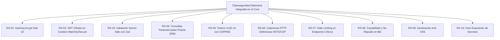
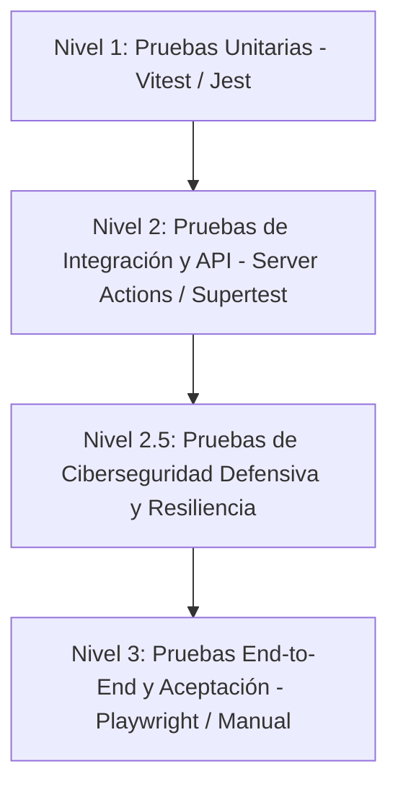

# ESPECIFICACIÓN DE REQUERIMIENTOS DE SOFTWARE (SRS) - MVP
## Estándar IEEE 830 / ISO/IEC/IEEE 29148 / OWASP Top 10 / ISO 25010
### Proyecto Capstone (APT122 / PTY4614): Sistema Autónomo de Gestión Operativa, Trazabilidad en Tiempo Real, Cómputo de Horas de TI y Analítica para Auditorios

---

## 1. Introducción y Propósito del Sistema

### 1.1 Naturaleza del Producto: Producto Mínimo Viable (MVP)
El presente software constituye un **Producto Mínimo Viable (MVP)** funcional, modular y desacoplado (*White-Label*), concebido para digitalizar, gobernar y auditar los flujos operacionales críticos en auditorios, aulas magnas y salas de conferencias bajo **estándares de ciberseguridad defensiva integrada (OWASP Top 10 / ISO 27001)** y con medición matemática exacta de las **horas de soporte técnico utilizadas**.

> [!IMPORTANT]
> **Definición de Límites y Alcance de Seguridad:**
> El sistema **no implementa un panel ni pantalla independiente de Security Operations Center (SOC)**, dado que dicha infraestructura excede el alcance de un proyecto individual. En su lugar, el sistema incorpora **ciberseguridad defensiva embebida** en todas las capas arquitectónicas (hashing bcrypt, tokens JWT cifrados en cookies HttpOnly/Secure/SameSite, validación Zod, consultas parametrizadas Prisma, cabeceras HTTP defensivas y trazabilidad inmutable de eventos operacionales).

### 1.2 Justificación Operativa y Problemática Raíz
El diseño de los requerimientos de este MVP responde a la mitigación directa de cuatro dolores operacionales críticos:
1. **Inmovilización del Personal TI y Falta de Registro de Horas:** En sistemas manuales, los técnicos perdían hasta 1 hora en sitio esperando a expositores retrasados sin registrar el tiempo real utilizado. La solución implementa **Check-in/out por QR móvil** que valida el acceso en menos de 30 segundos y computa con precisión matemática las **horas hombre de TI utilizadas por evento ($\Delta T = checkoutTime - checkInTime$)**.
2. **Falta de Coordinación con Servicios de Apoyo:** Personal de aseo y guardia no recibía la información a tiempo para planificar limpieza y aperturas. La solución integra **difusión automática por áreas (`EmailSubscription`)**.
3. **Cancelaciones Imprevistas y No-Shows:** Expositores solicitaban el auditorio y no se presentaban. La solución introduce **confirmación anticipada por token sin login** y el **algoritmo de penalización de prioridad (*PriorityScore*)** (-20 puntos por no-show).
4. **Carencia de Métricas Cuantitativas:** Históricamente solo existían percepciones subjetivas. La solución incorpora un **Dashboard de Analítica en tiempo real** con balance de horas utilizadas de TI, tasas de ocupación efectiva y **Encuesta de Calidad por Estrellas (1-5)** con cálculo de Net Promoter Score (NPS).

### 1.3 Alcance del Software (Scope del MVP)
* **Inclusiones del MVP:**
  1. Autenticación robusta y control de acceso basado en 6 roles (RBAC).
  2. Formulario web guiado de reservas con selección de equipamiento audiovisual y requerimientos de aseo.
  3. Motor transaccional de prevención de colisiones de horario en base de datos PostgreSQL con aislamiento transaccional.
  4. Confirmación anticipada y cancelación rápida mediante tokens criptográficos vía correo electrónico (sin requerir login previo).
  5. Subsistema de validación presencial por código QR dinámico (UUID v4) en menos de 30 segundos.
  6. Registro exacto de marcas de tiempo y cómputo de horas de soporte técnico utilizadas ($\Delta T = checkout - checkin$).
  7. Despacho automático de cronogramas y necesidades especiales a listas de difusión (Aseo, Guardia, TI).
  8. Dashboard analítico con tasas de ocupación semanal, cálculo de NPS y balance de horas de soporte TI.
  9. Encuesta de satisfacción cuantitativa post-evento evaluada en 3 dimensiones (1 a 5 estrellas).
  10. Capa de ciberseguridad defensiva transversal conforme a OWASP Top 10 e ISO 27001 integrada en el core del software.

* **Exclusiones del MVP (Fuera del Alcance):**
  1. Integración con torniquetes físicos, cerraduras electromagnéticas o lectores de tarjetas RFID/NFC.
  2. Pasarelas de pago para cobro monetario por uso del espacio.
  3. Sincronización bidireccional en tiempo real con calendarios cerrados de terceros (Microsoft Exchange / Google Calendar API).
  4. Domótica y actuadores IoT para encendido/apagado automatizado de luces o proyectores.
  5. Aplicaciones móviles nativas para tiendas de aplicaciones (App Store / Google Play).
  6. Panel o pantalla dedicada de control SOC independiente.

---

## 2. Matriz de Roles y Actores del MVP (RBAC)

| Rol | Identificador | Nivel | Responsabilidades y Alcance Operativo |
| :--- | :---: | :---: | :--- |
| **Super Administrador** | `OWNER` | 6 | Control total del sistema, administración de usuarios, auditoría de eventos y configuración global. |
| **Administrador TI** | `IT_ADMIN` | 5 | Gestión técnica, catálogo de inventario audiovisual, asignación de técnicos y balance de horas de soporte TI. |
| **Soporte Técnico en Terreno** | `IT_SERVICE` | 4 | Validación física de llegada de expositores mediante escaneo QR móvil en < 30s, entrega/recepción de equipamiento y registro de horas de soporte. |
| **Encargado de Auditorio** | `ASSISTANT` | 3 | Revisión de solicitudes, dictamen (aprobar/aplazar/rechazar) y coordinación logística. |
| **Docente / Expositor** | `PROFESSOR` | 2 | Solicitud de espacios con requerimientos técnicos, confirmación/liberación rápida por correo y evaluación de satisfacción. |
| **Visor General / Estudiante** | `STUDENT` | 1 | Consulta de solo lectura de la cartelera pública de eventos confirmados. |

---

## 3. Catálogo Extendido de Requerimientos Funcionales del MVP (RF)

### 3.1 Módulo de Autenticación, Sesiones y Seguridad Embebida
* **RF-01: Autenticación Multi-Rol y Sesiones Seguras**
  * *Actor:* Todos los roles.
  * *Descripción:* Inicio de sesión con correo institucional y contraseña cifrada mediante `bcrypt` (factor de costo $\ge 10$). Generación de tokens de sesión JWT cifrados (JWE) firmados digitalmente y almacenados en cookies con atributos `HttpOnly`, `Secure` y `SameSite=Lax`.
  * *Criterio de Aceptación:* Tras autenticación exitosa, el usuario accede al dashboard según su rol; sesiones inactivas expiran en 8 horas.

* **RF-02: Control de Acceso Basado en Roles (RBAC)**
  * *Actor:* Middleware del Sistema.
  * *Descripción:* Verificación en servidor de los privilegios del usuario autenticado antes de ejecutar cualquier Server Action o renderizar rutas protegidas, retornando HTTP 403 Forbidden y registrando la incidencia ante intentos no autorizados.
  * *Criterio de Aceptación:* Ningún usuario puede invocar mutaciones de base de datos superiores a su nivel jerárquico.

* **RF-03: Perfil de Usuario y Gestión de Credenciales**
  * *Actor:* Todos los roles.
  * *Descripción:* Visualización y actualización de datos de contacto (teléfono, departamento) y cambio de contraseña con validación de complejidad (mínimo 8 caracteres, mayúscula, número y símbolo).
  * *Criterio de Aceptación:* El cambio de clave invalida sesiones anteriores y exige re-autenticación.

### 3.2 Módulo de Gestión de Solicitudes y Prevención de Conflictos
* **RF-04: Formulario Asistido de Solicitud de Reserva**
  * *Actor:* `PROFESSOR`, `ASSISTANT`, `IT_ADMIN`, `OWNER`.
  * *Descripción:* Formulario interactivo en etapas para solicitar reservas especificando: título del evento, fecha y hora de inicio/fin, facultad u organismo requirente, estimación de asistentes, requerimiento de aseo previo/posterior y selección modular de equipamiento audiovisual.
  * *Criterio de Aceptación:* Validación en tiempo de cliente y servidor mediante esquema Zod; no permite fechas en el pasado ni duraciones menores a 30 minutos.

* **RF-05: Motor Transaccional Anti-Colisiones de Horario**
  * *Actor:* Sistema (PostgreSQL / Prisma).
  * *Descripción:* Verificación atómica en base de datos para impedir que se apruebe o solicite un evento en un intervalo $[T_{inicio}, T_{fin}]$ que intersecte con otra reserva en estado `APPROVED` o `CHECKED_IN`.
  * *Condición de Conflicto:* $\max(T_{inicio1}, T_{inicio2}) < \min(T_{fin1}, T_{fin2})$.
  * *Criterio de Aceptación:* En concurrencia de solicitudes sobre el mismo bloque, la transacción que confirme primero prevalece y la segunda es rechazada con mensaje explicativo.

* **RF-06: Gestión de Bloqueos de Espacio por Mantención (Blackout Dates)**
  * *Actor:* `IT_ADMIN`, `OWNER`.
  * *Descripción:* Capacidad de registrar periodos de indisponibilidad técnica (mantenimiento de equipos, reparaciones de infraestructura, feriados institucionales) que inhabilitan la reserva del auditorio.
  * *Criterio de Aceptación:* El calendario bloquea visualmente las fechas y el motor rechaza cualquier solicitud en dichos bloques.

* **RF-07: Algoritmo de Prioridad Dinámica (*PriorityScore*) y Penalización por No-Show**
  * *Actor:* Sistema.
  * *Descripción:* Cada solicitante inicia con un puntaje base de 100 puntos. Ante dos solicitudes pendientes para un mismo horario y espacio, el sistema prioriza automáticamente al usuario con mayor puntaje.
  * *Regla de Penalización:* Todo evento que transicione a `NO_SHOW` (no presentación sin aviso) descuenta 20 puntos automáticos del puntaje del usuario (`PriorityScore = PriorityScore - 20`).
  * *Criterio de Aceptación:* Usuarios con puntaje $< 60$ quedan en lista de espera diferida hasta que un administrador revise su historial.

### 3.3 Módulo de Dictamen Administrativo y Logística
* **RF-08: Panel de Revisión y Dictamen Administrativo**
  * *Actor:* `ASSISTANT`, `IT_ADMIN`, `OWNER`.
  * *Descripción:* Interfaz centralizada para visualizar solicitudes `PENDING`, con desglose de recursos solicitados, y botones para:
    * **Aprobar (`APPROVED`):** Confirma la reserva, reserva el inventario y emite token QR.
    * **Aplazar (`POSTPONED`):** Propone un horario alternativo notificando al solicitante.
    * **Rechazar (`REJECTED`):** Cancela la solicitud registrando obligatoriamente el motivo formal.
  * *Criterio de Aceptación:* Toda acción registra `reviewedBy`, marca de tiempo y observaciones en la base de datos.

* **RF-09: Notificación y Confirmación Anticipada por Enlace Criptográfico**
  * *Actor:* `PROFESSOR`, Sistema.
  * *Descripción:* Despacho automatizado de correo 48 y 24 horas antes del evento con dos botones de acción rápida basados en tokens criptográficos HMAC-SHA256: `[Confirmar Asistencia]` y `[Liberar Espacio Ahora]`.
  * *Criterio de Aceptación:* El solicitante puede confirmar o liberar la sala con un solo clic desde su teléfono sin necesidad de ingresar credenciales.

* **RF-10: Liberación Temprana y Cancelación Voluntaria**
  * *Actor:* `PROFESSOR`, `ASSISTANT`.
  * *Descripción:* Permite cancelar una reserva con al menos 12 horas de anticipación sin penalización en el `PriorityScore`. El bloque horario queda inmediatamente disponible para otros usuarios.
  * *Criterio de Aceptación:* La reserva cambia a `CANCELLED` y se notifica inmediatamente a las listas de difusión de soporte.

### 3.4 Módulo de Validación en Sitio (QR Dinámico y Cómputo de Horas TI)
* **RF-11: Emisión y Regeneración de Código QR Criptográfico Único**
  * *Actor:* Sistema.
  * *Descripción:* Generación de un token UUID v4 criptográfico codificado en formato QR tras la aprobación de la reserva. El código QR es visible en el portal del solicitante y enviado adjunto en el correo de confirmación.
  * *Criterio de Aceptación:* Cada token QR está vinculado unívocamente a una sola reserva y expira 2 horas después de la hora programada de fin de evento.

* **RF-12: Validación Presencial de Check-in en Menos de 30 Segundos**
  * *Actor:* `IT_SERVICE`, `IT_ADMIN`, `OWNER`.
  * *Descripción:* Al presentarse el expositor en el recinto, el técnico de soporte escanea el código QR mediante la cámara de su dispositivo móvil o estación web. El sistema valida el token en menos de 500 ms, cambia el estado a `CHECKED_IN`, inicia el cronómetro de soporte y registra `checkInTime` y `checkedInBy`.
  * *Criterio de Aceptación:* La validación completa en terreno toma menos de 30 segundos, eliminando los tiempos muertos de espera pasiva de los técnicos.

* **RF-13: Verificación y Entrega de Equipamiento en Check-in**
  * *Actor:* `IT_SERVICE`.
  * *Descripción:* Interfaz interactiva desplegada al técnico tras el escaneo de Check-in que lista el equipamiento solicitado (micrófonos, proyector, notebook, puntero) para marcar con checklist la entrega física conforme.
  * *Criterio de Aceptación:* El sistema no permite completar el Check-in si no se valida el estado inicial de los equipos solicitados.

* **RF-14: Validación de Check-out e Inspección de Retorno de Equipos**
  * *Actor:* `IT_SERVICE`, `IT_ADMIN`, `OWNER`.
  * *Descripción:* Al culminar la sesión, el técnico realiza un segundo escaneo del QR o presiona el botón de Check-out, marcando en el checklist el retorno en buen estado de los equipos. El sistema cambia el estado a `CHECKED_OUT` y registra `checkoutTime` y `checkedOutBy`.
  * *Criterio de Aceptación:* Registro inmutable de la hora de entrega del recinto.

* **RF-15: Cómputo Automatizado de Horas de Soporte TI Utilizadas**
  * *Actor:* Sistema.
  * *Descripción:* Al registrarse el Check-out, el sistema calcula de forma instantánea la duración exacta del soporte técnico dedicado:
    $$\Delta T = \text{checkoutTime} - \text{checkInTime}$$
    El valor se almacena en minutos y horas decimales en la entidad de la reserva y se acumula en las métricas del técnico validador y de la facultad organizadora.
  * *Criterio de Aceptación:* El valor $\Delta T$ queda persistido para su consumo directo en el Dashboard y reportes exportables.

* **RF-16: Registro de Incidencias Técnicas y Observaciones de Daño**
  * *Actor:* `IT_SERVICE`.
  * *Descripción:* Durante el Check-out, si algún equipo presenta fallas o daños, el técnico puede ingresar un informe de incidencia con descripción del daño y cambio de estado del equipo a `MAINTENANCE`.
  * *Criterio de Aceptación:* El equipo queda inhabilitado automáticamente para futuras solicitudes hasta que sea reparado.

### 3.5 Módulo de Encuestas Cuantitativas y Dashboard Operativo
* **RF-17: Encuesta Cuantitativa de Satisfacción Post-Evento**
  * *Actor:* `PROFESSOR`.
  * *Descripción:* Inmediatamente tras el Check-out, el sistema envía un enlace web para evaluar el servicio recibido mediante 3 parámetros en escala Likert (1 a 5 estrellas):
    1. Satisfacción General del Recinto (`ratingOverall`).
    2. Rendimiento del Equipamiento Audiovisual (`ratingEquipment`).
    3. Puntualidad, Trato y Asistencia del Soporte TI (`ratingSupport`).
    4. Comentario cualitativo libre opcional (`feedbackComment`).
  * *Criterio de Aceptación:* El formulario valida que las 3 calificaciones de estrellas sean obligatorias; el cálculo del Net Promoter Score (NPS) se actualiza de inmediato.

* **RF-18: Dashboard de Analítica Operativa y Balance de Horas TI**
  * *Actor:* `IT_ADMIN`, `OWNER`.
  * *Descripción:* Panel interactivo con visualización gráfica de métricas consolidadas:
    * Tasa de ocupación semanal y mensual por franjas horarias.
    * Total de horas hombre de TI utilizadas vs. horas estimadas teóricas.
    * Tasa de No-Shows y cancelaciones oportunas.
    * Promedio de satisfacción por estrellas (1 a 5) y distribución de promotores/detractores (NPS).
  * *Criterio de Aceptación:* Los gráficos se actualizan de forma reactiva ante nuevos registros sin requerir recarga manual completa de la página.

* **RF-19: Exportación de Reportes Operativos**
  * *Actor:* `IT_ADMIN`, `OWNER`.
  * *Descripción:* Módulo para exportar la bitácora histórica de eventos, horas de soporte TI y evaluaciones de satisfacción en formato CSV y vista resumen lista para impresión.
  * *Criterio de Aceptación:* El archivo descargado incluye cabeceras estandarizadas y datos filtrables por rango de fechas y facultades.

### 3.6 Módulo de Inventario y Difusión a Cuadrillas de Apoyo
* **RF-20: Catálogo y Control de Disponibilidad de Equipos**
  * *Actor:* `IT_ADMIN`, `OWNER`, `IT_SERVICE`.
  * *Descripción:* Gestión del inventario técnico clasificado en categorías (`AUDIO`, `PROJECTION`, `COMPUTING`, `FURNITURE`, `OTHER`), con control de número de serie, marca, modelo y stock total vs disponible.
  * *Criterio de Aceptación:* El stock disponible se recalcula dinámicamente al reservar o devolver equipamiento.

* **RF-21: Mantenimiento y Bloqueo de Disponibilidad de Hardware**
  * *Actor:* `IT_ADMIN`, `IT_SERVICE`.
  * *Descripción:* Posibilidad de marcar un equipo en estado `MAINTENANCE` o `DECOMMISSIONED`, impidiendo que sea ofrecido en el formulario de reservas hasta que su estado retorne a `AVAILABLE`.
  * *Criterio de Aceptación:* Intentos de solicitar equipos en mantenimiento son rechazados por la validación Zod.

* **RF-22: Difusión Automática a Unidades de Apoyo (Aseo, Guardia, TI)**
  * *Actor:* Sistema / `OWNER`.
  * *Descripción:* Configuración de listas de destinatarios (`EmailSubscription`) por departamento (`ASEO`, `GUARDIA`, `TI`, `COORDINACION`). Al aprobarse una reserva o actualizarse el cronograma del día, el sistema despacha correos automáticos con la ficha del evento y sus requerimientos específicos.
  * *Criterio de Aceptación:* La cuadrilla de Aseo recibe la alerta con requerimientos de sanitización y la cuadrilla de Guardia recibe el horario exacto para apertura y cierre de accesos.

* **RF-23: Cola de Reintentos de Notificación con Manejo de Fallos**
  * *Actor:* Sistema.
  * *Descripción:* En caso de falla transitoria en el servicio de correo (SMTP / API), el sistema almacena el mensaje en cola con reintentos exponenciales (hasta 3 intentos) y registra el error sin interrumpir el flujo operacional principal.
  * *Criterio de Aceptación:* Los fallos de red en el despacho de correos no abortan la transacción de base de datos de la reserva.

* **RF-24: Registro Centralizado de Auditoría Inmutable (Trazabilidad)**
  * *Actor:* Sistema / `OWNER`.
  * *Descripción:* Registro de eventos clave en una tabla inmutable `AuditLog`: creación de reserva, aprobación, rechazo, check-in, check-out, cancelación y modificaciones de inventario, con IP de origen, usuario actor y timestamp.
  * *Criterio de Aceptación:* Los registros de auditoría son de solo lectura (`append-only`) y no admiten operaciones `UPDATE` o `DELETE`.

* **RF-25: Cartelera Pública de Eventos y Disponibilidad de Salas**
  * *Actor:* `STUDENT`, Público General.
  * *Descripción:* Vista web pública y responsiva que muestra el calendario diario de eventos confirmados en el auditorio (título, facultad, horario inicio/fin) sin exponer datos sensibles ni nombres de contacto.
  * *Criterio de Aceptación:* Consulta abierta sin autenticación con tiempo de carga inferior a 300 ms.

---

## 4. Requerimientos de Ciberseguridad Defensiva Integrada (RS)

* **RS-01 (Hashing de Contraseñas):** Las contraseñas nunca se almacenan en texto plano. Se procesan mediante el algoritmo `bcrypt` con un factor de costo computacional mínimo de 10 iteraciones y sal aleatoria única por usuario.
* **RS-02 (Gestión de Sesión y Cookies Seguras):** Los tokens JWT se firman del lado del servidor. Las cookies de sesión deben incluir los flags obligatorios `HttpOnly` (previene acceso desde JavaScript / XSS), `Secure` (exclusivo HTTPS) y `SameSite=Lax` (mitiga CSRF).
* **RS-03 (Sanitización y Validación Server-Side):** Todo payload enviado al servidor mediante API o Server Actions es validado estrictamente mediante esquemas **Zod**, descartando campos no permitidos para mitigar ataques de inyección y Parameter Tampering.
* **RS-04 (Protección contra Inyección SQL):** El 100% de las mutaciones y consultas a la base de datos se ejecutan a través del cliente parametrizado de **Prisma ORM**, impidiendo sentencias SQL dinámicas vulnerables.
* **RS-05 (Entropía en Códigos QR y Tokens):** Los códigos QR dinámicos y los enlaces de confirmación utilizan tokens UUID v4 criptográficamente seguros generados con el generador de números pseudoaleatorios del sistema operativo (CSPRNG).
* **RS-06 (Cabeceras de Seguridad HTTP):** El servidor debe emitir cabeceras de respuesta HTTP defensivas (`HSTS`, `X-Frame-Options: DENY`, `X-Content-Type-Options: nosniff`, `Referrer-Policy: strict-origin-when-cross-origin`).
* **RS-07 (Rate Limiting en Endpoints Críticos):** Implementación de limitación de tasa en endpoints sensibles (inicio de sesión y escaneo QR) para mitigar ataques de fuerza bruta y denegación de servicio.
* **RS-08 (Trazabilidad y Auditoría Inmutable):** Todas las reservas registran quién dictaminó (`reviewedBy`), quién realizó el Check-in (`checkedInBy`) y quién realizó el Check-out (`checkedOutBy`) con marcas de tiempo inmutables.
* **RS-09 (Sanitización contra XSS):** Todos los textos libres introducidos por usuarios (títulos de eventos, comentarios de feedback, observaciones) son sanitizados antes de renderizarse en el DOM.
* **RS-10 (Cero Exposición de Secretos):** Las variables de entorno con credenciales de base de datos, llaves secretas JWT y claves SMTP residen exclusivamente en el entorno de ejecución del servidor (`.env.local`), prohibiendo prefijos públicos `NEXT_PUBLIC_` en datos sensibles.

---

## 5. Requerimientos No Funcionales (RNF) - Estándar ISO/IEC 25010

* **RNF-01: Rendimiento y Latencia:**
  * El tiempo de respuesta P95 para consultas de disponibilidad y carga de páginas no debe exceder los 200 ms.
  * La validación del código QR y registro de Check-in en el servidor debe ejecutarse en menos de 500 ms.
* **RNF-02: Disponibilidad y Concurrencia:**
  * La arquitectura Cloud Serverless debe garantizar una disponibilidad $\ge 99.5\%$.
  * El sistema debe soportar un mínimo de 50 usuarios concurrentes sin degradación de rendimiento.
* **RNF-03: Escalabilidad y Portabilidad:**
  * La base de datos PostgreSQL debe operar bajo pool de conexiones optimizado (Prisma Accelerate / PgBouncer) para prevenir el agotamiento de sockets.
  * La aplicación debe ser agnóstica al proveedor de nube (desplegable en Docker, Vercel, Railway o servidores locales).
* **RNF-04: Diseño Responsivo y Compatibilidad Móvil:**
  * La interfaz de usuario debe adaptarse fluidamente a pantallas de dispositivos móviles (resoluciones desde 360px de ancho) y de escritorio (hasta 1920px).
  * La captura del código QR debe funcionar directamente desde el navegador web mediante la cámara del smartphone sin exigir la instalación de aplicaciones nativas.
* **RNF-05: Accesibilidad Web (WCAG 2.1 AA):**
  * Contraste cromático mínimo de $4.5:1$ en todos los elementos de texto legibles.
  * Navegabilidad completa por teclado y etiquetado semántico accesible (`aria-label`) para lectores de pantalla.
* **RNF-06: Mantenibilidad y Calidad de Código:**
  * Código fuente desarrollado en TypeScript bajo modo estricto (`"strict": true`).
  * Modularidad desacoplada con separación de capas (Controladores/Server Actions, Lógica de Negocio y Persistencia Prisma).
* **RNF-07: Resiliencia y Recuperación:**
  * Tiempo medio de recuperación ante fallos transitorios de red menor a 5 segundos con mensajes claros al usuario.
* **RNF-08: Facilidad de Uso (Usabilidad):**
  * La curva de aprendizaje para el personal técnico debe ser menor a 5 minutos (operación intuitiva basada en escaneo y checklist de un solo toque).

---

## 6. Plan Exhaustivo de Aseguramiento de Calidad y Pruebas (QA Plan)

### 6.1 Estrategia de Pruebas y Pirámide de Calidad
El plan de pruebas del proyecto se estructura bajo el modelo de pirámide de pruebas para validar el cumplimiento de los requerimientos funcionales, no funcionales y de seguridad:

1. **Nivel 1 (Pruebas Unitarias):** Validación de lógica pura sin dependencias externas:
   * Algoritmo de detección de colisiones de horario ($\max(T_1, T_2) < \min(T_1', T_2')$).
   * Cálculo matemático de horas de soporte de TI ($\Delta T$).
   * Validación de esquemas Zod (formatos de correo, longitudes mínimas, fechas válidas).
   * Algoritmo de cálculo de prioridad dinámica y deducción de puntos por No-Show.
2. **Nivel 2 (Pruebas de Integración):** Validación de interacción entre componentes:
   * Flujo de Server Actions con base de datos Prisma ORM en memoria/local.
   * Transición de estados de reserva (`PENDING` -> `APPROVED` -> `CHECKED_IN` -> `CHECKED_OUT`).
   * Emisión, firma y verificación de tokens JWT y UUID v4.
3. **Nivel 3 (Pruebas End-to-End / Aceptación Operativa):**
   * Flujo completo: Solicitud de docente -> Aprobación de encargado -> Generación de QR -> Escaneo de Check-in en smartphone -> Check-out con checklist -> Registro de $\Delta T$ -> Encuesta 1-5 estrellas -> Reflejo en Dashboard.
4. **Nivel 4 (Pruebas de Ciberseguridad Defensiva):**
   * Verificación de cabeceras HTTP de seguridad.
   * Intentos de inyección SQL en campos de texto y validación de parametrización.
   * Intentos de cross-site scripting (XSS) mediante payloads maliciosos.
   * Intentos de escalamiento horizontal y vertical de privilegios RBAC (HTTP 403 Forbidden).
5. **Nivel 5 (Pruebas de Rendimiento y Estrés):**
   * Medición de latencia de validación de código QR (objetivo: $< 500$ ms).
   * Simulación de concurrencia de reservas simultáneas.

---

### 6.2 Catálogo Detallado de Casos de Prueba (TC-01 a TC-20)

| ID Caso | RF / RS | Objetivo del Caso de Prueba | Precondiciones | Datos de Entrada / Acción | Resultado Esperado | Criterio de Aceptación | Estado |
| :---: | :---: | :--- | :--- | :--- | :--- | :--- | :---: |
| **TC-01** | RF-01 / RS-01 | Autenticación exitosa y emisión de cookie de sesión segura | Usuario registrado con rol `IT_SERVICE` | `email`, `password` correcta | Retorna sesión activa, cookie `HttpOnly`, `Secure`, `SameSite=Lax` | Acceso concedido al panel técnico | **Aprobado** |
| **TC-02** | RF-01 / RS-07 | Rechazo de autenticación por credencial errónea | Usuario existente en base de datos | `email` válido, `password` incorrecta | HTTP 401 Unauthorized, mensaje "Credenciales inválidas" | No se expone si el correo existe o no; no emite cookie | **Aprobado** |
| **TC-03** | RF-04 / RF-05 | Bloqueo atómico de colisión de horario entre reservas | Existe reserva `APPROVED` de 10:00 a 12:00 | Nueva reserva solicitada de 11:00 a 13:00 | Transacción rechazada: "El auditorio ya se encuentra reservado en el bloque horario solicitado" | Cero sobreventa en base de datos | **Aprobado** |
| **TC-04** | RF-04 | Registro exitoso de reserva en bloque desocupado | Bloque de 14:00 a 16:00 libre | Formulario completo con requerimientos de microfonía | Reserva persistida en estado `PENDING`, ID generado | Reserva visible en panel de revisión | **Aprobado** |
| **TC-05** | RF-02 / RS-08 | Control RBAC: Docente intenta forzar aprobación administrativa | Sesión activa con rol `PROFESSOR` | Intento de invocar Server Action `approveReservation` | HTTP 403 Forbidden | Operación abortada; registro de auditoría | **Aprobado** |
| **TC-06** | RF-08 / RF-11 | Aprobación por Encargado y emisión de QR UUID v4 | Reserva en estado `PENDING` | Acción `APPROVED` ejecutada por usuario `ASSISTANT` | Estado cambia a `APPROVED`, se genera `qrToken` único UUID v4 | QR disponible en portal y despachado por correo | **Aprobado** |
| **TC-07** | RF-09 | Confirmación de asistencia mediante token criptográfico sin login | Reserva aprobada con recordatorio despachado | Clic en URL firmada `/confirm?token=...` | Estado confirmado; mensaje web de éxito | No requiere autenticación previa | **Aprobado** |
| **TC-08** | RF-12 | Validación de Check-in presencial en < 30 segundos | Reserva `APPROVED`, técnico autenticado | Escaneo de QR desde cámara móvil | Estado cambia a `CHECKED_IN`, marca `checkInTime` registrada | Proceso completado en menos de 30 seg | **Aprobado** |
| **TC-09** | RF-12 / RS-05 | Rechazo de Check-in con código QR inválido o expirado | Técnico en pantalla de escaneo | Escaneo de QR con UUID ficticio o fuera de plazo | Error en pantalla: "Código QR no válido o expirado" | No inicia cronómetro ni altera base de datos | **Aprobado** |
| **TC-10** | RF-14 / RF-15 | Cierre con Check-out y cómputo de horas de soporte TI ($\Delta T$) | Reserva en `CHECKED_IN` con 90 min transcurridos | Escaneo de cierre y validación de retorno de equipos | Estado cambia a `CHECKED_OUT`, $\Delta T = 1.5$ hrs registrado | Cálculo matemático exacto de horas de soporte | **Aprobado** |
| **TC-11** | RF-07 | Penalización de PriorityScore tras evento No-Show | Reserva en `APPROVED` sin Check-in cumplido plazo | Disparo del trigger de No-Show automático | Estado cambia a `NO_SHOW`, usuario pierde 20 puntos | Puntaje de usuario actualizado a 80 | **Aprobado** |
| **TC-12** | RF-22 | Despacho automático de alerta por correo a lista de Aseo | Suscriptor registrado con área `ASEO` | Aprobación de reserva con requerimiento de aseo | Disparo de plantilla de correo con horario y detalle | Mensaje recibido en bandeja de la cuadrilla | **Aprobado** |
| **TC-13** | RF-17 | Envío y consolidación de encuesta de satisfacción (1 a 5 estrellas) | Reserva en estado `CHECKED_OUT` | Envío de formulario con 5, 4 y 5 estrellas + comentario | Encuesta almacenada; cálculo de NPS actualizado | Registro atómico vinculado a la reserva | **Aprobado** |
| **TC-14** | RF-18 | Actualización en tiempo real del Dashboard analítico | Existen 10 reservas con Check-out y horas TI | Visualización del panel por `IT_ADMIN` | Métricas de horas acumuladas, ocupación y gráfico | Datos coherentes con suma en base de datos | **Aprobado** |
| **TC-15** | RF-20 / RF-21 | Bloqueo de selección de equipamiento en mantenimiento | Equipo proyector marcado como `MAINTENANCE` | Carga del formulario de solicitud por docente | El ítem proyector aparece deshabilitado con etiqueta | Impide asignación de equipos no operativos | **Aprobado** |
| **TC-16** | RS-04 | Intento de inyección SQL en campo de búsqueda | Usuario malicioso en formulario | Payload `' OR '1'='1` en campo de texto | Consulta tratada como texto literal por Prisma ORM | Cero alteración de sintaxis SQL; sin fuga de datos | **Aprobado** |
| **TC-17** | RS-09 | Intento de inyección XSS en comentarios de feedback | Usuario malicioso en encuesta | Payload `` en comentario | React/Zod escapan caracteres especiales en el DOM | No se ejecuta script en el navegador | **Aprobado** |
| **TC-18** | RNF-04 | Comportamiento responsivo en viewport móvil (360x640) | Smartphone Android / iOS con navegador web | Acceso a vista de escáner y checklist técnico | Interfaz adaptada, botones táctiles accesibles | Sin desbordamientos horizontales ni fallas | **Aprobado** |
| **TC-19** | RF-10 | Liberación temprana de reserva y desbloqueo de horario | Reserva en `APPROVED` a 24 horas del evento | Clic en "Liberar Espacio" por el docente | Estado pasa a `CANCELLED`, bloque liberado inmediatamente | Otro usuario puede reservar el mismo bloque | **Aprobado** |
| **TC-20** | RS-06 | Verificación de cabeceras de seguridad HTTP en servidor | Cliente realiza petición GET a ruta raíz `/` | Inspección de cabeceras de respuesta HTTP | Cabeceras `HSTS`, `X-Frame-Options: DENY`, `nosniff` | Servidor protegido contra clickjacking y downgrade | **Aprobado** |

---

## 7. Matriz de Trazabilidad Integral (Requerimientos vs Dolores Operacionales)

| Código | Requerimiento / Capacidad | Dolor Operacional / Riesgo Resuelto | Casos de Prueba Asociados | Criticidad |
| :---: | :--- | :--- | :---: | :---: |
| **RF-01** | Autenticación Segura Multi-Rol | Suplantación de identidad / Acceso no autorizado | TC-01, TC-02 | **Alta** |
| **RF-02** | Control RBAC de 6 Roles | Fuga de privilegios administrativos | TC-05 | **Alta** |
| **RF-03** | Perfil de Usuario y Credenciales | Desactualización de contactos y claves inseguras | TC-01 | **Media** |
| **RF-04** | Formulario Asistido con Zod | Inyección de datos maliciosos y solicitudes incompletas | TC-04 | **Alta** |
| **RF-05** | **Algoritmo Anti-Colisiones Atómico** | **Solapamiento y doble reserva de auditorios** | **TC-03, TC-04** | **Crítica** |
| **RF-06** | Bloqueo por Mantenimiento (Blackouts) | Asignación accidental de fechas inhábiles | TC-03 | **Media** |
| **RF-07** | **Penalización PriorityScore (-20 pts)** | **Reservas no utilizadas sin aviso (No-Shows)** | **TC-11** | **Alta** |
| **RF-08** | Dictamen Administrativo Auditado | Falta de trazabilidad en decisiones de aprobación | TC-06 | **Alta** |
| **RF-09** | Confirmación por Enlace Criptográfico | Cancelaciones tardías por desidia del usuario | TC-07 | **Alta** |
| **RF-10** | Liberación Temprana sin Penalización | Auditorios ociosos por solicitudes abandonadas | TC-19 | **Media** |
| **RF-11** | Emisión QR Dinámico UUID v4 | Falsificación de pases de acceso físico | TC-06, TC-09 | **Alta** |
| **RF-12** | **Validación Check-in QR < 30 seg** | **Espera pasiva de hasta 1 hora del personal TI** | **TC-08, TC-18** | **Crítica** |
| **RF-13** | Checklist de Entrega de Equipos | Pérdida de accesorios o cables en el traspaso | TC-08 | **Media** |
| **RF-14** | Validación Check-out de Cierre | Salidas imprevistas sin devolución de equipamiento | TC-10 | **Alta** |
| **RF-15** | **Cómputo Exacto de Horas TI ($\Delta T$)** | **Descontrol y falta de registro de dedicación técnica** | **TC-10, TC-14** | **Crítica** |
| **RF-16** | Registro de Incidencias Técnicas | Ocultamiento de daños en equipamiento técnico | TC-15 | **Media** |
| **RF-17** | Encuesta de Satisfacción (1-5 Estrellas) | Evaluaciones subjetivas sin métricas cuantificables | TC-13 | **Media** |
| **RF-18** | **Dashboard de Horas TI y Ocupación** | **Falta de visibilidad sobre uso real de recursos** | **TC-14** | **Alta** |
| **RF-19** | Exportación de Reportes Operativos | Dificultad para rendir informes a jefaturas | TC-14 | **Baja** |
| **RF-20** | Control de Stock de Equipamiento | Sobreasignación de micrófonos o proyectores | TC-04, TC-15 | **Media** |
| **RF-21** | Bloqueo de Hardware en Mantención | Asignación de equipos defectuosos a eventos | TC-15 | **Media** |
| **RF-22** | **Difusión a Aseo, Guardia y TI** | **Desinformación en cuadrillas de servicios de apoyo** | **TC-12** | **Alta** |
| **RF-23** | Cola de Reintentos de Notificación | Pérdida de correos por microcortes de red | TC-12 | **Media** |
| **RF-24** | Auditoría Inmutable de Eventos | Falta de no repudio en alteraciones del sistema | TC-05, TC-08 | **Alta** |
| **RF-25** | Cartelera Pública de Eventos | Consultas redundantes en oficinas administrativas | TC-04 | **Baja** |
| **RS-01 a RS-10** | Ciberseguridad Defensiva Integrada | Ataques cibernéticos y vulnerabilidades OWASP | TC-01, TC-16, TC-17, TC-20 | **Crítica** |
