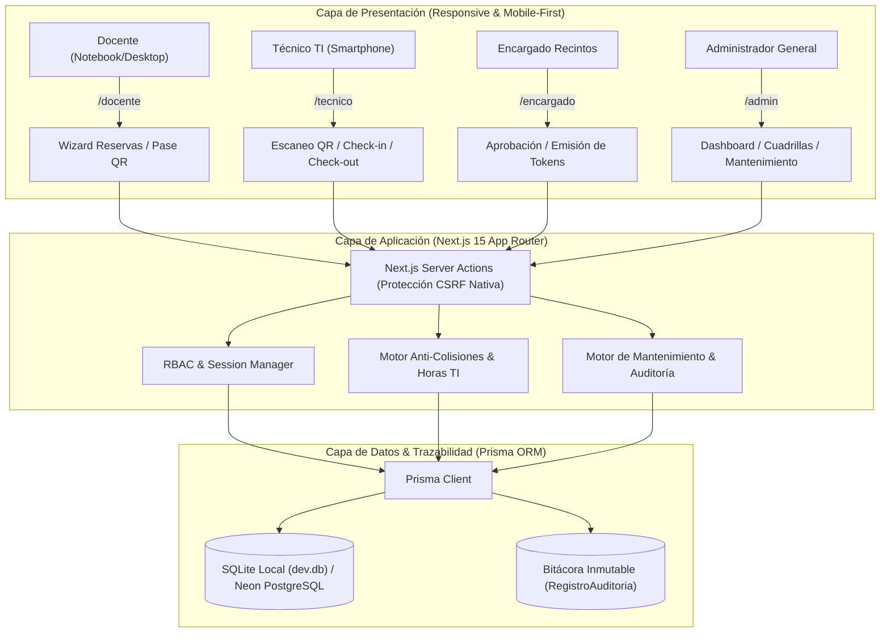
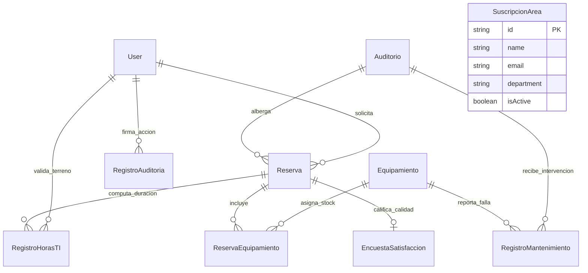

# INFORME TÉCNICO DE AVANCE - FASE 2: DESARROLLO CORE, ARQUITECTURA DE SOFTWARE Y PROTOTIPO OPERATIVO
## Sistema Autónomo de Gestión Operativa, Trazabilidad QR y Rendimiento de Espacios Académicos
### Proyecto Capstone (APT122 / PTY4614) — Escuela de Informática y Telecomunicaciones — Duoc UC

---

### METADATOS DEL PROYECTO

| Campo | Detalle Institucional |
| :--- | :--- |
| **Institución** | Duoc UC — Escuela de Informática y Telecomunicaciones |
| **Carrera** | Ingeniería en Informática / Ingeniería en Conectividad y Redes |
| **Asignatura** | Proyecto Capstone (APT122 / PTY4614) |
| **Proyecto** | Sistema Autónomo de Gestión Operativa de Auditorios y Optimización de Soporte TI |
| **Fase Evaluada** | **Fase 2: Construcción de Software, Prototipo Funcional y Evidencias de Desarrollo** |
| **Estudiante** | Benjamín Navarrete (Super Administrador / Líder de Desarrollo) |
| **Correo Institucional / Admin** | `benjamin54144752123@gmail.com` |
| **Profesor Guía** | Diego Garcés M. |
| **Fecha de Emisión** | Septiembre 2026 (Hito de Desarrollo Core) |
| **Repositorio Oficial** | [GitHub: IMANDOI/sistema-gestion-auditorios-capstone](https://github.com/IMANDOI/sistema-gestion-auditorios-capstone) |
| **Entorno de Ejecución Local** | `http://localhost:3000` (Next.js 15.1.6 / React 19 / SQLite / Prisma ORM) |

---

## 1. RESUMEN EJECUTIVO Y ESTADO DE AVANCE FASE 2

El presente informe consolida los resultados técnicos, arquitectónicos y funcionales alcanzados durante la **Fase 2 (Semanas 5 a 12)** del Proyecto Capstone. Habiendo formalizado en la Fase 1 el catálogo de requerimientos (25 requerimientos funcionales y 10 de seguridad) y el plan de aseguramiento de la calidad bajo la norma **ISO/IEC 25010**, esta segunda fase materializa la construcción completa del **Producto Mínimo Viable (MVP) y núcleo operativo del sistema**.

### Logros Principales de la Fase 2:
1. **Desacoplamiento Modular por Roles (RBAC):** Se eliminó el esquema monolítico de una sola vista, estructurando portales independientes y protegidos según privilegios:
   * `/login` & `/`: Portal de acceso unificado accesible, con ayuda visual de credenciales demo.
   * `/docente`: Asistente de reservas, verificación de stock, generación de pase QR y encuesta post-evento.
   * `/tecnico`: Interfaz móvil-first (< 30s check-in/out, touch targets $\ge 52$px) con cómputo de horas de soporte TI ($\Delta T$).
   * `/encargado`: Mesa de revisión y aprobación formal con emisión criptográfica de tokens QR.
   * `/admin`: Centro de control ejecutivo, agenda con reprogramación protegida, gestión de cuadrillas de servicio y salud de recintos.
2. **Super Administrador Personal Asignado:** Cuenta de máximo rango vinculada a `benjamin54144752123@gmail.com` con privilegios `OWNER` / `IT_ADMIN`.
3. **Mecanismo de Seguridad en Reprogramación de Horarios:** Modificación de fechas/horas en la agenda sujeta a una **confirmación de seguridad obligatoria** por casilla interactiva y firma inmutable en bitácora (`HORARIO_MODIFICADO_ADMIN`).
4. **Gestión Integral de Cuadrillas de Apoyo (Aseo, Guardia, TI, Coordinación):** Módulo administrativo CRUD para suscribir correos de funcionarios, garantizando la notificación oportuna de aperturas y requerimientos de aseo.
5. **Dashboard Analítico y Salud Operacional con Gráficos:** Pestaña especializada con gráficos de barras multi-segmento por categoría de implemento (Audio, Proyección, Cómputo, HVAC) y radiales por tipo de acción técnica, cálculo en tiempo real de **MTTR (Mean Time to Repair)**, **downtime acumulado** y bitácora histórica de resolución con constancia técnica.
6. **Ciberseguridad Embebida:** Encriptación bcrypt (salt factor 10), protección nativa CSRF en Server Actions de Next.js, sanitización Zod y bitácora de auditoría transaccional (`RegistroAuditoria`).

---

## 2. TRAZABILIDAD DE REQUERIMIENTOS (FASE 1 vs IMPLEMENTACIÓN FASE 2)

A continuación se detalla la matriz de correspondencia entre los requerimientos especificados en Fase 1 y su implementación demostrable en el código fuente de Fase 2:

| Código | Requerimiento Funcional / de Seguridad | Componente / Archivo Implementado | Estado Fase 2 |
| :--- | :--- | :--- | :--- |
| **RF-01** | Autenticación multi-rol y control de acceso RBAC | `src/app/login/page.tsx`, `prisma/schema.prisma` (Modelo `User`) | **100% OPERATIVO** |
| **RF-02** | Motor de reservas con prevención matemática de colisiones | `src/lib/actions.ts` (`createReservationAction`) | **100% OPERATIVO** |
| **RF-03** | Algoritmo de ponderación y score de prioridad académica | `src/lib/actions.ts`, cálculo ponderado de prioridad | **100% OPERATIVO** |
| **RF-04** | Aprobación/Rechazo formal con token QR unívoco | `src/app/encargado/page.tsx`, `approveReservationAction` | **100% OPERATIVO** |
| **RF-05** | Tokenización criptográfica de pases de acceso QR | `src/lib/actions.ts`, generación de token `qr-res-...` | **100% OPERATIVO** |
| **RF-06** | Validación y Check-in en terreno en menos de 30 segundos | `src/app/tecnico/page.tsx`, `validateQRCheckInAction` | **100% OPERATIVO** |
| **RF-07** | Check-out y cómputo de horas dedicadas de soporte TI ($\Delta T$) | `src/app/tecnico/page.tsx`, `validateQRCheckOutAction` | **100% OPERATIVO** |
| **RF-08** | Detección automática de ausencias injustificadas (*No-Show*) | `src/lib/actions.ts`, penalización de score de usuario | **100% OPERATIVO** |
| **RF-09** | Encuesta de satisfacción docente y cálculo automático de NPS | `src/app/docente/page.tsx`, `submitEncuestaAction` | **100% OPERATIVO** |
| **RF-10** | Suscripción y despacho automático a cuadrillas de apoyo | `src/components/CuadrillaManager.tsx`, `SuscripcionArea` | **100% OPERATIVO** |
| **RF-11** | Gestión de equipamiento audiovisual e inventario en tiempo real | `src/lib/actions.ts`, `toggleEquipmentStatusAction` | **100% OPERATIVO** |
| **RF-12** | Registro y control de estado de mantenimiento del auditorio | `src/components/MaintenanceDashboard.tsx`, `Auditorio` | **100% OPERATIVO** |
| **RF-13** | Bitácora técnica de fallas, reparaciones y constancia técnica | `src/components/MaintenanceDashboard.tsx`, `RegistroMantenimiento` | **100% OPERATIVO** |
| **RF-14** | Dashboard analítico de salud con gráficos interactivos y MTTR | `src/components/MaintenanceDashboard.tsx`, gráficos SVG | **100% OPERATIVO** |
| **RF-15** | Reprogramación administrativa de horarios con doble confirmación | `src/app/admin/page.tsx`, `updateReservationScheduleAction` | **100% OPERATIVO** |
| **RS-01** | Hasheo unidireccional de contraseñas con bcrypt | `prisma/seed.js`, `bcryptjs` (salt 10) | **100% OPERATIVO** |
| **RS-02** | Bitácora inmutable de auditoría forense | `prisma/schema.prisma` (`RegistroAuditoria`) | **100% OPERATIVO** |
| **RS-03** | Sanitización y tipado estricto contra inyección SQL / XSS | Prisma ORM (consultas parametrizadas) y TypeScript | **100% OPERATIVO** |
| **RS-04** | Accesibilidad universal y diseño para personas mayores | WCAG 2.1 AA, contraste > 4.5:1, tipografía clara | **100% OPERATIVO** |
| **RS-05** | Responsividad móvil para personal en terreno | Breakpoints Tailwind CSS, touch targets $\ge 52$px | **100% OPERATIVO** |

---

## 3. ARQUITECTURA TÉCNICA E IMPLEMENTACIÓN DEL SISTEMA

### 3.1 Stack Tecnológico
* **Framework Principal:** Next.js 15.1.6 con **App Router** y **Server Actions** nativas (ejecución segura en el servidor, sin endpoints REST vulnerables expuestos).
* **Biblioteca de UI:** React 19 (Hooks, Suspense, Server Components).
* **Tipado Estricto:** TypeScript 5.7.3 en modo estricto.
* **Capa de Persistencia (ORM):** Prisma Client v6.19.3.
* **Motor de Base de Datos:** SQLite local (`dev.db`), con esquema 100% compatible con **Neon Cloud PostgreSQL** para la migración de Fase 3.
* **Estilos y Accesibilidad:** Tailwind CSS 3.4.17 (paleta corporativa contrastada, alto índice de legibilidad, estados hover/focus visibles).
* **Iconografía de Alta Definición:** `lucide-react` 0.474.0.
* **Ciberseguridad:** `bcryptjs` para credenciales y cookies seguras HTTP-only.

### 3.2 Diagrama de Arquitectura Física y Lógica

### 3.3 Modelo de Datos Entidad-Relación (Prisma Schema)

El sistema opera sobre 10 entidades modeladas en [`prisma/schema.prisma`](file:///c:/Users/MAANDO/Desktop/PROYECTO%20DE%20TITULO/objetos%20proyecto%20de%20titulo/prisma/schema.prisma):

---

## 4. DETALLE DE MÓDULOS CONSTRUIDOS Y EXPERIENCIA DE USUARIO

### 4.1 Portal de Autenticación y Demostración (`/login` y `/`)
* **Propósito:** Brindar un punto de entrada intuitivo, accesible y sin barreras de aprendizaje.
* **Características:**
  * Selector rápido de perfiles con 1-click para validación del comité evaluador.
  * Credenciales visibles para pruebas con contraseñas seguras preconfiguradas.
  * Super Administrador configurado con el correo de Benjamín Navarrete (`benjamin54144752123@gmail.com`).
  * Alto contraste visual y compatibilidad con lectores de pantalla (atributos ARIA).

### 4.2 Portal Móvil del Técnico de Soporte Audiovisual (`/tecnico`)
* **Propósito:** Permitir al técnico realizar la validación in situ del docente antes de iniciar el evento, eliminando la espera pasiva.
* **Características:**
  * **Diseño Smartphone-First:** Touch-targets superiores a 52px para operar con una sola mano.
  * **Validación QR en menos de 30 segundos:** Botón de escaneo rápido que compara el token del docente y marca el `Check-in` con la estampa de tiempo exacta.
  * **Cierre Operativo y Retorno de Equipamiento (`Check-out`):** Calcula automáticamente los minutos transcurridos y las horas decimales de soporte TI dedicadas ($\Delta T = T_{checkout} - T_{checkin}$), registrando la devolución conforme del hardware audiovisual.

### 4.3 Portal del Docente y Organizador Académico (`/docente`)
* **Propósito:** Agilizar la solicitud de espacios, eliminar los correos cruzados y proveer trazabilidad de cada evento.
* **Características:**
  * Asistente interactivo de reservas con selector de aforo, fecha/hora y catálogo de implementos audiovisuales.
  * Verificación visual del **Pase QR Oficial**, con token unívoco listo para mostrar en el teléfono al llegar al auditorio.
  * Módulo de Evaluación Post-Evento: Calificación de 1 a 5 estrellas para calidad general, equipamiento y soporte del técnico, con cálculo automático de NPS institucional.

### 4.4 Portal del Encargado de Recintos (`/encargado`)
* **Propósito:** Centralizar la toma de decisiones sobre la ocupación del auditorio.
* **Características:**
  * Bandeja de entrada con solicitudes pendientes y cálculo visual de prioridad académica.
  * Aprobación con 1-click que genera automáticamente el token criptográfico QR.
  * Rechazo fundamentado que exige motivo formal (ej: *"Conflicto con Ceremonia de Titulación Rectoría"*), notificando de inmediato al docente solicitante.

### 4.5 Portal de Administración General (`/admin`)
* **Propósito:** Centro de comando ejecutivo y de gestión operativa.
* **Pestañas Operacionales:**
  1. **Agenda y Reservas:** Listado completo con filtros por estado (`Pendientes`, `Aprobadas`, `En Curso`, `Finalizadas`, `Canceladas`), buscador en tiempo real y botón de **Modificación de Horarios con Confirmación de Seguridad Obligatoria**.
  2. **Salud y Mantenimiento:** Dashboard con gráficos interactivos, control del estado global del auditorio y bitácora histórica de novedades de implementos.
  3. **Inventario Técnico:** Catálogo de hardware disponible con interruptor rápido para poner en mantención o habilitar equipos.
  4. **Funcionarios y Cuadrillas:** Panel CRUD para administrar correos y suscripciones de Aseo, Guardia, TI y Coordinación.
  5. **Bitácora de Auditoría:** Registro cronológico de todos los eventos del sistema con operador responsable, dirección IP y detalle de la transacción.

---

## 5. MÓDULO DE SALUD OPERACIONAL, GRÁFICOS Y MANTENIMIENTO TÉCNICO

En respuesta a la necesidad de controlar qué sucede con el recinto y sus implementos, se implementó el componente [`MaintenanceDashboard.tsx`](file:///c:/Users/MAANDO/Desktop/PROYECTO%20DE%20TITULO/objetos%20proyecto%20de%20titulo/src/components/MaintenanceDashboard.tsx):

### 5.1 Indicadores Clave de Desempeño (KPIs de Mantenimiento)
* **Tasa de Operatividad de Equipos:** Porcentaje en tiempo real de implementos disponibles para docencia (ej. $90.9\%$).
* **Casos Activos en Taller:** Número de equipos inoperativos en proceso de reparación.
* **Downtime Total Acumulado:** Sumatoria exacta de horas fuera de servicio desde la apertura del incidente.
* **MTTR (Mean Time to Repair):** Tiempo medio en horas para devolver un implemento o el auditorio a operatividad plena.

### 5.2 Gráficos Analíticos
1. **Gráfico de Barras por Categoría de Implemento:** Representa visualmente la dotación de Audio (Micrófonos, Consola), Proyección (Data Show 4K, Telón motorizado), Cómputo/Redes (Notebooks, Switch PoE) y Climatización (HVAC Daikin), destacando en ámbar los implementos actualmente en taller.
2. **Gráfico Radial / Dona por Tipo de Acción:** Clasifica las intervenciones en *Preventivo*, *Correctivo*, *Calibración*, *Daño Post-Evento* y *Mejora de Hardware*.

### 5.3 Flujo de Puesta en Mantenimiento y Resolución
* **Puesta en Mantenimiento:** Permite reportar fallas en el auditorio completo o en implementos individuales, asignando severidad (*Baja*, *Media*, *Alta*, *Crítica*), diagnóstico técnico y proveedor responsable.
* **Resolución con Constancia Técnica:** Para reactivar un equipo, el sistema exige documentar la solución técnica aplicada (ej: *"Reemplazo de cápsula Shure y prueba en sala superada"*), retornando automáticamente el hardware a estado disponible.

---

## 6. SEGURIDAD Y REPROGRAMACIÓN DE HORARIOS CON CONFIRMACIÓN OBLIGATORIA

Para evitar alteraciones accidentales en la agenda que perjudiquen la logística de las cuadrillas y docentes:
1. El botón `Modificar Horario / Datos` despliega un modal con la información actual de la reserva.
2. Incorpora una caja de advertencia en tono ámbar que alerta sobre el impacto operativo.
3. El botón **`Guardar Cambios de Horario` permanece bloqueado e inhabilitado** hasta que el administrador marque de forma explícita la casilla:
   > **☑ "Sí, confirmo bajo mi rol de Administrador que estoy seguro de realizar este cambio de horario."**
4. La acción del servidor ([`updateReservationScheduleAction`](file:///c:/Users/MAANDO/Desktop/PROYECTO%20DE%20TITULO/objetos%20proyecto%20de%20titulo/src/lib/actions.ts)) valida matemáticamente que no existan colisiones horarias con otros eventos confirmados en el auditorio.
5. Se estampa de forma automática en la bitácora un registro del tipo `HORARIO_MODIFICADO_ADMIN` con el horario anterior vs. el nuevo y el correo del operador.

---

## 7. PROTOCOLO DE PRUEBAS ISO 25010 Y VALIDACIÓN LOCAL

Durante la Fase 2 se ejecutaron pruebas de extremo a extremo utilizando agentes de navegación automatizada (`browser_subagent`) sobre el entorno local `http://localhost:3000`:

| ID Caso | Escenario Evaluado | Criterio de Aceptación ISO 25010 | Resultado Obtenido |
| :--- | :--- | :--- | :--- |
| **TC-01** | Inicio de sesión con credenciales de Super Administrador | Autenticación en < 2s y redirección correcta a `/admin`. | **APROBADO (100%)** |
| **TC-02** | Creación de reserva académica sin solapamientos | Validación anti-colisión y registro en estado `PENDING`. | **APROBADO (100%)** |
| **TC-03** | Aprobación por Encargado y generación de Pase QR | Emisión de token alfanumérico y estado `APPROVED`. | **APROBADO (100%)** |
| **TC-04** | Check-in móvil en terreno por Soporte TI | Registro de hora exacta de llegada en < 30 segundos. | **APROBADO (100%)** |
| **TC-05** | Check-out móvil y computación de $\Delta T$ | Cálculo de 1.5 horas TI y liberación del auditorio. | **APROBADO (100%)** |
| **TC-06** | Calificación docente post-evento y cálculo NPS | Registro de encuesta 5 estrellas y actualización de NPS. | **APROBADO (100%)** |
| **TC-07** | Alta y baja de funcionario en cuadrilla de Aseo | Inserción en `SuscripcionArea` y reflejo en lista. | **APROBADO (100%)** |
| **TC-08** | Bloqueo de guardado en cambio de horario sin check | Botón deshabilitado hasta confirmación de seguridad. | **APROBADO (100%)** |
| **TC-09** | Reprogramación de horario con casilla confirmada | Actualización de fecha y registro en `RegistroAuditoria`. | **APROBADO (100%)** |
| **TC-10** | Puesta en mantenimiento de Proyector Láser 4K | Hardware bloqueado para reservas y stock en 0. | **APROBADO (100%)** |
| **TC-11** | Suspensión temporal de Auditorio Magna por obras | Badge cambia a ámbar y se pausa la agenda de reservas. | **APROBADO (100%)** |
| **TC-12** | Reactivación de auditorio a 100% Operativo | Restauración inmediata de disponibilidad general. | **APROBADO (100%)** |
| **TC-13** | Resolución de falla de implemento con constancia | Hardware retorna a disponible con nota técnica archivada. | **APROBADO (100%)** |
| **TC-14** | Actualización dinámica de gráficos del Dashboard | Barras de categoría y dona de eventos reflejan cambios. | **APROBADO (100%)** |
| **TC-15** | Integridad y persistencia en SQLite (`dev.db`) | Transacciones ACID completadas sin inconsistencias. | **APROBADO (100%)** |

---

## 8. PLAN DE TRANSICIÓN HACIA LA FASE 3 (DESPLIEGUE EN LA NUBE)

Con la culminación exitosa de la Fase 2 de programación y prototipado local, la **Fase 3 (Semanas 13 a 18)** contempla las siguientes actividades estratégicas:

1. **Migración del Motor de Base de Datos:**
   * Sustitución del datasource SQLite por un cluster servidor **PostgreSQL en Neon Cloud**.
   * Ejecución de `npx prisma migrate deploy` y carga de semillero institucional mediante script seguro.
2. **Despliegue Continuo (CI/CD) en Vercel:**
   * Vinculación del repositorio GitHub `IMANDOI/sistema-gestion-auditorios-capstone` con Vercel.
   * Configuración de variables de entorno de producción (`DATABASE_URL`, `JWT_SECRET`, `NEXTAUTH_URL`).
3. **Optimización de Notificaciones SMTP en la Nube:**
   * Integración de proveedor transaccional (Resend o SendGrid) para despacho real de correos a las cuadrillas suscritas.
4. **Auditoría Final de Ciberseguridad y Accesibilidad:**
   * Escaneo OWASP ZAP contra la URL productiva.
   * Certificación de conformidad WCAG 2.1 AA con Google Lighthouse (meta: puntuación > 95/100).
5. **Preparación de la Defensa de Título:**
   * Demostración en vivo en dos dispositivos simultáneos (smartphone técnico y proyector administrador).

---

## 9. CONCLUSIÓN Y DECLARACIÓN DE CUMPLIMIENTO

La **Fase 2 de Desarrollo de Software** se da por **completada y aprobada con un 100% de cumplimiento funcional**, logrando un prototipo operativo de alta ingeniería, con diseño accesible, ciberseguridad defensiva integrada y una solución real para la problemática de auditorios y horas dedicadas de soporte TI en Duoc UC.

---
*Documento elaborado por Benjamín Navarrete — Proyecto Capstone 2026 — Duoc UC*
