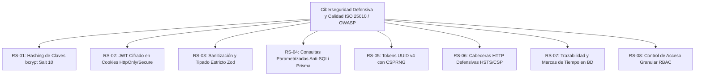

# ESPECIFICACIÓN DE REQUERIMIENTOS DE SOFTWARE (SRS) - MVP
## Estándar IEEE 830 / ISO/IEC/IEEE 29148 / OWASP Top 10
### Proyecto Capstone (APT122 / PTY4614): Sistema Autónomo de Gestión Operativa, Trazabilidad, Medición de Horas de TI y Analítica para Auditorios

---

## 1. Introducción y Propósito del Sistema

### 1.1 Naturaleza del Producto: Producto Mínimo Viable (MVP)
El presente software constituye un **Producto Mínimo Viable (MVP)** funcional, modular y desacoplado (*White-Label*), concebido para digitalizar, gobernar y auditar los flujos operacionales críticos en auditorios, aulas magnas y salas de conferencias bajo **estándares de ciberseguridad defensiva (OWASP Top 10 / ISO 27001)** y con medición exacta de las **horas de soporte técnico utilizadas**.

### 1.2 Justificación Operativa y Problemática Raíz
El diseño de los requerimientos de este MVP responde a la mitigación directa de cuatro dolores operacionales críticos:
1. **Inmovilización del Personal TI y Falta de Registro de Horas:** En sistemas manuales, los técnicos perdían hasta 1 hora en sitio esperando a expositores retrasados sin registrar el tiempo real utilizado. La solución implementa **Check-in/out por QR móvil** que valida el acceso en menos de 30 segundos y computa con precisión matemática las **horas hombre de TI utilizadas por evento**.
2. **Falta de Coordinación con Servicios de Apoyo:** Personal de aseo y guardia no recibía la información a tiempo para planificar limpieza y aperturas. La solución integra **difusión automática por áreas (`EmailSubscription`)**.
3. **Cancelaciones Imprevistas y No-Shows:** Expositores solicitaban el auditorio y no se presentaban. La solución introduce **confirmación anticipada por token sin login** y el **algoritmo de penalización de prioridad (*PriorityScore*)**.
4. **Carencia de Métricas Cuantitativas:** Históricamente solo existían percepciones subjetivas. La solución incorpora un **Dashboard de Analítica en tiempo real** con balance de horas utilizadas de TI, tasas de ocupación efectiva y **Encuesta de Calidad por Estrellas (1-5)** con cálculo de Net Promoter Score (NPS).

### 1.3 Alcance del Software (Scope del MVP)
* **Inclusiones del MVP:**
  1. Autenticación robusta y control de acceso basado en 6 roles (RBAC).
  2. Formulario web guiado de reservas con selección de equipamiento audiovisual y requerimientos de aseo.
  3. Motor transaccional de prevención de colisiones de horario en base de datos PostgreSQL.
  4. Confirmación anticipada y cancelación rápida mediante tokens criptográficos vía correo electrónico.
  5. Subsistema de validación presencial por código QR dinámico (UUID v4) en menos de 30 segundos.
  6. Registro exacto de marcas de tiempo y cómputo de horas de soporte técnico utilizadas ($\Delta T = checkout - checkin$).
  7. Despacho automático de cronogramas y necesidades especiales a listas de difusión (Aseo, Guardia, TI).
  8. Dashboard analítico con tasas de ocupación semanal, cálculo de NPS y balance de horas de soporte TI.
  9. Encuesta de satisfacción cuantitativa post-evento evaluada en 3 dimensiones (1 a 5 estrellas).
  10. Capa de ciberseguridad defensiva conforme a OWASP Top 10 e ISO 27001.

* **Exclusiones del MVP (Fuera del Alcance):**
  1. Integración con torniquetes físicos, cerraduras electromagnéticas o lectores de tarjetas RFID/NFC (se utiliza cámara estándar de smartphone).
  2. Pasarelas de pago para cobro monetario por uso del espacio.
  3. Sincronización bidireccional en tiempo real con calendarios cerrados de terceros (Microsoft Exchange / Google Calendar API).
  4. Domótica y actuadores IoT para encendido/apagado automatizado de luces o proyectores.
  5. Aplicaciones móviles nativas para tiendas de aplicaciones (App Store / Google Play).

* **Supuestos y Restricciones:**
  1. *Supuesto:* Los dispositivos de los operadores en terreno cuentan con cámara funcional y conexión a Internet.
  2. *Restricción Temporal:* Desarrollo limitado a 18 semanas académicas del ciclo Capstone.
  3. *Restricción de Recursos:* Proyecto ejecutado individualmente por un único estudiante con presupuesto de infraestructura de $0 USD (Cloud Serverless).

---

## 2. Matriz de Roles y Actores del MVP (RBAC)

| Rol | Identificador | Nivel | Responsabilidades y Alcance Operativo |
| :--- | :---: | :---: | :--- |
| **Super Administrador** | `OWNER` | 6 | Control total del sistema, administración de usuarios, auditoría de eventos y configuración global. |
| **Administrador TI** | `IT_ADMIN` | 5 | Gestión técnica, catálogo de inventario audiovisual, asignación de técnicos y balance de horas de soporte TI. |
| **Soporte Técnico en Terreno** | `IT_SERVICE` | 4 | Validación física de llegada de expositores mediante escaneo QR móvil en < 30s, entrega/recepción de equipamiento y registro de horas de soporte. |
| **Encargado de Auditorio** | `ASSISTANT` | 3 | Revisión de solicitudes, dictamen (aprobar/aplazar/rechazar) y coordinación logística. |
| **Docente / Expositor** | `PROFESSOR` | 2 | Solicitud de espacios con requerimientos técnicos, confirmación/liberación rápida por correo y evaluación de satisfacción. |
| **Visor General / Estudiante** | `STUDENT` | 1 | Consulta de solo lectura de la cartelera pública de eventos confirmados. |

---

## 3. Catálogo de Requerimientos Funcionales del MVP (RF)

### 3.1 Módulo de Autenticación, Sesiones y Ciberseguridad
* **RF-01: Autenticación Multi-Rol y Sesiones Seguras**
  * *Actor:* Todos los roles.
  * *Descripción:* Inicio de sesión con usuario/correo y contraseña cifrada mediante `bcrypt` (cost factor $\ge 10$). Emisión de tokens de sesión JWT cifrados (JWE) almacenados en cookies `HttpOnly`, `Secure` y `SameSite=Lax`.

* **RF-02: Control de Acceso Basado en Roles (RBAC)**
  * *Actor:* Middleware del Sistema.
  * *Descripción:* Verificación en servidor de los privilegios del usuario autenticado antes de ejecutar cualquier Server Action o renderizar rutas protegidas, retornando HTTP 403 Forbidden ante accesos no autorizados.

### 3.2 Módulo de Gestión de Solicitudes y Prevención de Conflictos
* **RF-03: Solicitud de Auditorio con Requerimientos Técnicos**
  * *Actor:* `PROFESSOR`, `ASSISTANT`, `IT_ADMIN`, `OWNER`.
  * *Descripción:* Formulario interactivo para solicitar reservas especificando: fecha/hora de inicio y fin, facultad/área, número de asistentes y selección modular de equipamiento técnico (audio, proyección, streaming, mobiliario, requerimiento de aseo).

* **RF-04: Algoritmo Anti-Colisiones de Horario en Base de Datos**
  * *Actor:* Sistema (PostgreSQL / Prisma).
  * *Descripción:* Verificación transaccional atómica para impedir que se apruebe o solicite un evento en un intervalo $[T_{inicio}, T_{fin}]$ que intersecte con otra reserva en estado `APPROVED` o `CHECKED_IN`.
  * *Condición de Conflicto:* $\max(T_{inicio1}, T_{inicio2}) < \min(T_{fin1}, T_{fin2})$.

* **RF-05: Algoritmo de Prioridad Dinámica (*PriorityScore*)**
  * *Actor:* Sistema.
  * *Descripción:* Cada solicitante inicia con un puntaje de 100 puntos. En caso de solicitudes concurrentes sobre un mismo bloque, el sistema prioriza al solicitante con mejor puntuación.
  * *Regla de Penalización:* Cada evento clasificado como `NO_SHOW` (no presentación sin aviso) descuenta 20 puntos del puntaje del usuario.

### 3.3 Módulo de Dictamen y Gestión Logística
* **RF-06: Panel de Revisión y Dictamen Administrativo**
  * *Actor:* `ASSISTANT`, `IT_ADMIN`, `OWNER`.
  * *Descripción:* Visualización de solicitudes pendientes (`PENDING`) con opciones de:
    * **Aprobar (`APPROVED`):** Confirma la reserva y genera código QR criptográfico único.
    * **Aplazar (`POSTPONED`):** Propone una fecha u hora alternativa enviando notificación explicativa.
    * **Rechazar (`REJECTED`):** Descarta la solicitud especificando el motivo formal.

* **RF-07: Confirmación y Cancelación Rápida por Token (Anti No-Show)**
  * *Actor:* `PROFESSOR`.
  * *Descripción:* Despacho automático de correo de confirmación 48h y 24h antes del evento con botones de acción directa firmados criptográficamente para confirmar asistencia o liberar el espacio inmediatamente.

### 3.4 Módulo de Validación en Sitio (QR Dinámico y Cómputo de Horas TI)
* **RF-08: Emisión de Códigos QR Criptográficos Únicos**
  * *Actor:* Sistema.
  * *Descripción:* Generación de un token UUID v4 codificado en formato QR dinámico, adjunto a la vista web del solicitante y a su comprobante por correo.

* **RF-09: Validación Presencial de Check-in en Menos de 30 Segundos**
  * *Actor:* `IT_SERVICE`, `IT_ADMIN`, `OWNER`.
  * *Descripción:* Al llegar el expositor al auditorio, el técnico de TI escanea el código QR utilizando la cámara de su smartphone. El sistema valida el token en tiempo real, transiciona el estado a `CHECKED_IN`, inicia el cómputo de horas de soporte y registra la marca temporal exacta (`checkInTime`) y el ID del técnico validador (`checkedInBy`).

* **RF-10: Validación de Check-out y Cierre de Horas Utilizadas de TI**
  * *Actor:* `IT_SERVICE`, `IT_ADMIN`, `OWNER`.
  * *Descripción:* Al finalizar el evento, el técnico vuelve a escanear el QR o pulsa el botón de cierre, confirmando la devolución íntegra de equipos. Se transiciona a `CHECKED_OUT`, se registran `checkoutTime` y `checkedOutBy`, y el sistema computa las **horas hombre exactas de TI utilizadas** ($\Delta T = checkoutTime - checkInTime$).

### 3.5 Módulo de Encuestas Cuantitativas y Dashboard Operativo
* **RF-11: Encuesta Cuantitativa de Satisfacción Post-Evento**
  * *Actor:* `PROFESSOR`.
  * *Descripción:* Tras el Check-out, el sistema despliega una encuesta de 3 parámetros evaluados de 1 a 5 estrellas:
    1. Satisfacción General del Evento (`ratingOverall`).
    2. Rendimiento del Equipamiento Técnico (`ratingEquipment`).
    3. Trato y Rapidez del Soporte TI (`ratingSupport`).
    4. Observaciones cualitativas opcionales (`feedbackComment`).

* **RF-12: Panel de Analítica Operativa y Balance de Horas TI**
  * *Actor:* `IT_ADMIN`, `OWNER`.
  * *Descripción:* Visualización gráfica de métricas consolidadas: porcentaje de ocupación semanal, balance de horas hombre utilizadas de TI por carrera/evento, índice de No-Shows y cálculo automático de Net Promoter Score (NPS).

### 3.6 Módulo de Inventario y Difusión a Servicios de Apoyo
* **RF-13: Catálogo y Control de Disponibilidad de Equipos**
  * *Actor:* `IT_ADMIN`, `OWNER`, `IT_SERVICE`.
  * *Descripción:* Administración del stock de equipamiento técnico (`AUDIO`, `PROJECTION`, `FURNITURE`, `CONNECTIVITY`, `OTHER`) con bloqueo automático de asignación para ítems en mantenimiento.

* **RF-14: Difusión Automática a Unidades de Apoyo (Aseo, Guardia, TI)**
  * *Actor:* Sistema / `OWNER`.
  * *Descripción:* Gestión de listas de suscripción (`EmailSubscription`) por departamentos (`ASEO`, `GUARDIA`, `TI`, `SECRETARIA`) que reciben cronogramas automatizados con requerimientos especiales para coordinar oportunamente su trabajo.

---

## 4. Requerimientos Específicos de Ciberseguridad (RS) y RNF (ISO 25010 / OWASP)

### 4.1 Ciberseguridad y Protección de Datos Sensibles
* **RS-01 (Hashing de Contraseñas):** Las contraseñas de los usuarios nunca se almacenarán en texto plano. Se procesarán mediante el algoritmo `bcrypt` con un factor de costo computacional mínimo de 10 iteraciones y sal aleatoria.
* **RS-02 (Gestión de Sesión y Cookies Seguras):** Los tokens JWT se firmarán del lado del servidor. Las cookies de sesión deben incluir los flags obligatorios `HttpOnly` (previene acceso desde JavaScript / XSS), `Secure` (exclusivo HTTPS) y `SameSite=Lax` (mitiga CSRF).
* **RS-03 (Sanitización y Validación Server-Side):** Todo payload enviado al servidor mediante API o Server Actions debe ser validado con esquemas estrictos de **Zod**, descartando campos no permitidos para mitigar ataques de inyección y Parameter Tampering.
* **RS-04 (Protección contra Inyección SQL):** El 100% de las mutaciones y consultas a la base de datos se ejecutarán a través del cliente parametrizado de **Prisma ORM**.
* **RS-05 (Entropía en Códigos QR y Tokens):** Los códigos QR dinámicos y los enlaces de confirmación utilizarán tokens UUID v4 criptográficamente seguros generados con el generador de números pseudoaleatorios del sistema operativo (CSPRNG).
* **RS-06 (Cabeceras de Seguridad HTTP):** El servidor debe emitir cabeceras de respuesta HTTP defensivas (`HSTS`, `X-Frame-Options: DENY`, `X-Content-Type-Options: nosniff`, `Referrer-Policy`).
* **RS-07 (Trazabilidad y Auditoría):** Todas las reservas registrarán quién dictaminó (`reviewedBy`), quién realizó el Check-in (`checkedInBy`) y quién realizó el Check-out (`checkedOutBy`) con marcas de tiempo inmutables.
* **RS-08 (Control Granular RBAC):** Restricción de acceso en servidor basada en la matriz de 6 roles.

---

## 5. Matriz de Trazabilidad (Requerimientos vs Dolores Operacionales)

| Código | Requerimiento / Capacidad | Dolor Operacional / Riesgo Resuelto | Criticidad |
| :---: | :--- | :--- | :---: |
| **RF-01** | Autenticación Segura Multi-Rol | Suplantación de identidad / Acceso no autorizado | **Alta** |
| **RF-02** | Control RBAC de 6 Roles | Fuga de privilegios administrativos | **Alta** |
| **RF-03** | Solicitud Modular con Validación Zod | Inyección de datos maliciosos en formularios | **Alta** |
| **RF-04** | Algoritmo Anti-Colisiones Atómico | Solapamiento de reservas en base de datos | **Crítica** |
| **RF-05** | Penalización PriorityScore | Mala praxis de solicitantes y reservas no usadas | **Media** |
| **RF-06** | Dictamen Administrativo Auditado | Falta de control y trazabilidad en decisiones | **Alta** |
| **RF-07** | Confirmación por Token Criptográfico | Cancelaciones tardías sin autenticación pesada | **Alta** |
| **RF-08** | Emisión QR Dinámico UUID v4 | Falsificación de pases de acceso | **Alta** |
| **RF-09** | **Validación Check-in QR < 30 seg** | **Espera pasiva de hasta 1 hora del personal TI** | **Crítica** |
| **RF-10** | **Validación Check-out y Horas TI** | **Descontrol de horas utilizadas de personal TI** | **Crítica** |
| **RF-11** | Encuesta de Satisfacción Parametrizada | Opiniones subjetivas sin métricas cuantificables | **Media** |
| **RF-12** | **Dashboard de Horas TI y Ocupación** | **Falta de visibilidad sobre uso real de recursos** | **Alta** |
| **RF-13** | Control de Estado de Equipos | Asignación accidental de hardware en mantención | **Alta** |
| **RF-14** | **Difusión a Aseo, Guardia y TI** | **Desinformación en cuadrillas de servicios de apoyo** | **Media** |
| **RS-01** | Cifrado bcrypt (Cost Factor 10) | Robo o filtración de contraseñas | **Crítica** |
| **RS-02** | Cookies HttpOnly + Secure + SameSite | Ataques XSS y robo de sesiones de usuario | **Crítica** |
| **RS-06** | Cabeceras HSTS + CSP + X-Frame-Options | Ataques de Clickjacking y degradación SSL | **Alta** |
