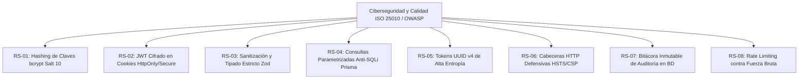

# ESPECIFICACIÓN DE REQUERIMIENTOS DE SOFTWARE (SRS) - MVP
## Estándar IEEE 830 / ISO/IEC/IEEE 29148 / OWASP Top 10
### Proyecto: Sistema Autónomo de Gestión Operativa, Trazabilidad, Medición de Horas Utilizadas de TI y Centro de Operaciones (SOC)

---

## 1. Introducción y Propósito del Sistema

### 1.1 Naturaleza del Producto: Producto Mínimo Viable (MVP)
El presente software constituye un **Producto Mínimo Viable (MVP)** funcional, modular y desacoplado (*White-Label*), concebido para digitalizar, gobernar y auditar la totalidad de los flujos operacionales críticos en auditorios, aulas magnas y salas de conferencias de alta demanda bajo **estándares internacionales de ciberseguridad (OWASP Top 10 / ISO 27001)**, medición exacta de **horas de soporte TI utilizadas** y un **Centro de Control de Operaciones y Seguridad (SOC)**.

### 1.2 Justificación Operativa y Problemática Raíz
El diseño de los requerimientos de este MVP responde a la mitigación directa de cinco dolores operacionales y de seguridad críticos:
1. **Ineficiencia Crítica y Falta de Registro de Horas de TI:** En sistemas convencionales, los técnicos perdían hasta 1 hora en sitio esperando a expositores retrasados sin registrar el tiempo real utilizado. La solución implementa **Check-in/out por QR móvil** que valida el acceso en menos de 30 segundos y computa con precisión matemática las **horas hombre de TI utilizadas por evento**.
2. **Falta de Coordinación con Servicios de Apoyo:** Personal de aseo y guardia no recibía la información a tiempo para planificar limpieza y aperturas. La solución integra **difusión automática por áreas (`EmailSubscription`)**.
3. **Cancelaciones Imprevistas y No-Shows:** Profesores solicitaban el auditorio a última hora o no se presentaban. La solución introduce **confirmación anticipada por token sin login** y el **algoritmo de penalización de prioridad (*PriorityScore*)**.
4. **Carencia de Métricas Cuantitativas:** Históricamente solo existían quejas subjetivas. La solución incorpora un **Dashboard de Analítica en tiempo real** con balance de horas utilizadas de TI, tasas de ocupación efectiva y **Encuesta de Calidad por Estrellas (1-5)** con cálculo de Net Promoter Score (NPS).
5. **Ceguera de Seguridad y Falta de Observabilidad (SOC):** Inexistencia de registros de accesos no autorizados, ataques de fuerza bruta o intentos de fraude. La solución incorpora un **Centro de Control de Ciberseguridad (SOC Dashboard)** con telemetría en tiempo real y bitácora de auditoría inmutable.

---

## 2. Matriz de Roles y Actores del MVP (RBAC)

| Rol | Identificador | Nivel | Responsabilidades y Alcance Operativo |
| :--- | :---: | :---: | :--- |
| **Super Administrador** | `OWNER` | 6 | Control total del sistema, auditoría de logs, bypass de contingencia (`MASTER-CODE`), Centro de Control SOC y configuración de plataforma. |
| **Administrador TI** | `IT_ADMIN` | 5 | Gestión técnica, catálogo de inventario audiovisual, asignación de técnicos, balance de horas utilizadas de TI y telemetría de ciberseguridad. |
| **Soporte Técnico en Terreno** | `IT_SERVICE` | 4 | Validación física de llegada de expositores mediante escaneo QR móvil en < 30s, entrega/recepción de equipamiento y registro de horas de soporte. |
| **Encargado de Auditorio** | `ASSISTANT` | 3 | Revisión de solicitudes, aprobación/aplazamiento/rechazo y coordinación logística de aperturas. |
| **Docente / Expositor** | `PROFESSOR` | 2 | Solicitud de espacios con requerimientos técnicos, confirmación/liberación rápida por correo y evaluación de satisfacción. |
| **Visor General / Estudiante** | `STUDENT` | 1 | Consulta de solo lectura de la cartelera pública de eventos confirmados. |

---

## 3. Catálogo de Requerimientos Funcionales del MVP (RF)

### 3.1 Módulo de Autenticación, Sesiones y Ciberseguridad
* **RF-01: Autenticación Multi-Rol y Sesiones Seguras**
  * *Actor:* Todos los roles.
  * *Descripción:* Inicio de sesión con usuario/correo y contraseña cifrada mediante `bcrypt` (cost factor >= 10). Emisión de tokens de sesión JWT cifrados (JWE) almacenados en cookies `HttpOnly`, `Secure` y `SameSite=Lax`.
  * *Regla de Negocio:* Si un usuario posee rol `OWNER` o utiliza el Código Maestro de contingencia, se otorga acceso de superusuario con registro en bitácora de auditoría.

* **RF-02: Control de Acceso Basado en Roles (RBAC)**
  * *Actor:* Middleware del Sistema.
  * *Descripción:* Verificación en servidor de los privilegios del usuario autenticado antes de ejecutar cualquier Server Action o renderizar rutas protegidas. Retorna HTTP 403 Forbidden en caso de privilegios insuficientes y dispara un evento de alerta al SOC.

### 3.2 Módulo de Gestión de Solicitudes y Prevención de Conflictos
* **RF-03: Solicitud de Auditorio con Requerimientos Técnicos**
  * *Actor:* `PROFESSOR`, `ASSISTANT`, `IT_ADMIN`, `OWNER`.
  * *Descripción:* Formulario interactivo en etapas para solicitar reservas especificando: fecha/hora de inicio y fin, facultad/área, número de asistentes y selección modular de equipamiento:
    * *Audio:* Micrófonos inalámbricos (cantidad), solapa/lavalier, micrófonos fijos con pedestal.
    * *Video:* Proyector, transmisión streaming en vivo, grabación de video, registro fotográfico, laptop de apoyo.
    * *Mobiliario y Protocolo:* Podio, mantelería, banderas protocolares, dispensador de agua, mesas adicionales.
    * *Servicios Generales:* Coffee break, solicitud de aseo previo y aseo posterior.

* **RF-04: Algoritmo Anti-Colisiones de Horario en Base de Datos**
  * *Actor:* Sistema (PostgreSQL / Prisma).
  * *Descripción:* Verificación transaccional atómica para impedir que se apruebe o solicite un evento en un intervalo $[T_{inicio}, T_{fin}]$ que intersecte con otra reserva en estado `APPROVED` o `CHECKED_IN`.
  * *Condición de Conflicto:* $\max(T_{inicio1}, T_{inicio2}) < \min(T_{fin1}, T_{fin2})$.

* **RF-05: Algoritmo de Prioridad Dinámica (*PriorityScore*)**
  * *Actor:* Sistema.
  * *Descripción:* Cada solicitante inicia con un puntaje de 100 puntos. En caso de solicitudes concurrentes sobre un mismo bloque, el sistema prioriza al solicitante con mejor puntuación.
  * *Regla de Penalización:* Cada evento clasificado como `NO_SHOW` (no presentación sin aviso) descuenta 20 puntos del puntaje del usuario de forma irreversible.

### 3.3 Módulo de Dictamen y Gestión Logística
* **RF-06: Panel de Revisión y Dictamen Administrativo**
  * *Actor:* `ASSISTANT`, `IT_ADMIN`, `OWNER`.
  * *Descripción:* Visualización de solicitudes pendientes (`PENDING`) con opciones de:
    * **Aprobar (`APPROVED`):** Confirma la reserva, genera código QR criptográfico único y token de confirmación.
    * **Aplazar (`POSTPONED`):** Propone una fecha u hora alternativa enviando una notificación explicativa al usuario.
    * **Rechazar (`REJECTED`):** Descarta la solicitud especificando el motivo formal.

* **RF-07: Confirmación y Cancelación Rápida por Token (Anti No-Show)**
  * *Actor:* `PROFESSOR`.
  * *Descripción:* Despacho automático de correo de confirmación 48 horas y 24 horas antes del evento con botones de acción directa firmados criptográficamente:
    1. *Confirmar Asistencia:* Marca `confirmedByUser = true`.
    2. *Liberar Espacio:* Cambia estado a `REJECTED` / `CANCELLED`, liberando el auditorio inmediatamente para otros usuarios.

### 3.4 Módulo de Validación en Sitio (QR Dinámico y Cómputo de Horas TI)
* **RF-08: Emisión de Códigos QR Criptográficos Únicos**
  * *Actor:* Sistema.
  * *Descripción:* Generación de un token UUID v4 codificado en formato QR dinámico de alta densidad, adjunto a la vista web del solicitante y a su comprobante por correo.

* **RF-09: Validación Presencial de Check-in en Menos de 30 Segundos**
  * *Actor:* `IT_SERVICE`, `IT_ADMIN`, `OWNER`.
  * *Descripción:* Al llegar el expositor al auditorio, el técnico de TI escanea el código QR utilizando la cámara de su smartphone. El sistema valida el token en tiempo real, transiciona el estado a `CHECKED_IN`, inicia el cómputo de horas de soporte y registra la marca temporal exacta (`checkInTime`) y el ID del técnico validador (`checkedInBy`), eliminando las esperas pasivas de TI.

* **RF-10: Validación de Check-out y Cierre de Horas Utilizadas de TI**
  * *Actor:* `IT_SERVICE`, `IT_ADMIN`, `OWNER`.
  * *Descripción:* Al finalizar el evento, el técnico vuelve a escanear el QR o pulsa el botón de cierre, confirmando la devolución íntegra de equipos. Se transiciona a `CHECKED_OUT`, se registran `checkoutTime` y `checkedOutBy`, y el sistema computa las **horas hombre exactas de TI utilizadas** ($\Delta T = checkoutTime - checkInTime$).

### 3.5 Módulo de Encuestas Cuantitativas y Dashboard Operativo
* **RF-11: Encuesta Cuantitativa de Satisfacción Post-Evento**
  * *Actor:* `PROFESSOR`.
  * *Descripción:* Tras el Check-out, el sistema despliega una encuesta de 3 parámetros evaluados de 1 a 5 estrellas:
    1. Satisfacción General del Evento (`ratingOverall`).
    2. Rendimiento y Estado del Equipamiento Técnico (`ratingEquipment`).
    3. Trato y Rapidez del Soporte TI (`ratingSupport`).
    4. Observaciones cualitativas opcionales (`feedbackComment`).

* **RF-12: Panel de Analítica Operativa, Horas de TI Utilizadas y KPIs**
  * *Actor:* `IT_ADMIN`, `OWNER`.
  * *Descripción:* Visualización gráfica de métricas consolidadas: porcentaje de ocupación semanal, balance de horas hombre utilizadas de TI por carrera/evento, índice de No-Shows, cálculo automático de Net Promoter Score (NPS) y equipos con mayor tasa de fallas.

### 3.6 Módulo de Inventario y Difusión a Servicios de Apoyo
* **RF-13: Catálogo y Control de Disponibilidad de Equipos**
  * *Actor:* `IT_ADMIN`, `OWNER`, `IT_SERVICE`.
  * *Descripción:* Administración del stock de equipamiento técnico (`AUDIO`, `PROJECTION`, `FURNITURE`, `CONNECTIVITY`, `OTHER`) con bloqueo automático de asignación para ítems en mantenimiento.

* **RF-14: Difusión Automática a Unidades de Apoyo (Aseo, Guardia, TI)**
  * *Actor:* Sistema / `OWNER`.
  * *Descripción:* Gestión de listas de suscripción (`EmailSubscription`) por departamentos (`ASEO`, `GUARDIA`, `TI`, `SECRETARIA`) que reciben cronogramas automatizados con requerimientos especiales (ej. necesidad de limpieza previa o coffee break) para coordinar oportunamente su trabajo.

### 3.7 Módulo de Centro de Control de Ciberseguridad (SOC Dashboard)
* **RF-15: Monitoreo y Contador de Ataques y Accesos No Deseados**
  * *Actor:* `IT_ADMIN`, `OWNER`.
  * *Descripción:* Panel gráfico en tiempo real que contabiliza y grafica eventos de seguridad:
    * Intentos fallidos de inicio de sesión y bloqueos por fuerza bruta.
    * Accesos denegados por falta de privilegios (403 Forbidden).
    * Intentos de validación de códigos QR expirados, duplicados o falsificados.
    * Registro de uso del Código Maestro de bypass.
  * *Visualización:* Gráficos de series de tiempo, semáforo de estado de amenaza (`VERDE - Normal`, `AMARILLO - Advertencia`, `ROJO - Bajo Ataque`) y distribución de eventos.

* **RF-16: Explorador y Bitácora de Telemetría de Auditoría (Audit Log Explorer)**
  * *Actor:* `OWNER`, `IT_ADMIN`.
  * *Descripción:* Tabla interactiva con filtros avanzados por nivel de severidad (`INFO`, `WARN`, `SECURITY_ALERT`, `CRITICAL`), fecha, usuario e IP de origen, permitiendo a los desarrolladores y administradores identificar la causa raíz de cualquier anomalía de forma instantánea.

---

## 4. Requerimientos Específicos de Ciberseguridad (RS) y RNF (ISO 25010 / OWASP)

### 4.1 Ciberseguridad y Protección de Datos Sensibles (Security)
* **RS-01 (Hashing de Contraseñas):** Las contraseñas de los usuarios nunca se almacenarán en texto plano. Se procesarán mediante el algoritmo `bcrypt` con un factor de costo computacional mínimo de 10 iteraciones.
* **RS-02 (Gestión de Sesión y Cookies Seguras):** Los tokens JWT se firmarán y cifrarán del lado del servidor. Las cookies de sesión deben incluir los flags obligatorios `HttpOnly` (previene acceso desde JavaScript), `Secure` (exclusivo HTTPS) y `SameSite=Lax` (mitiga CSRF).
* **RS-03 (Sanitización y Validación Server-Side):** Todo payload enviado al servidor mediante API o Server Actions debe ser validado con esquemas estrictos de **Zod**, descartando campos no permitidos para mitigar ataques de inyección y Parameter Tampering.
* **RS-04 (Protección contra Inyección SQL):** Se prohíbe la concatenación directa de comandos SQL; el 100% de las mutaciones y consultas a la base de datos se ejecutarán a través del cliente parametrizado de **Prisma ORM**.
* **RS-05 (Entropía en Códigos QR y Tokens de Email):** Los códigos QR dinámicos y los enlaces de confirmación utilizarán tokens UUID v4 criptográficamente seguros generados con el generador de números pseudoaleatorios del sistema operativo (CSPRNG).
* **RS-06 (Cabeceras de Seguridad HTTP):** El servidor debe emitir cabeceras de respuesta HTTP defensivas (`HSTS`, `X-Frame-Options: DENY`, `X-Content-Type-Options: nosniff`, `Referrer-Policy`).
* **RS-07 (Trazabilidad y Bitácora de Auditoría):** Todas las acciones críticas registrarán un evento en la tabla `SecurityAuditLog` con IP, User-Agent, severidad y marca temporal inmutable.
* **RS-08 (Mitigación de Ataques de Fuerza Bruta):** Los endpoints de inicio de sesión y validación de tokens deben implementar mecanismos de limitación de tasa de solicitudes (*Rate Limiting*).

---

## 5. Matriz de Trazabilidad (Requerimientos vs Dolores Operacionales vs Seguridad)

| Código | Requerimiento / Capacidad | Dolor Operacional / Riesgo de Seguridad Resuelto | Criticidad |
| :---: | :--- | :--- | :---: |
| **RF-01** | Autenticación Segura Multi-Rol | Suplantación de identidad / Acceso no autorizado | **Alta** |
| **RF-02** | Control RBAC de 6 Roles | Fuga de privilegios administrativos | **Alta** |
| **RF-03** | Solicitud Modular con Validación Zod | Inyección de datos maliciosos en formularios | **Alta** |
| **RF-04** | Algoritmo Anti-Colisiones Atómico | Solapamiento de reservas en base de datos | **Crítica** |
| **RF-05** | Penalización PriorityScore | Mala praxis docente y reservas fantasmas | **Media** |
| **RF-06** | Dictamen Administrativo Auditado | Falta de control y trazabilidad en decisiones | **Alta** |
| **RF-07** | Confirmación por Token Criptográfico | Cancelaciones tardías sin autenticación pesada | **Alta** |
| **RF-08** | Emisión QR Dinámico UUID v4 | Falsificación de pases de acceso | **Alta** |
| **RF-09** | **Validación Check-in QR < 30 seg** | **Cuello de botella de 1 hora de espera de TI** | **Crítica** |
| **RF-10** | **Validación Check-out y Horas TI** | **Descontrol de horas utilizadas de personal TI** | **Crítica** |
| **RF-11** | Encuesta de Satisfacción Parametrizada | Opiniones subjetivas sin métricas cuantificables | **Media** |
| **RF-12** | **Dashboard de Horas TI y Ocupación** | **Ceguera directiva sobre uso real de recursos técnicos** | **Alta** |
| **RF-13** | Control de Estado de Equipos | Asignación accidental de hardware dañado | **Alta** |
| **RF-14** | **Difusión a Aseo, Guardia y TI** | **Desinformación en cuadrillas de servicios generales** | **Media** |
| **RF-15** | **Monitoreo SOC de Ataques y Accesos** | **Ceguera de ciberseguridad y falta de métricas a largo plazo** | **Crítica** |
| **RF-16** | **Explorador de Bitácora de Telemetría** | **Dificultad para identificar y auditar la causa raíz de fallas** | **Alta** |
| **RS-01** | Cifrado bcrypt (Cost Factor 10) | Robo o filtración de base de datos de credenciales | **Crítica** |
| **RS-02** | Cookies HttpOnly + Secure + SameSite | Ataques XSS y robo de sesiones de usuario | **Crítica** |
| **RS-06** | Cabeceras HSTS + CSP + X-Frame-Options | Ataques de Clickjacking y degradación SSL | **Alta** |
