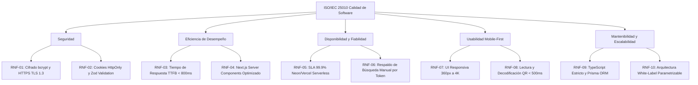

# ESPECIFICACIÓN DE REQUERIMIENTOS DE SOFTWARE (SRS)
## Estándar IEEE 830 / ISO/IEC/IEEE 29148
### Proyecto: Sistema Autónomo de Gestión Operativa, Trazabilidad y Analítica para Auditorios y Espacios Multiuso

---

## 1. Introducción y Propósito del Sistema

### 1.1 Naturaleza del Producto
El sistema es una plataforma web modular, autónoma y desacoplada (*White-Label*), concebida para digitalizar, gobernar y auditar la totalidad de los flujos operacionales en auditorios, aulas magnas y salas de conferencias de alta demanda. No depende de ninguna institución particular y está parametrizado para adaptarse a universidades, centros de formación técnica, centros de eventos y complejos corporativos.

### 1.2 Justificación Operativa y Problemática Raíz
El diseño de los requerimientos de este software responde a la mitigación directa de cuatro dolores operacionales críticos:
1. **Ineficiencia Crítica del Soporte Técnico TI:** En sistemas convencionales, los técnicos perdían hasta 1 hora en sitio esperando a expositores retrasados para entregar equipos. La solución implementa **Check-in/out por QR móvil** que valida el acceso y entrega de equipamiento en menos de 30 segundos.
2. **Falta de Coordinación con Servicios de Apoyo:** Personal de aseo y guardia no recibía la información a tiempo para planificar limpieza y aperturas. La solución integra **difusión automática por áreas (`EmailSubscription`)**.
3. **Cancelaciones Imprevistas y No-Shows:** Profesores solicitaban el auditorio a última hora o no se presentaban. La solución introduce **confirmación anticipada por token sin login** y el **algoritmo de penalización de prioridad (*PriorityScore*)**.
4. **Carencia de Métricas Cuantitativas:** Históricamente solo existían quejas subjetivas. La solución incorpora un **Dashboard de Analítica en tiempo real** y una **Encuesta de Calidad por Estrellas (1-5)** con cálculo de Net Promoter Score (NPS) y horas de ocupación efectiva.

---

## 2. Matriz de Roles y Actores del Sistema (RBAC)

| Rol | Identificador | Nivel | Responsabilidades y Alcance Operativo |
| :--- | :---: | :---: | :--- |
| **Super Administrador** | `OWNER` | 6 | Control total del sistema, auditoría de logs, bypass de contingencia (`MASTER-CODE`) y configuración de plataforma. |
| **Administrador TI** | `IT_ADMIN` | 5 | Gestión técnica, catálogo de inventario audiovisual, asignación de técnicos y analítica de métricas. |
| **Soporte Técnico en Terreno** | `IT_SERVICE` | 4 | Validación física de llegada de expositores mediante escaneo QR móvil en < 30s, entrega y recepción de equipamiento. |
| **Encargado de Auditorio** | `ASSISTANT` | 3 | Revisión de solicitudes, aprobación/aplazamiento/rechazo y coordinación logística de aperturas. |
| **Docente / Expositor** | `PROFESSOR` | 2 | Solicitud de espacios con requerimientos técnicos, confirmación/liberación rápida por correo y evaluación de satisfacción. |
| **Visor General / Estudiante** | `STUDENT` | 1 | Consulta de solo lectura de la cartelera pública de eventos confirmados. |

---

## 3. Catálogo de Requerimientos Funcionales (RF)

### 3.1 Módulo de Autenticación, Sesiones y Seguridad
* **RF-01: Autenticación Multi-Rol y Sesiones Seguras**
  * *Actor:* Todos los roles.
  * *Descripción:* Inicio de sesión con usuario/correo y contraseña cifrada mediante `bcrypt` (cost factor >= 10). Emisión de tokens de sesión JWT cifrados (JWE) almacenados en cookies `HttpOnly` y `SameSite=Lax`.
  * *Regla de Negocio:* Si un usuario posee rol `OWNER` o utiliza el Código Maestro de contingencia, se otorga acceso de superusuario con registro en bitácora de auditoría.

* **RF-02: Control de Acceso Basado en Roles (RBAC)**
  * *Actor:* Middleware del Sistema.
  * *Descripción:* Verificación en servidor de los privilegios del usuario autenticado antes de ejecutar cualquier Server Action o renderizar rutas protegidas. Retorna HTTP 403 Forbidden en caso de privilegios insuficientes.

### 3.2 Módulo de Gestión de Solicitudes y Prevención de Conflictos
* **RF-03: Solicitud de Auditorio con Requerimientos Técnicos**
  * *Actor:* `PROFESSOR`, `ASSISTANT`, `IT_ADMIN`, `OWNER`.
  * *Descripción:* Formulario interactivo en etapas para solicitar reservas especificando: fecha/hora de inicio y fin, facultad/área, número de asistentes y selección modular de equipamiento:
    * *Audio:* Micrófonos inalámbricos (cantidad), solapa/lavalier, micrófonos fijos con pedestal.
    * *Video:* Proyector, transmisión streaming en vivo, grabación de video, registro fotográfico, laptop de apoyo.
    * *Mobiliario y Protocolo:* Podio, mantelería, banderas protocolares, dispensador de agua, mesas adicionales.
    * *Servicios Generales:* Coffee break, solicitud de aseo previo y aseo posterior.

* **RF-04: Algoritmo Anti-Colisiones de Horario en Base de Datos**
  * *Actor:* Sistema (PostgreSQL / Prisma).
  * *Descripción:* Verificación transaccional atómica para impedir que se apruebe o solicite un evento en un intervalo $[T_{inicio}, T_{fin}]$ que intersecte con otra reserva en estado `APPROVED` o `CHECKED_IN`.
  * *Condición de Conflicto:* $\max(T_{inicio1}, T_{inicio2}) < \min(T_{fin1}, T_{fin2})$.

* **RF-05: Algoritmo de Prioridad Dinámica (*PriorityScore*)**
  * *Actor:* Sistema.
  * *Descripción:* Cada solicitante inicia con un puntaje de 100 puntos. En caso de solicitudes concurrentes sobre un mismo bloque, el sistema prioriza al solicitante con mejor puntuación.
  * *Regla de Penalización:* Cada evento clasificado como `NO_SHOW` (no presentación sin aviso) descuenta 20 puntos del puntaje del usuario de forma irreversible.

### 3.3 Módulo de Dictamen y Gestión Logística
* **RF-06: Panel de Revisión y Dictamen Administrativo**
  * *Actor:* `ASSISTANT`, `IT_ADMIN`, `OWNER`.
  * *Descripción:* Visualización de solicitudes pendientes (`PENDING`) con opciones de:
    * **Aprobar (`APPROVED`):** Confirma la reserva, genera código QR criptográfico único y token de confirmación.
    * **Aplazar (`POSTPONED`):** Propone una fecha u hora alternativa enviando una notificación explicativa al usuario.
    * **Rechazar (`REJECTED`):** Descarta la solicitud especificando el motivo formal.

* **RF-07: Confirmación y Cancelación Rápida por Token (Anti No-Show)**
  * *Actor:* `PROFESSOR`.
  * *Descripción:* Despacho automático de correo de confirmación 48 horas y 24 horas antes del evento con botones de acción directa firmados criptográficamente:
    1. *Confirmar Asistencia:* Marca `confirmedByUser = true`.
    2. *Liberar Espacio:* Cambia estado a `REJECTED` / `CANCELLED`, liberando el auditorio inmediatamente para otros usuarios.

### 3.4 Módulo de Validación en Sitio (QR Dinámico Check-in / Check-out)
* **RF-08: Emisión de Códigos QR Criptográficos Únicos**
  * *Actor:* Sistema.
  * *Descripción:* Generación de un token UUID v4 codificado en formato QR dinámico de alta densidad, adjunto a la vista web del solicitante y a su comprobante por correo.

* **RF-09: Validación Presencial de Check-in en Menos de 30 Segundos**
  * *Actor:* `IT_SERVICE`, `IT_ADMIN`, `OWNER`.
  * *Descripción:* Al llegar el expositor al auditorio, el técnico de TI escanea el código QR utilizando la cámara de su smartphone. El sistema valida el token en tiempo real, transiciona el estado a `CHECKED_IN` y registra la marca temporal exacta (`checkInTime`) y el ID del técnico validador (`checkedInBy`), eliminando las esperas pasivas de TI.

* **RF-10: Validación de Check-out y Control de Devolución de Activos**
  * *Actor:* `IT_SERVICE`, `IT_ADMIN`, `OWNER`.
  * *Descripción:* Al finalizar el evento, el técnico vuelve a escanear el QR o pulsa el botón de cierre, confirmando la devolución íntegra de equipos. Se transiciona a `CHECKED_OUT` y se registran `checkoutTime` y `checkedOutBy`.

### 3.5 Módulo de Encuestas Cuantitativas y Dashboard de Métricas
* **RF-11: Encuesta Cuantitativa de Satisfacción Post-Evento**
  * *Actor:* `PROFESSOR`.
  * *Descripción:* Tras el Check-out, el sistema despliega una encuesta de 3 parámetros evaluados de 1 a 5 estrellas:
    1. Satisfacción General del Evento (`ratingOverall`).
    2. Rendimiento y Estado del Equipamiento Técnico (`ratingEquipment`).
    3. Trato y Rapidez del Soporte TI (`ratingSupport`).
    4. Observaciones cualitativas opcionales (`feedbackComment`).

* **RF-12: Panel de Analítica Operativa y KPIs en Tiempo Real**
  * *Actor:* `IT_ADMIN`, `OWNER`.
  * *Descripción:* Visualización gráfica de métricas consolidadas: porcentaje de ocupación semanal, índice de No-Shows, cálculo automático de Net Promoter Score (NPS), horas hombre ahorradas en soporte técnico y equipos con mayor tasa de fallas.

### 3.6 Módulo de Inventario y Difusión a Servicios de Apoyo
* **RF-13: Catálogo y Control de Disponibilidad de Equipos**
  * *Actor:* `IT_ADMIN`, `OWNER`, `IT_SERVICE`.
  * *Descripción:* Administración del stock de equipamiento técnico (`AUDIO`, `PROJECTION`, `FURNITURE`, `CONNECTIVITY`, `OTHER`) con bloqueo automático de asignación para ítems en mantenimiento.

* **RF-14: Difusión Automática a Unidades de Apoyo (Aseo, Guardia, TI)**
  * *Actor:* Sistema / `OWNER`.
  * *Descripción:* Gestión de listas de suscripción (`EmailSubscription`) por departamentos (`ASEO`, `GUARDIA`, `TI`, `SECRETARIA`) que reciben cronogramas automatizados con requerimientos especiales (ej. necesidad de limpieza previa o cofee break) para coordinar oportunamente su trabajo.

---

## 4. Requerimientos No Funcionales (RNF) bajo Estándar ISO/IEC 25010

### 4.1 Seguridad (Security)
* **RNF-01:** Hasheo de credenciales con `bcrypt` y tránsito exclusivo bajo HTTPS con TLS 1.3.
* **RNF-02:** Tokens JWT firmados criptográficamente y protegidos en cookies `HttpOnly` y `SameSite=Lax`. Validación estricta de payloads en servidor con Zod.

### 4.2 Eficiencia de Desempeño (Performance Efficiency)
* **RNF-03:** Tiempo de respuesta del servidor (TTFB) menor a 800 ms en consultas de calendario e inventario.
* **RNF-04:** Renderizado del lado del servidor (SSR) en Next.js para optimizar métricas Core Web Vitals (FCP < 1.2s, LCP < 2.0s).

### 4.3 Disponibilidad y Fiabilidad (Reliability)
* **RNF-05:** Disponibilidad del servicio del 99.9% sobre infraestructura serverless en Vercel y Neon Cloud.
* **RNF-06:** En caso de fallas de cámara en dispositivos móviles de los técnicos, el sistema permite la búsqueda y validación manual por código de token alfanumérico sin interrumpir la operación.

### 4.4 Usabilidad y Accesibilidad (Usability)
* **RNF-07:** Interfaz 100% responsiva (Mobile-First) diseñada para operar en pantallas desde 360px (móviles de técnicos en terreno) hasta estaciones de podio y monitores de recepción.
* **RNF-08:** Tiempo de lectura, enfoque y decodificación de códigos QR inferior a 500 ms en condiciones normales de iluminación.

### 4.5 Mantenibilidad y Portabilidad (Maintainability)
* **RNF-09:** Código fuente en TypeScript con modo estricto (`strict: true`), tipado integral de base de datos generado por Prisma Client.
* **RNF-10:** Arquitectura agnóstica de marca (*White-Label*), permitiendo cambiar colores institucionales, logotipos y nombres de recintos mediante variables de configuración sin alterar el código base.

---

## 5. Matriz de Trazabilidad (Requerimientos vs Dolores Operacionales vs Competencias)

| Código RF | Dolor Operacional Resuelto | Competencia del Perfil de Egreso | Criticidad |
| :---: | :--- | :--- | :---: |
| **RF-01** | Acceso no autorizado / Suplantación | Competencia 4: Desarrollo e Integración de Software | **Alta** |
| **RF-02** | Fuga de privilegios entre perfiles | Competencia 4: Desarrollo e Integración de Software | **Alta** |
| **RF-03** | Solicitudes desordenadas de equipamiento | Competencia 4: Desarrollo e Integración de Software | **Alta** |
| **RF-04** | Solapamiento y cruce de reservas | Competencia 3: Modelos de Datos Escalables | **Crítica** |
| **RF-05** | No-Shows y mala praxis docente | Competencia 2: Gestión y Toma de Decisiones | **Media** |
| **RF-06** | Falta de control administrativo | Competencia 2: Gestión de Proyectos Informáticos | **Alta** |
| **RF-07** | Cancelaciones imprevistas de último minuto | Competencia 4: Desarrollo e Integración de Software | **Alta** |
| **RF-08** | Inseguridad en tickets de acceso | Competencia 4: Desarrollo e Integración de Software | **Alta** |
| **RF-09** | **Pérdida de 1h de espera de técnicos TI** | Competencia 1: Pruebas y Certificación de Procesos | **Crítica** |
| **RF-10** | Extravío de equipamiento audiovisual | Competencia 1: Pruebas y Certificación de Procesos | **Crítica** |
| **RF-11** | Opiniones subjetivas sin datos duros | Competencia 1: Pruebas y Calidad de Software | **Media** |
| **RF-12** | Ceguera directiva sobre uso y KPIs | Competencia 2: Gestión y Toma de Decisiones | **Alta** |
| **RF-13** | Asignación de equipos en mal estado | Competencia 3: Modelos de Datos Escalables | **Alta** |
| **RF-14** | **Desinformación en Aseo, Guardia y TI** | Competencia 4: Desarrollo e Integración de Software | **Media** |
