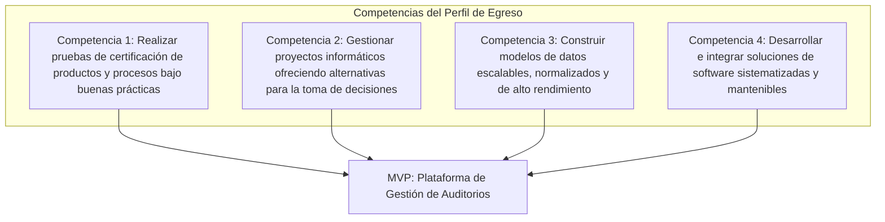
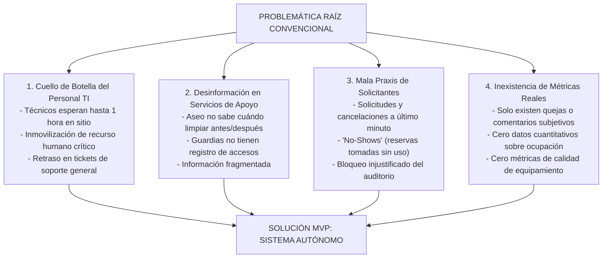
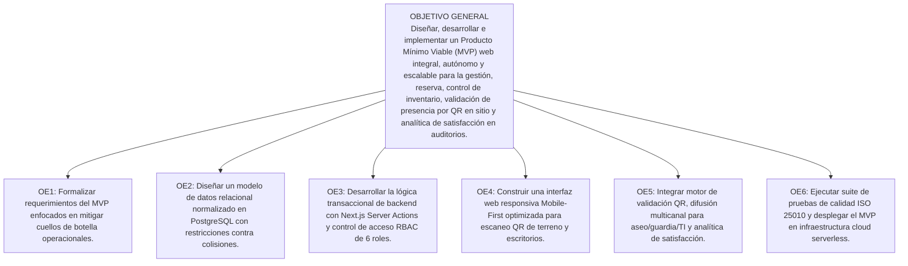
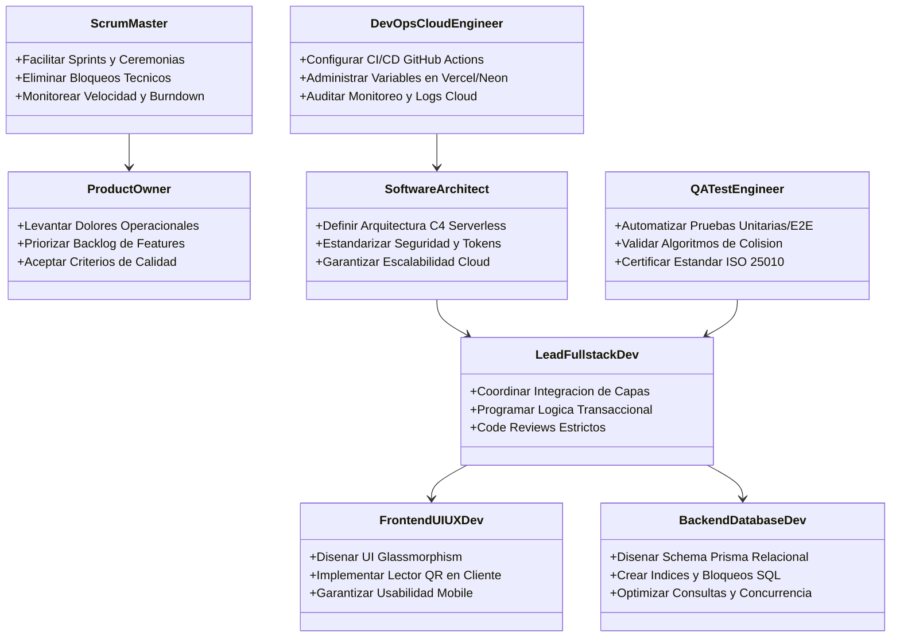
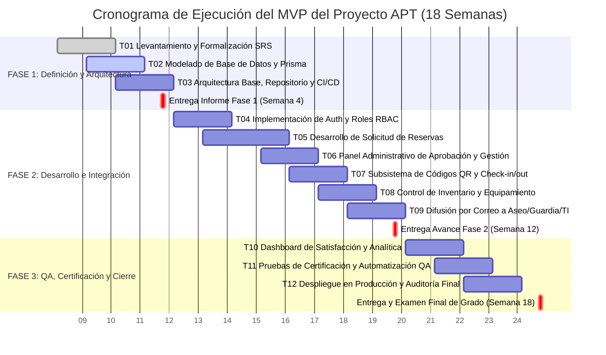
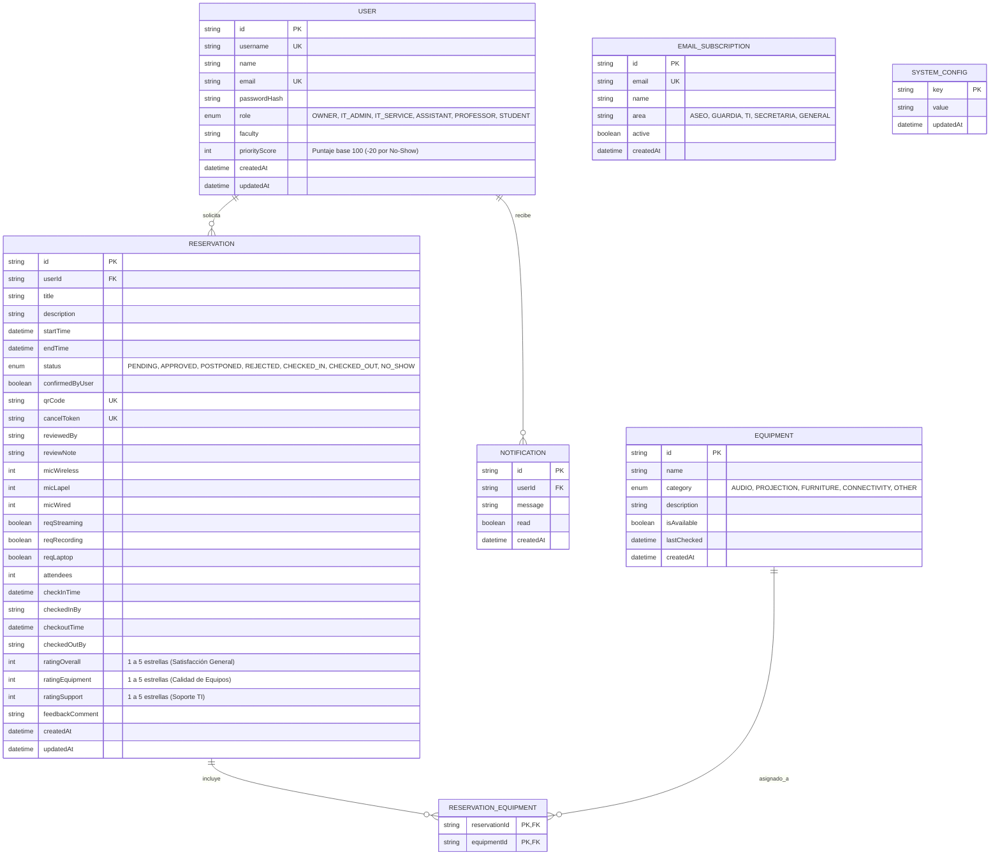

# INFORME DE INGENIERÍA - FASE 1: DEFINICIÓN DEL PROYECTO APT
## Asignatura: Capstone (PTY4614) - Portafolio de Título
### Sistema Autónomo de Gestión Operativa, Trazabilidad en Tiempo Real y Analítica para Auditorios y Espacios Multiuso

---

**Datos del Estudiante y del Proyecto:**
* **Nombre del Estudiante:** Benjamín Mandujano
* **Carrera:** Ingeniería en Informática / Análisis Programador
* **Sede:** Sede La Florida
* **Asignatura:** Proyecto Capstone / Portafolio de Título (PTY4614)
* **Docente Guía / Comisión Evaluadora:** Comisión de Evaluación de Proyectos de Título
* **Fecha de Entrega:** Semestre Académico 2026 - Fase 1 (Semana 4)
* **Naturaleza del Entregable:** Producto Mínimo Viable (MVP) Operativo de Alta Fidelidad
* **Repositorio Público de Evidencias:** [https://github.com/IMANDOI/sistema-gestion-auditorios-capstone](https://github.com/IMANDOI/sistema-gestion-auditorios-capstone)

---

## Resumen Ejecutivo

El presente proyecto de titulación nace a partir de una problemática operacional empírica y crítica experimentada en la gestión de espacios comunes y auditorios de alta demanda: la absoluta descoordinación logística, el uso ineficiente del recurso humano técnico y la inexistencia de métricas cuantitativas de servicio. En la operación convencional, los procesos basados en planillas informales, correos y mensajería provocan constantes solicitudes de último minuto, cancelaciones imprevistas sin aviso ("No-Shows") y una grave brecha de comunicación que deja desinformados al personal de aseo, seguridad y administración. Especialmente crítico es el impacto sobre las unidades de Soporte TI, donde los técnicos solían perder hasta una hora completa en sitio esperando la llegada de expositores para validar accesos y entregar equipos, paralizando la atención de otros incidentes en el recinto.

Para erradicar esta raíz del problema, se diseña e implementa un **Producto Mínimo Viable (MVP)** funcional, modular y desacoplado de cualquier institución particular (arquitectura *white-label* escalable). Este MVP no pretende ser la versión final definitiva con todas las integraciones corporativas futuras, sino una versión funcional estratégica enfocada en validar y resolver los dolores operacionales críticos inmediatos:
1. **Subsistema Criptográfico de Check-in/Check-out mediante Códigos QR Dinámicos:** Reduce el tiempo de recepción y entrega de 60 minutos a menos de 30 segundos, registrando marcas temporales exactas y trazabilidad de activos audiovisuales.
2. **Motor Automatizado de Difusión Multicanal por Áreas:** Distribuye listas operativas automáticas a los equipos de aseo, guardias, TI y administración.
3. **Mecanismos de Confirmación Anticipada y Penalización de Prioridad:** Desincentiva reservas fantasmas y optimiza el uso del espacio mediante un algoritmo de prioridad docente (*PriorityScore*).
4. **Dashboard de Analítica Cuantitativa y Panel de Satisfacción Inmediata:** Transforma comentarios cualitativos en datos duros de rendimiento, tasas de ocupación, NPS y eficiencia operativa.

La solución se construye sobre Next.js 15, Prisma ORM y PostgreSQL serverless en Neon Cloud, bajo una metodología ágil Scrum que simula una célula de ingeniería de software de 8 roles, garantizando el cumplimiento de los estándares ISO/IEC 25010 y las 4 competencias clave del perfil de egreso.

---

## Tabla de Contenidos
1. [PARTE I: Definición y Fundamentación del Proyecto APT](#parte-i-definición-y-fundamentación-del-proyecto-apt)
   * 1.1 [Antecedentes del Postulante e Independencia Institucional](#11-antecedentes-del-postulante-e-independencia-institucional)
   * 1.2 [Definición y Alcance del Producto Mínimo Viable (MVP)](#12-definición-y-alcance-del-producto-mínimo-viable-mvp)
   * 1.3 [Áreas de Desempeño y Competencias del Perfil de Egreso](#13-áreas-de-desempeño-y-competencias-del-perfil-de-egreso)
   * 1.4 [Fundamentación: Análisis Exhaustivo de la Problemática Raíz](#14-fundamentación-análisis-exhaustivo-de-la-problemática-raíz)
   * 1.5 [Pertinencia con el Perfil de Egreso](#15-pertinencia-con-el-perfil-de-egreso)
   * 1.6 [Relación con los Intereses Profesionales](#16-relación-con-los-intereses-profesionales)
   * 1.7 [Estudio de Factibilidad Técnica, Operativa, Económica y Temporal](#17-estudio-de-factibilidad-técnica-operativa-económica-y-temporal)
2. [PARTE II: Planificación de Ingeniería, Metodología y Gestión](#parte-ii-planificación-de-ingeniería-metodología-y-gestión)
   * 2.1 [Definición de Objetivos (General y Específicos)](#21-definición-de-objetivos-general-y-específicos)
   * 2.2 [Metodología de Desarrollo y Estructura Organizacional (Equipo Simulado de 8 Roles)](#22-metodología-de-desarrollo-y-estructura-organizacional-equipo-simulado-de-8-roles)
   * 2.3 [Matriz de Evidencias e Hitos Evaluativos](#23-matriz-de-evidencias-e-hitos-evaluativos)
   * 2.4 [Plan de Trabajo Detallado](#24-plan-de-trabajo-detallado)
   * 2.5 [Carta Gantt del Ciclo Académico (18 Semanas)](#25-carta-gantt-del-ciclo-académico-18-semanas)
3. [PARTE III: Arquitectura de la Solución y Modelado Conceptual](#parte-iii-arquitectura-de-la-solución-y-modelado-conceptual)
   * 3.1 [Diagrama de Casos de Uso del Negocio](#31-diagrama-de-casos-de-uso-del-negocio)
   * 3.2 [Arquitectura de Contenedores y Flujo de Datos (C4 Model)](#32-arquitectura-de-contenedores-y-flujo-de-datos-c4-model)
   * 3.3 [Modelo Entidad-Relación y Estructura de Datos](#33-modelo-entidad-relación-y-estructura-de-datos)
4. [PARTE IV: Roadmap Evolutivo y Conclusiones Académicas](#parte-iv-roadmap-evolutivo-y-conclusiones-académicas)
   * 4.1 [Límites del MVP vs Roadmap Post-Proyecto](#41-límites-del-mvp-vs-roadmap-post-proyecto)
   * 4.2 [Conclusiones Generales del Informe](#42-conclusiones-generales-del-informe)
   * 4.3 [Conclusiones Individuales del Proyecto](#43-conclusiones-individuales-del-proyecto)
   * 4.4 [Reflexión Profesional](#44-reflexión-profesional)
5. [PARTE V: Referencias Bibliográficas y Estándares](#parte-v-referencias-bibliográficas-y-estándares)

---

# PARTE I: Definición y Fundamentación del Proyecto APT

## 1.1 Antecedentes del Postulante e Independencia Institucional

| Campo | Detalle Institucional / Académico |
| :--- | :--- |
| **Estudiante Postulante** | Benjamín Mandujano |
| **Carrera** | Ingeniería en Informática |
| **Asignatura** | PTY4614 - Capstone / Portafolio de Título |
| **Sede** | Sede La Florida |
| **Tipo de Solución** | Producto Mínimo Viable (MVP) de Arquitectura *White-Label* |
| **Repositorio Oficial de Avances** | `https://github.com/IMANDOI/sistema-gestion-auditorios-capstone` |

> [!NOTE]
> **Aclaración de Alcance y Definición como MVP:**
> El sistema desarrollado en el marco de esta asignatura corresponde formalmente a un **Producto Mínimo Viable (MVP)**. Su objetivo es implementar el conjunto nuclear de funcionalidades que permitan validar y resolver en un entorno operacional real los cuatro problemas críticos detectados (cuello de botella de TI, desinformación de aseo/guardia, cancelaciones tardías y falta de métricas duras). No constituye un producto cerrado o inmutable, sino una base sólida y escalable para futuras versiones comerciales y corporativas.

## 1.2 Definición y Alcance del Producto Mínimo Viable (MVP)
El MVP contempla la digitalización y automatización del flujo esencial del auditorio:


## 1.3 Áreas de Desempeño y Competencias del Perfil de Egreso

El desarrollo del proyecto cubre de manera demostrable las cuatro competencias fundamentales del perfil de egreso:



1. **Competencia 1 - Aseguramiento de Calidad y Pruebas (QA):** Pruebas unitarias de algoritmos de colisión de horarios, pruebas de integración de Server Actions y pruebas de estrés para lectura concurrente de códigos QR en terreno.
2. **Competencia 2 - Gestión de Proyectos Informáticos:** Planificación bajo Scrum con estimación en Story Points, gestión de riesgos de concurrencia y control de Carta Gantt en 18 semanas.
3. **Competencia 3 - Construcción de Modelos de Datos Escalables:** Esquema relacional en 3FN en PostgreSQL (Neon), índices B-Tree en campos críticos de búsqueda temporal y restricciones de integridad referencial modeladas en Prisma ORM.
4. **Competencia 4 - Desarrollo e Integración de Software:** Construcción Fullstack moderna en Next.js 15 (React 19 Server Components), autenticación NextAuth con RBAC de 6 niveles, integración de correos automáticos por áreas y generación criptográfica de tokens QR.

---

## 1.4 Fundamentación: Análisis Exhaustivo de la Problemática Raíz

La génesis de este proyecto radica en la observación directa y vivencial de las ineficiencias críticas que sufren las organizaciones al gestionar espacios de alta demanda mediante métodos convencionales:



### 1. El Cuello de Botella del Personal de Soporte TI (Impacto Crítico de Productividad)
En los sistemas manuales, cuando un docente o expositor reserva el auditorio a las 09:00 hrs, el técnico de TI debe apersonarse con antelación para abrir la cabina, encender proyectores y micrófonos. No obstante, en la práctica el expositor suele retrasarse 30, 45 o hasta 60 minutos. Durante todo ese tiempo, el personal de TI quedaba inmovilizado físicamente en el auditorio esperando la llegada del usuario, imposibilitado de resolver tickets de soporte en otras salas o laboratorios.
* **Solución del MVP:** El **subsistema de validación QR dinámico** automatiza el Check-in. El técnico únicamente acude cuando el expositor está presente o valida la entrega en menos de 30 segundos mediante escaneo móvil. Si el expositor no llega en la ventana de tolerancia (15 minutos), el sistema marca automáticamente `NO_SHOW`, libera el espacio y notifica al técnico para que continúe con sus labores.

### 2. Desinformación Crónica en las Unidades de Apoyo (Aseo, Guardias y Administración)
En la operación tradicional, la información de reservas quedaba guardada en una planilla privada del encargado. Como consecuencia:
* El personal de **Aseo** no sabía si debía limpiar antes del evento o si habría un coffee break que requiriera aseo posterior.
* El personal de **Guardia y Seguridad** desconocía quiénes eran los expositores externos autorizados para ingresar.
* **Solución del MVP:** Motor de **Listas de Difusión Automática por Área (`EmailSubscription`)**, que despacha notificaciones automáticas y calendarios semanales personalizados a los correos de Aseo, Guardia y Secretaría.

### 3. Cancelaciones Imprevistas y el Fenómeno del "No-Show"
Docentes y coordinadores solían solicitar el auditorio "por si acaso" y luego, al cambiar de planes, no avisaban a nadie. El auditorio permanecía vacío mientras otros docentes que necesitaban el espacio eran rechazados por supuesta falta de cupo.
* **Solución del MVP:**
  * **Confirmación Anticipada por Token Criptográfico (48h / 24h antes):** Un clic en el correo confirma o libera el espacio sin requerir inicio de sesión engorroso.
  * **Algoritmo de Prioridad Docente (*PriorityScore*):** Cada No-Show descuenta 20 puntos del perfil del usuario, relegando sus futuras solicitudes frente a docentes responsables.

### 4. Necesidad de Métricas Cuantitativas (Dashboard de Gestión y Satisfacción)
Las decisiones directivas y la renovación de equipamiento tecnológico solían basarse en "comentarios al pasar" o quejas informales. No existía un registro de si un proyector fallaba repetidamente o si el soporte brindado era óptimo.
* **Solución del MVP:** **Dashboard de Analítica en Tiempo Real** y **Encuesta de Satisfacción Post-Evento (1 a 5 estrellas)** que desglosa:
  * Satisfacción General del Evento (`ratingOverall`).
  * Estado y Rendimiento del Equipamiento Audiovisual (`ratingEquipment`).
  * Eficiencia y Trato del Soporte Técnico TI (`ratingSupport`).
  * Cálculo automatizado de tasa de ocupación efectiva vs horas reservadas.

---

## 1.5 Pertinencia con el Perfil de Egreso
La construcción de este MVP demuestra un dominio integral de las áreas fundamentales de la ingeniería informática:
* **Arquitectura de Software y Seguridad:** Creación de un sistema de control de acceso RBAC de 6 roles (`OWNER`, `IT_ADMIN`, `IT_SERVICE`, `ASSISTANT`, `PROFESSOR`, `STUDENT`) protegido por tokens JWT cifrados (JWE) y cookies de seguridad `HttpOnly`.
* **Modelado de Datos Transaccional:** Prevención de sobre-reserva mediante bloqueos a nivel de base de datos relacional y queries optimizadas mediante Prisma ORM.
* **Ingeniería Web Moderna:** Uso de Next.js 15 con React Server Components para garantizar tiempos de carga inferiores a 1 segundo y soporte para lectura móvil de cámaras en terreno.

## 1.6 Relación con los Intereses Profesionales
Este proyecto consolida mi perfil profesional como **Ingeniero de Software Fullstack y Desarrollador Cloud**, demostrando capacidad para:
* Identificar cuellos de botella operacionales en organizaciones complejas y transformarlos en soluciones automatizadas de alto valor.
* Diseñar arquitecturas web escalables y de costo de infraestructura cero mediante tecnologías serverless de última generación.
* Implementar metodologías de aseguramiento de calidad y buenas prácticas de ingeniería de software reconocidas a nivel global.

## 1.7 Estudio de Factibilidad Técnica, Operativa, Económica y Temporal

| Dimensión de Factibilidad | Análisis de Viabilidad Técnica y Operativa | Estado |
| :--- | :--- | :---: |
| **Factibilidad Técnica** | Stack tecnológico consolidado y probado en producción: Next.js 15, TypeScript, Tailwind CSS, Prisma ORM, PostgreSQL en Neon Serverless y bibliotecas de escaneo QR HTML5 estándar. | **VIABLE (100%)** |
| **Factibilidad Operativa** | Los solicitantes interactúan a través de un navegador web moderno o enlaces de correo; el personal de TI utiliza la cámara de cualquier smartphone corporativo o personal sin instalar software pesado. | **VIABLE (100%)** |
| **Factibilidad Económica** | Arquitectura 100% *Zero-Cost* en fase de despliegue mediante capas gratuitas de alta capacidad (Vercel Serverless Hosting, Neon Cloud PostgreSQL, GitHub Free y Resend/SMTP). Costo inicial: **$0 USD**. | **VIABLE (100%)** |
| **Factibilidad Temporal** | Estructurada rigurosamente en un plan de 18 semanas de desarrollo ágil (Fase 1: Semanas 1-4; Fase 2: Semanas 5-12; Fase 3: Semanas 13-18). | **VIABLE (100%)** |

---

# PARTE II: Planificación de Ingeniería, Metodología y Gestión

## 2.1 Definición de Objetivos (General y Específicos)



### Objetivo General
Diseñar, desarrollar e implementar un Producto Mínimo Viable (MVP) web integral, autónomo y escalable para la gestión de reservas, control de inventario técnico, validación operativa en tiempo real mediante códigos QR y analítica cuantitativa de satisfacción en auditorios y espacios de alta demanda, resolviendo los cuellos de botella de personal técnico y la desinformación en servicios generales.

### Objetivos Específicos
1. **OE1 (Levantamiento y Análisis):** Levantar, formalizar y especificar los requerimientos funcionales, no funcionales y reglas de negocio del MVP, modelando los flujos de Check-in/out, penalización de No-Shows y difusión de calendarios operativos.
2. **OE2 (Modelado de Datos Relacional):** Modelar e implementar un esquema relacional normalizado en 3FN en PostgreSQL (Neon) utilizando Prisma ORM, con índices B-Tree e integridad referencial estricta para garantizar cero colisiones de reservas.
3. **OE3 (Seguridad y Lógica de Negocio):** Implementar la capa de lógica transaccional con Next.js Server Actions y seguridad NextAuth con autenticación JWT y roles RBAC de 6 niveles (`OWNER`, `IT_ADMIN`, `IT_SERVICE`, `ASSISTANT`, `PROFESSOR`, `STUDENT`).
4. **OE4 (Interfaz y Experiencia de Usuario):** Construir una interfaz de usuario moderna con estética Glassmorphism, completamente responsiva y optimizada para dispositivos móviles (cámara QR para técnicos) y paneles de escritorio.
5. **OE5 (Automatización e Integraciones):** Integrar subsistemas de lectura criptográfica de códigos QR, despacho automático de correos por listas de suscripción (Aseo, Guardia, TI) y encuestas de satisfacción inmediata con métricas cuantitativas.
6. **OE6 (Aseguramiento de Calidad y Despliegue):** Ejecutar pruebas unitarias, de integración y rendimiento bajo estándares ISO/IEC 25010, culminando con el despliegue productivo y monitoreo del MVP en Vercel y Neon Cloud.

## 2.2 Metodología de Desarrollo y Estructura Organizacional (Equipo Simulado de 8 Roles)

El proyecto se gestiona mediante el marco **Scrum**, simulando las funciones especializadas de una célula de ingeniería de software de **8 roles clave**:



## 2.3 Matriz de Evidencias e Hitos Evaluativos

| Hito / Entrega | Tipo de Evidencia | Nombre de la Evidencia | Descripción del Entregable | Justificación y Aporte |
| :---: | :---: | :--- | :--- | :--- |
| **Fase 1 (Semana 4)** | **Avance** | **Informe Técnico de Definición y SRS** | Documento exhaustivo con problemática raíz, objetivos, factibilidad, arquitectura, metodología y especificación formal de requerimientos del MVP. | Establece los cimientos teóricos, operativos y de arquitectura sin ambigüedades. |
| **Fase 1 (Semana 4)** | **Avance** | **Modelo Entidad-Relación y Schema Prisma** | Archivo declarativo `schema.prisma` y modelos relacionales normalizados listos para migración a PostgreSQL Neon. | Garantiza la estructura de persistencia para soportar concurrencia y reglas operativas. |
| **Fase 2 (Semana 8)** | **Avance** | **Módulo Core de Auth, RBAC y Reservas** | MVP funcional con inicio de sesión multi-rol, prevención de colisiones de horario y formulario de reservas. | Valida la lógica de negocio central del auditorio. |
| **Fase 2 (Semana 12)** | **Avance** | **Subsistema QR, Check-in/out y Mailing** | Lector QR en tiempo real para técnicos, registro de marcas temporales y despacho automático de correos a Aseo/Guardia. | Elimina el cuello de botella de 1 hora de TI e integra a los servicios de apoyo. |
| **Fase 3 (Semana 16)** | **Final** | **Suite de Pruebas Automatizadas y QA** | Batería de pruebas unitarias y de integración con métricas de cobertura y reporte de aseguramiento de calidad ISO 25010. | Certifica la robustez, seguridad y tolerancia a fallos de la solución. |
| **Fase 3 (Semana 18)** | **Final** | **MVP en Producción y Defensa de Grado** | Despliegue productivo en Vercel/Neon, manual técnico, manual de usuario y presentación final de grado. | Entrega el producto de software totalmente operativo y transferible. |

## 2.4 Plan de Trabajo Detallado

| ID | Actividad / Tarea | Descripción Técnica | Recursos | Duración | Responsable Simulado | Mitigación de Riesgos |
| :---: | :--- | :--- | :--- | :---: | :--- | :--- |
| **T01** | Análisis y Formalización de Requerimientos | Levantamiento de dolores operacionales (TI, aseo, cancelaciones), redacción de casos de uso y SRS del MVP. | Plantillas IEEE 830, herramientas de modelado. | 2 Semanas | Product Owner | *Riesgo:* Alcance difuso.<br>*Mitigación:* Validación mediante matriz de trazabilidad. |
| **T02** | Modelado de Base de Datos y Restricciones | Diseño de esquemas en Prisma, definición de enums (`ReservationStatus`, `Role`, `EquipmentCategory`) e índices B-Tree. | PostgreSQL Neon, Prisma ORM, VS Code. | 2 Semanas | Backend & DB Dev | *Riesgo:* Solapamiento de horarios.<br>*Mitigación:* Restricciones a nivel de base de datos e índices únicos. |
| **T03** | Arquitectura Base, Repositorio y CI/CD | Configuración de Next.js 15, TypeScript estricto, Tailwind CSS y sincronización con GitHub. | GitHub Actions, Vercel CLI, Node.js. | 1 Semana | DevOps Engineer | *Riesgo:* Incompatibilidad de paquetes.<br>*Mitigación:* Lockfile estricto (`package-lock.json`). |
| **T04** | Autenticación y Control de Roles (RBAC) | Configuración de NextAuth, hashing de contraseñas con bcrypt, JWT cifrado y middleware de 6 roles. | NextAuth.js, bcryptjs, Jose. | 2 Semanas | Backend Dev | *Riesgo:* Vulnerabilidad en rutas.<br>*Mitigación:* Middleware centralizado con denegación por defecto. |
| **T05** | Formulario Inteligente de Reservas | Vista de solicitud en pasos con requerimientos técnicos (microfonía, streaming, podio, aseo). | React Hook Form, Tailwind CSS, Lucide Icons. | 3 Semanas | Frontend UI/UX Dev | *Riesgo:* Formularios complejos.<br>*Mitigación:* Diseño por etapas (Wizard) intuitivo. |
| **T06** | Panel de Dictamen y Gestión de Solicitudes | Dashboard para encargados con acciones de Aprobar, Aplazar y Rechazar con notas explicativas. | Next.js Server Actions, TanStack Table. | 2 Semanas | Lead Fullstack Dev | *Riesgo:* Tiempos lentos de carga.<br>*Mitigación:* Server-Side Rendering y paginación en servidor. |
| **T07** | Módulo de Validación QR (Check-in/out) | Generación de QR criptográfico y escáner móvil para validación presencial de TI en < 30 seg. | `html5-qrcode`, Web Crypto API. | 2 Semanas | Fullstack Dev | *Riesgo:* Fallas de cámara en celulares.<br>*Mitigación:* Soporte alternativo de búsqueda por token alfanumérico. |
| **T08** | Control de Inventario y Equipos | Catálogo de equipamiento técnico con estados de operatividad y asignación dinámica por evento. | Prisma ORM, Server Actions. | 2 Semanas | Backend Dev | *Riesgo:* Pérdida de equipos.<br>*Mitigación:* Trazabilidad ligada al Check-out del técnico de TI. |
| **T09** | Motor de Correos y Listas de Difusión | Despacho automático de cronogramas a listas de Aseo, Guardia y TI, más confirmaciones por token. | Resend / Nodemailer API. | 2 Semanas | Backend Dev | *Riesgo:* SPAM en correos.<br>*Mitigación:* Plantillas HTML limpias y headers autenticados. |
| **T10** | Módulo de Encuestas y Dashboard Analítico | Sistema de calificación (1-5 estrellas) y panel gráfico de métricas cuantitativas (NPS, No-Shows, ocupación). | Chart.js / Recharts, Tailwind CSS. | 2 Semanas | Frontend Dev | *Riesgo:* Baja tasa de respuesta.<br>*Mitigación:* Encuesta ultra-rápida de 3 clics post Check-out. |
| **T11** | Pruebas de Calidad y Certificación QA | Batería de pruebas unitarias y de concurrencia bajo estándar ISO/IEC 25010. | Vitest / Jest, Playwright. | 2 Semanas | QA Test Engineer | *Riesgo:* Errores en producción.<br>*Mitigación:* Pipeline de testing automatizado antes de cada merge. |
| **T12** | Despliegue en Producción y Cierre | Despliegue en Vercel/Neon, manuales de usuario/técnicos y preparación de defensa de grado. | Vercel Platform, Markdown Docs. | 2 Semanas | Todo el Equipo | *Riesgo:* Variables de entorno erróneas.<br>*Mitigación:* Checklist de despliegue validado. |

## 2.5 Carta Gantt del Ciclo Académico (18 Semanas)



---

# PARTE III: Arquitectura de la Solución y Modelado Conceptual

## 3.1 Diagrama de Casos de Uso del Negocio

```mermaid
graph TD
    Docente([Docente / Expositor])
    Admin([Administrador / Encargado Auditorio])
    IT([Soporte TI / Validador en Terreno])
    Servicios([Personal de Aseo y Guardia])
    Visor([Público General / Estudiante])

    subgraph MVP Sistema Autónomo de Gestión de Auditorios
        CU01(CU01: Autenticación y Perfil de Usuario)
        CU02(CU02: Solicitar Auditorio con Requerimientos Técnicos)
        CU03(CU03: Confirmar / Liberar Reserva por Token de Email)
        CU04(CU04: Responder Encuesta Cuantitativa de Satisfacción)
        
        CU05(CU05: Evaluar y Dictaminar Solicitudes: Aprobar/Aplazar/Rechazar)
        CU06(CU06: Administrar Catálogo y Estado de Equipos)
        CU07(CU07: Visualizar Dashboard de Métricas, Ocupación y NPS)
        
        CU08(CU08: Validar Ingreso Check-in mediante Escaneo QR < 30s)
        CU09(CU09: Validar Retiro y Devolución Check-out)
        
        CU10(CU10: Recibir Cronograma Automático de Limpieza y Seguridad)
        CU11(CU11: Consultar Cartelera Pública de Eventos)
    end

    Docente --> CU01
    Docente --> CU02
    Docente --> CU03
    Docente --> CU04

    Admin --> CU01
    Admin --> CU05
    Admin --> CU06
    Admin --> CU07

    IT --> CU01
    IT --> CU08
    IT --> CU09
    IT --> CU06

    Servicios --> CU10
    Visor --> CU11
```



## 3.2 Arquitectura de Contenedores y Flujo de Datos (C4 Model)

```mermaid
graph TB
    subgraph Capa de Presentación (Dispositivos de Usuario)
        B1["Navegador Web Escritorio<br>(Docentes y Administradores)"]
        B2["Navegador Web Móvil con Cámara<br>(Soporte TI en Terreno)"]
    end

    subgraph Capa de Aplicación Cloud (Vercel Serverless)
        direction TB
        AppRouter["Next.js 15 App Router<br>(React 19 Server Components)"]
        AuthModule["NextAuth.js v5<br>(Tokens JWT / Control RBAC 6 Roles)"]
        BusinessLogic["Server Actions & API Handlers<br>(Lógica Transaccional y Algoritmo Anti-Colisión)"]
        QRValidator["Motor Criptográfico de Tokens & QR<br>(Generación y Validación Instantánea)"]
    end

    subgraph Capa de Persistencia Cloud (Neon Serverless)
        PrismaClient["Prisma ORM Client<br>(Tipado Estricto TypeScript)"]
        PostgresDB[("PostgreSQL 18 Database<br>- Modelos Relacionales Normalizados<br>- Índices B-Tree en Fechas y Estados<br>- Transacciones Atómicas ACID")]
    end

    subgraph Servicios Externos
        MailingService["Servicio SMTP / Resend API<br>(Correos a Solicitantes y Listas de Aseo/Guardia/TI)"]
    end

    B1 -->|HTTPS / UI React| AppRouter
    B2 -->|HTTPS / Video Stream QR| AppRouter
    AppRouter --> AuthModule
    AppRouter --> BusinessLogic
    BusinessLogic --> QRValidator
    BusinessLogic --> PrismaClient
    PrismaClient --> PostgresDB
    BusinessLogic -->|Despacho Automático| MailingService
```

## 3.3 Modelo Entidad-Relación y Estructura de Datos



---

# PARTE IV: Roadmap Evolutivo y Conclusiones Académicas

## 4.1 Límites del MVP vs Roadmap Post-Proyecto

Para mantener una delimitación formal de ingeniería, se establecen con precisión las fronteras entre el **MVP actual** y las **versiones evolutivas futuras**:

```mermaid
graph TD
    subgraph MVP Actual (Fase Titulacion)
        M1[Autenticación RBAC 6 Roles]
        M2[Motor de Reservas Anti-Colisión]
        M3[Check-in/out por QR Móvil < 30s]
        M4[Mailing a Aseo, Guardia y TI]
        M5[Dashboard de Métricas & NPS]
    end

    subgraph Roadmap Futuro (Post-MVP Enterprise)
        F1[Integración Google Calendar / Outlook API]
        F2[Domótica IoT: Control de Luces y Proyectores]
        F3[App Móvil Nativa iOS / Android con Push]
        F4[IA Predictiva de Demanda y Horarios]
    end

    MVP -->|Evolución Continua| Roadmap
```

| Módulo / Capacidad | Estado en MVP (Actual) | Evolución en Roadmap Post-MVP |
| :--- | :--- | :--- |
| **Validación de Presencia** | Escáner QR web móvil ultra-rápido (< 30s). | Torniquetes automatizados con lector NFC / RFID. |
| **Gestión de Calendario** | Calendario interactivo web en tiempo real. | Sincronización bidireccional con Microsoft 365 y Google Calendar. |
| **Control de Sala y Equipos** | Control de stock digital y checklist de entrega. | Integración IoT para encendido/apagado automático de proyectores y aire acondicionado. |
| **Canales de Usuario** | Web responsiva Mobile-First y correos automáticos. | Aplicación móvil nativa en React Native / Flutter con notificaciones push. |
| **Analítica y Predicción** | Reportes de ocupación, NPS y No-Shows en tiempo real. | Modelos de Machine Learning para recomendación inteligente de salas según tipo de evento. |

## 4.2 Conclusiones Generales del Informe
1. El diseño del MVP resuelve una problemática operativa tangible y universal: la pérdida de horas hombre en soporte técnico, la descoordinación de servicios generales y la falta de métricas cuantitativas en la gestión de auditorios.
2. La delimitación formal como Producto Mínimo Viable permite concentrar el esfuerzo de desarrollo en los módulos de mayor impacto y retorno operacional, manteniendo una arquitectura escalable lista para futuras extensiones.
3. La implementación de códigos QR dinámicos transforma un proceso manual que demoraba hasta 1 hora en una transacción digital verificada en menos de 30 segundos, liberando al personal técnico para tareas críticas de soporte.
4. El proyecto articula en su totalidad las cuatro competencias del perfil de egreso, cumpliendo rigurosamente con los estándares técnicos y metodológicos exigidos por la asignatura Capstone.

## 4.3 Conclusiones Individuales del Proyecto
* La culminación de la Fase 1 establece una base conceptual, matemática y operativa sólida para el MVP, mitigando de forma definitiva cuellos de botella históricos como la espera pasiva de personal técnico y la desinformación en servicios de apoyo.
* El modelado relacional en 3FN y las restricciones transaccionales a nivel de motor de base de datos proporcionan una garantía formal contra colisiones de reservas y asignaciones de inventario duplicadas.
* La planificación ágil bajo Scrum simulando 8 roles especializados permite abordar el ciclo de vida del software con la rigurosidad, trazabilidad y profesionalismo propios de la industria tecnológica.

## 4.4 Reflexión Profesional
* Transformar un conjunto de ineficiencias operacionales reales en un Producto Mínimo Viable funcional, automatizado y elegante constituye el propósito fundamental de la ingeniería informática.
* Enfrentar desafíos de ingeniería reales —como la concurrencia en reservas, la optimización de tiempos de respuesta en terreno mediante cámaras móviles, el despacho automatizado por áreas y la infraestructura serverless de costo cero— me ha permitido consolidar y poner en práctica los conocimientos más avanzados de desarrollo Fullstack y arquitectura de software.
* Este proyecto representa un MVP de alta fidelidad, transferible y con valor organizacional directo para cualquier institución o empresa que administre recintos de alta demanda.

---

# PARTE V: Referencias Bibliográficas y Estándares

1. **IEEE Computer Society.** (1998). *IEEE Recommended Practice for Software Requirements Specifications* (IEEE Std 830-1998). Institute of Electrical and Electronics Engineers.
2. **ISO/IEC/IEEE.** (2014). *Systems and software engineering — Software life cycle processes* (ISO/IEC/IEEE 12207:2014).
3. **ISO/IEC.** (2011). *Systems and software engineering — Systems and software Quality Requirements and Evaluation (SQuaRE) — System and software quality models* (ISO/IEC 25010:2011).
4. **Ries, E.** (2011). *The Lean Startup: How Today's Entrepreneurs Use Continuous Innovation to Create Radically Successful Businesses*. Crown Business.
5. **Schwaber, K., & Sutherland, J.** (2020). *The Scrum Guide: The Definitive Guide to Scrum: The Rules of the Game*. Scrum.org.
6. **Next.js Documentation.** (2026). *Next.js 15 App Router Architecture and Server Actions*. Vercel Inc. https://nextjs.org/docs
7. **Prisma Documentation.** (2026). *Prisma ORM & PostgreSQL Schema Architecture*. https://www.prisma.io/docs
