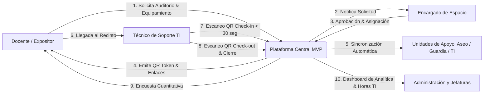
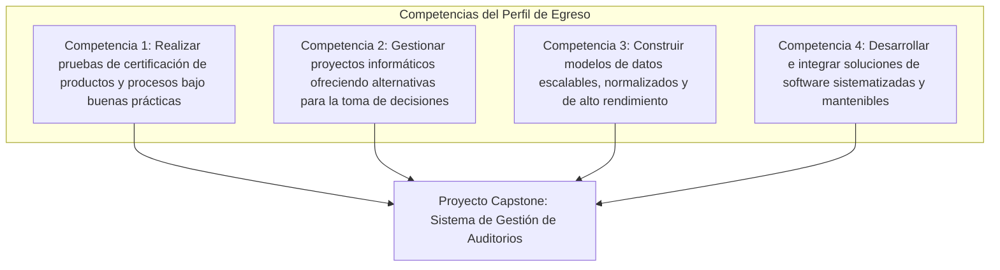
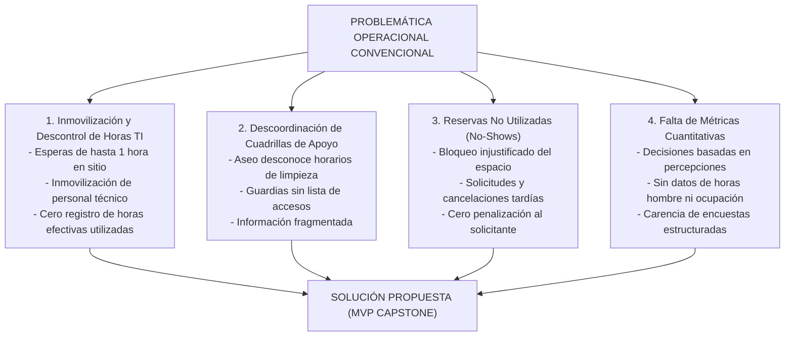
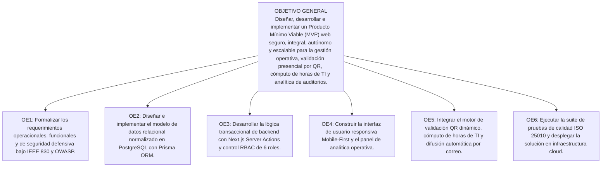
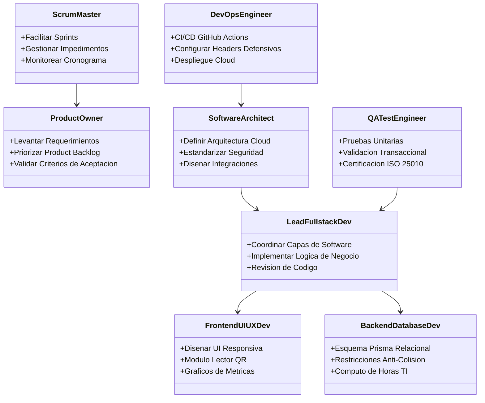
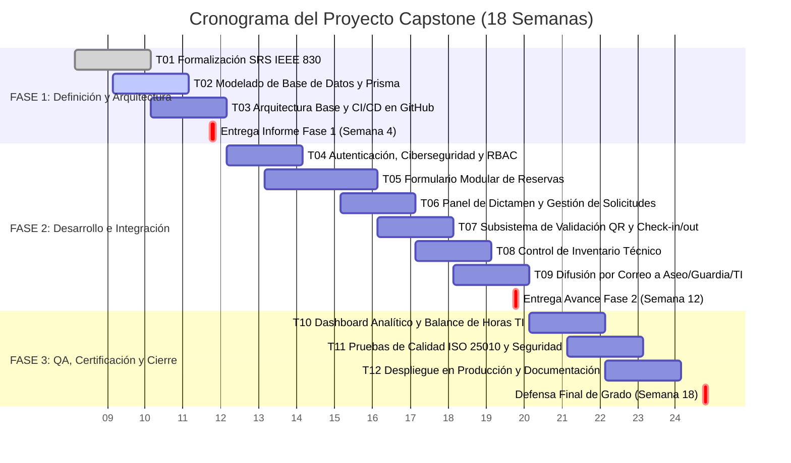
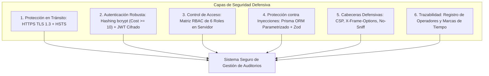
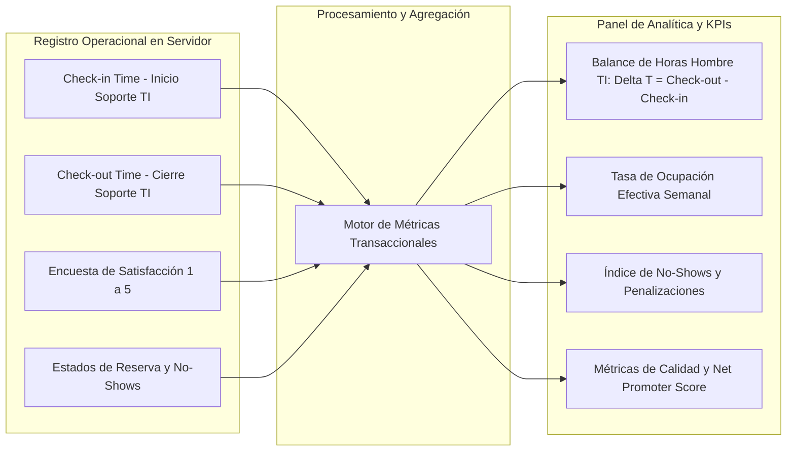
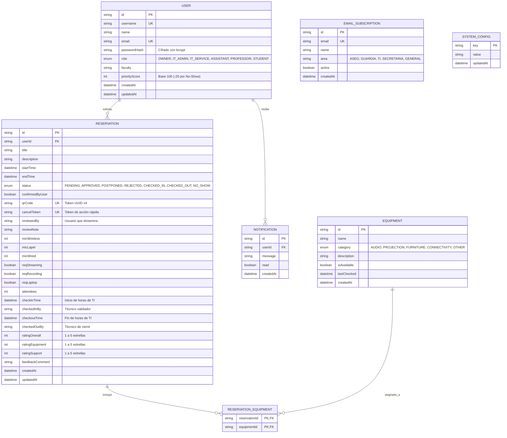

# INFORME DE INGENIERÍA - FASE 1: DEFINICIÓN DEL PROYECTO CAPSTONE
## Asignatura: Capstone (APT122 / PTY4614)
### Sistema Autónomo de Gestión Operativa, Trazabilidad en Tiempo Real, Cómputo de Horas de TI y Analítica para Auditorios y Espacios Multiuso

---

**Datos del Estudiante y del Proyecto:**
* **Nombre del Estudiante:** Benjamín Abraham Navarrete Hernández
* **RUT:** 21.252.605-3
* **Carrera:** Ingeniería en Informática / Análisis Programador
* **Sede:** Sede La Florida
* **Asignatura:** Proyecto Capstone (APT122 / PTY4614)
* **Docente Guía / Comisión Evaluadora:** Comisión de Evaluación de Proyectos Capstone
* **Fecha de Entrega:** Semestre Académico 2026 - Fase 1 (Semana 4)
* **Naturaleza del Entregable:** Producto Mínimo Viable (MVP) Operativo de Alta Fidelidad
* **Marco de Ciberseguridad Defensiva:** OWASP Top 10 e ISO/IEC 27001
* **Repositorio Público de Evidencias:** [https://github.com/IMANDOI/sistema-gestion-auditorios-capstone](https://github.com/IMANDOI/sistema-gestion-auditorios-capstone)

---

## Resumen Ejecutivo

El presente Proyecto Capstone surge a partir de una problemática operacional verificada empíricamente en la administración de auditorios y espacios de alta demanda: la falta de sincronización logística, la inmovilización improductiva del personal técnico de soporte, la ausencia de registros sobre el tiempo efectivo de dedicación técnica y la inexistencia de métricas cuantitativas sobre el uso del recinto. En el modelo de trabajo convencional basado en correos electrónicos y registros manuales, se generan solicitudes y cancelaciones imprevistas ("No-Shows"), desinformación en las cuadrillas de apoyo (aseo y seguridad) y tiempos de espera pasiva del personal de Soporte TI de hasta una hora para la entrega de equipamiento técnico.

Para resolver de manera estructural esta deficiencia, se diseña e implementa un **Producto Mínimo Viable (MVP)** funcional, modular y de arquitectura desacoplada (*White-Label*). La solución integra cuatro componentes principales:
1. **Subsistema de Check-in y Check-out mediante Códigos QR Dinámicos:** Reduce el tiempo de validación física y entrega de equipamiento a menos de 30 segundos, registrando la marca temporal exacta y el cómputo matemático de las horas de soporte técnico utilizadas.
2. **Módulo Automatizado de Difusión por Áreas:** Despacha cronogramas y requerimientos específicos a las cuadrillas de Aseo, Guardias y TI.
3. **Mecanismo de Confirmación Anticipada y Priorización:** Desincentiva reservas no utilizadas mediante confirmaciones por enlace firmado y un algoritmo de penalización de prioridad (*PriorityScore*).
4. **Dashboard de Analítica Operativa y Satisfacción:** Centraliza indicadores clave de desempeño (KPIs), tasas de ocupación efectiva, balance de horas de soporte TI y métricas cuantitativas de satisfacción (escala 1 a 5 y cálculo de Net Promoter Score).
5. **Capa de Ciberseguridad Defensiva:** Implementa cifrado de contraseñas con `bcrypt` (factor de costo $\ge 10$), sesiones mediante tokens JWT cifrados en cookies seguras (`HttpOnly`, `Secure`, `SameSite=Lax`), validación estricta de esquemas con Zod y consultas parametrizadas mediante Prisma ORM para mitigar vulnerabilidades del estándar OWASP Top 10.

El desarrollo se realiza sobre Next.js 15, Prisma ORM y PostgreSQL serverless en Neon Cloud, adoptando el marco de trabajo ágil Scrum con simulación de roles de ingeniería de software y garantizando el cumplimiento de los estándares ISO/IEC 25010 y las cuatro competencias del perfil de egreso.

---

## Tabla de Contenidos
1. [PARTE I: Definición y Fundamentación del Proyecto Capstone](#parte-i-definición-y-fundamentación-del-proyecto-capstone)
   * 1.1 [Antecedentes del Postulante e Independencia Institucional](#11-antecedentes-del-postulante-e-independencia-institucional)
   * 1.2 [Definición y Alcance del Producto Mínimo Viable (MVP)](#12-definición-y-alcance-del-producto-mínimo-viable-mvp)
   * 1.3 [Áreas de Desempeño y Competencias del Perfil de Egreso](#13-áreas-de-desempeño-y-competencias-del-perfil-de-egreso)
   * 1.4 [Fundamentación: Análisis Exhaustivo de la Problemática Raíz](#14-fundamentación-análisis-exhaustivo-de-la-problemática-raíz)
   * 1.5 [Pertinencia con el Perfil de Egreso](#15-pertinencia-con-el-perfil-de-egreso)
   * 1.6 [Relación con los Intereses Profesionales](#16-relación-con-los-intereses-profesionales)
   * 1.7 [Estudio de Factibilidad Técnica, Operativa, Económica y Temporal](#17-estudio-de-factibilidad-técnica-operativa-económica-y-temporal)
2. [PARTE II: Planificación de Ingeniería, Metodología y Gestión](#parte-ii-planificación-de-ingeniería-metodología-y-gestión)
   * 2.1 [Definición de Objetivos (General y Específicos)](#21-definición-de-objetivos-general-y-específicos)
   * 2.2 [Metodología de Desarrollo y Estructura Organizacional (Célula de Ingeniería)](#22-metodología-de-desarrollo-y-estructura-organizacional-célula-de-ingeniería)
   * 2.3 [Matriz de Evidencias e Hitos Evaluativos](#23-matriz-de-evidencias-e-hitos-evaluativos)
   * 2.4 [Plan de Trabajo Detallado](#24-plan-de-trabajo-detallado)
   * 2.5 [Carta Gantt del Ciclo Académico (18 Semanas)](#25-carta-gantt-del-ciclo-académico-18-semanas)
3. [PARTE III: Arquitectura de Software, Ciberseguridad y Modelado](#parte-iii-arquitectura-de-software-ciberseguridad-y-modelado)
   * 3.1 [Marco de Ciberseguridad Defensiva (OWASP Top 10 / ISO 27001)](#31-marco-de-ciberseguridad-defensiva-owasp-top-10--iso-27001)
   * 3.2 [Dashboard de Gestión Operativa, Trazabilidad y Horas de TI](#32-dashboard-de-gestión-operativa-trazabilidad-y-horas-de-ti)
   * 3.3 [Diagrama de Casos de Uso del Negocio](#33-diagrama-de-casos-de-uso-del-negocio)
   * 3.4 [Arquitectura de Contenedores y Flujo de Datos (C4 Model)](#34-arquitectura-de-contenedores-y-flujo-de-datos-c4-model)
   * 3.5 [Modelo Entidad-Relación y Estructura de Datos](#35-modelo-entidad-relación-y-estructura-de-datos)
4. [PARTE IV: Delimitación del Alcance, Roadmap y Conclusiones](#parte-iv-delimitación-del-alcance-roadmap-y-conclusiones)
   * 4.1 [Límites del MVP vs Roadmap Post-Proyecto](#41-límites-del-mvp-vs-roadmap-post-proyecto)
   * 4.2 [Conclusiones Generales del Informe](#42-conclusiones-generales-del-informe)
   * 4.3 [Conclusiones Individuales del Proyecto](#43-conclusiones-individuales-del-proyecto)
   * 4.4 [Reflexión Profesional](#44-reflexión-profesional)
5. [PARTE V: Referencias Bibliográficas y Normativa Técnica](#parte-v-referencias-bibliográficas-y-normativa-técnica)

---

# PARTE I: Definición y Fundamentación del Proyecto Capstone

## 1.1 Antecedentes del Postulante e Independencia Institucional

| Campo | Detalle Institucional / Académico |
| :--- | :--- |
| **Estudiante Postulante** | Benjamín Abraham Navarrete Hernández |
| **RUT** | 21.252.605-3 |
| **Carrera** | Ingeniería en Informática / Análisis Programador |
| **Asignatura** | Proyecto Capstone (APT122 / PTY4614) |
| **Sede** | Sede La Florida |
| **Tipo de Solución** | Producto Mínimo Viable (MVP) Operacional y Seguro (*White-Label*) |
| **Repositorio Oficial de Avances** | `https://github.com/IMANDOI/sistema-gestion-auditorios-capstone` |

> [!NOTE]
> **Aclaración de Independencia y Alcance MVP:**
> El software desarrollado no pertenece a ninguna institución educativa ni empresa privada en particular. Corresponde a una solución genérica, parametrizable y de código abierto orientada a resolver ineficiencias logísticas universales en recintos multiuso.

## 1.2 Definición, Alcance y Delimitación del Proyecto (Límites del MVP)

El alcance del proyecto se define formalmente bajo los principios de la metodología *Lean Startup* y las buenas prácticas de ingeniería de software, delimitando con precisión las fronteras operacionales y técnicas del Producto Mínimo Viable (MVP):



### 1.2.1 Alcance Inclusivo (Módulos y Funcionalidades Incluidas en el MVP)
1. **Módulo de Autenticación y Control de Acceso (RBAC):**
   * Registro e inicio de sesión seguro con contraseñas cifradas en `bcrypt` (factor de costo $\ge 10$).
   * Matriz de autorización para 6 roles jerárquicos (`OWNER`, `IT_ADMIN`, `IT_SERVICE`, `ASSISTANT`, `PROFESSOR`, `STUDENT`).
   * Manejo de sesiones mediante tokens JWT cifrados en cookies seguras (`HttpOnly`, `Secure`, `SameSite=Lax`).
2. **Módulo de Gestión de Solicitudes y Prevención de Conflictos:**
   * Formulario web interactivo en etapas para la reserva de espacios y selección modular de equipamiento técnico (audio, video, transmisión streaming, mobiliario, aseo previo/posterior).
   * Motor transaccional anti-colisiones en PostgreSQL que impide matemáticamente solapamientos de horario sobre reservas aprobadas o en curso: $\max(T_{inicio1}, T_{inicio2}) < \min(T_{fin1}, T_{fin2})$.
   * Algoritmo de reputación docente (*PriorityScore*) con penalización automática de 20 puntos por inasistencias no avisadas (`NO_SHOW`).
3. **Módulo de Dictamen y Coordinación Administrativa:**
   * Panel de revisión de solicitudes con opciones de Aprobar (`APPROVED`), Aplazar (`POSTPONED`) con propuesta horaria, o Rechazar (`REJECTED`) con motivo formal.
   * Sistema de confirmación y liberación rápida mediante enlaces con tokens criptográficos despachados por correo electrónico 48h y 24h antes del evento.
4. **Subsistema de Validación Presencial y Trazabilidad de Horas TI:**
   * Generación de códigos QR criptográficos dinámicos con identificadores UUID v4 generados por CSPRNG.
   * Módulo de escaneo web para smartphone mediante cámara estándar (HTML5 QR Scanner), ejecutando el Check-in en menos de 30 segundos y registrando `checkInTime` y `checkedInBy`.
   * Módulo de Check-out con checklist de devolución de equipos y cálculo automatizado del balance exacto de horas hombre de TI utilizadas ($\Delta T = checkoutTime - checkInTime$).
5. **Módulo de Comunicación y Difusión por Áreas:**
   * Gestión de listas de suscripción (`EmailSubscription`) para despacho automático de cronogramas y requerimientos especiales a las cuadrillas de Aseo, Guardias y TI.
6. **Módulo de Analítica Operativa y Encuestas de Satisfacción:**
   * Encuesta post-evento estructurada en 3 dimensiones (1 a 5 estrellas) para medir satisfacción general, estado de equipamiento y calidad del soporte TI, con cálculo automatizado de Net Promoter Score (NPS).
   * Dashboard gráfico para administración con tasas de ocupación efectiva semanal y balance de horas de soporte técnico consumidas por carrera o departamento.

### 1.2.2 Alcance Exclusivo / Límites del Proyecto (Fuera del Alcance del MVP)
Para asegurar la viabilidad técnica y temporal del proyecto dentro del ciclo de la asignatura Capstone, se declaran explícitamente fuera del alcance de esta versión:
* **Torniquetes Físicos y Lectores de Hardware Propietario:** No se incluye la integración física con cerraduras electromagnéticas o lectores RFID/NFC en puertas físicas (se valida mediante la cámara estándar de cualquier smartphone del técnico).
* **Pasarelas de Pago:** No se contempla el cobro monetario ni la integración con pasarelas de pago bancarias por el arriendo de salas.
* **Sincronización Bidireccional con Calendarios Externos Propietarios:** La sincronización en tiempo real mediante APIs cerradas de Microsoft 365 / Google Calendar queda establecida como parte del Roadmap evolutivo Post-MVP.
* **Domótica y Actuadores IoT:** No se contempla el encendido/apagado físico automatizado de proyectores o luces mediante protocolos domóticos (Zigbee/Z-Wave).
* **Aplicaciones Móviles Nativas en Tiendas:** No se desarrollarán aplicaciones nativas para Android o iOS que requieran publicación en Google Play o App Store (la plataforma es 100% web responsiva Mobile-First accesible vía navegador).

### 1.2.3 Supuestos y Restricciones del Proyecto
* **Supuestos Técnicos:**
  * Los recintos cuentan con conectividad a Internet (Wi-Fi o datos móviles) para la sincronización de datos al momento del escaneo QR.
  * Los usuarios disponen de navegadores web modernos compatibles con HTML5 y Web Crypto API.
* **Restricciones de Proyecto:**
  * **Temporal:** Duración máxima estricta de 18 semanas académicas para la totalidad de las fases de ingeniería.
  * **Recurso Humano:** Desarrollo ejecutado individualmente por un único estudiante en el marco de la asignatura Capstone.
  * **Económica:** Presupuesto de infraestructura de $0 USD, requiriendo el aprovechamiento de capas gratuitas en la nube serverless (Vercel y Neon Cloud).

### 1.2.4 Criterios de Aceptación y Métricas de Éxito del MVP
* **Tiempo de Validación en Terreno:** Reducción comprobada del tiempo de Check-in del técnico a menos de 30 segundos.
* **Precisión Transaccional:** Cero colisiones de horario registradas en la base de datos bajo pruebas de concurrencia.
* **Tiempo de Carga y Rendimiento:** Tiempos de respuesta del servidor (TTFB) inferiores a 800ms bajo el estándar ISO/IEC 25010.
* **Cobertura de Seguridad:** Cero vulnerabilidades críticas reportadas en auditorías estáticas de código (SAST) y cumplimiento de los requerimientos RS-01 a RS-08.


## 1.3 Áreas de Desempeño y Competencias del Perfil de Egreso

El desarrollo del proyecto cubre de manera demostrable las cuatro competencias fundamentales del plan de estudio:



1. **Competencia 1 - Aseguramiento de Calidad y Pruebas (QA):** Diseño e implementación de pruebas unitarias y de integración para validar la detección de colisiones de horario, la lectura de códigos QR y la sanitización de datos.
2. **Competencia 2 - Gestión de Proyectos Informáticos:** Planificación bajo metodología Scrum, estimación de esfuerzo en Story Points y control del cronograma en 18 semanas.
3. **Competencia 3 - Construcción de Modelos de Datos Escalables:** Diseño e implementación de un esquema relacional en 3FN en PostgreSQL (Neon Cloud) con Prisma ORM e indexación B-Tree en campos temporales.
4. **Competencia 4 - Desarrollo e Integración de Software:** Construcción de una solución Fullstack en Next.js 15, autenticación con NextAuth, control de acceso RBAC de 6 roles y consumo de servicios SMTP para notificaciones.

---

## 1.4 Fundamentación: Análisis Exhaustivo de la Problemática Raíz



### 1. Inmovilización del Personal Técnico y Falta de Registro de Horas de TI
* **Problema:** En el flujo manual, el técnico de soporte acudía al auditorio a la hora fijada y permanecía esperando pasivamente la llegada del expositor (a menudo con retrasos de 30 a 60 minutos) para entregar micrófonos y proyector. Esto generaba un uso ineficiente del recurso humano técnico y retrasaba la atención de requerimientos en el resto del campus, sin registro formal del tiempo realmente invertido.
* **Solución:** Validación presencial mediante **código QR dinámico** en menos de 30 segundos. El sistema registra la marca de tiempo exacta de ingreso (`checkInTime`) y de salida (`checkoutTime`), computando matemáticamente las **horas de soporte técnico utilizadas por evento y departamento**.

### 2. Descoordinación en Unidades de Apoyo (Aseo, Guardias y Administración)
* **Problema:** Los equipos de servicios generales no recibían la planificación de eventos con la antelación necesaria, lo que provocaba recintos sin aseo previo o retrasos en la apertura de puertas.
* **Solución:** Listas automatizadas de difusión (`EmailSubscription`) por áreas operativas (`ASEO`, `GUARDIA`, `TI`).

### 3. Cancelaciones Imprevistas y No-Shows
* **Problema:** Solicitudes aprobadas que no se utilizaban, impidiendo que otros docentes accedieran al espacio.
* **Solución:** Confirmación previa por token mediante correo electrónico (48h/24h) y algoritmo de penalización (*PriorityScore* restando 20 puntos por inasistencia no avisada).

### 4. Carencia de Métricas Cuantitativas de Servicio
* **Problema:** La administración no disponía de datos objetivos sobre el nivel de servicio, estado del equipamiento ni porcentaje real de ocupación.
* **Solución:** Dashboard analítico con cálculo automático de Net Promoter Score (NPS), horas de TI utilizadas y tasas de ocupación semanal.

---

## 1.5 Pertinencia con el Perfil de Egreso
El desarrollo del proyecto permite aplicar de forma integrada competencias en arquitectura de software, modelado de bases de datos relacionales, desarrollo web fullstack con componentes de servidor y medidas de ciberseguridad defensiva en aplicaciones web.

## 1.6 Relación con los Intereses Profesionales
El proyecto consolida la especialización profesional en **Ingeniería de Software Fullstack, Arquitectura Cloud y Ciberseguridad Aplicada**, abordando problemas de concurrencia, integración de servicios cloud serverless y diseño de interfaces web responsivas.

## 1.7 Estudio de Factibilidad Técnica, Operativa, Económica y Temporal

| Dimensión | Análisis de Viabilidad | Estado |
| :--- | :--- | :---: |
| **Factibilidad Técnica** | Stack tecnológico consolidado: Next.js 15, TypeScript, Tailwind CSS, Prisma ORM, PostgreSQL (Neon Cloud) y Chart.js/Recharts. | **VIABLE (100%)** |
| **Factibilidad Operativa** | Interfaz intuitiva para administradores y módulo móvil de escaneo QR para técnicos en terreno sin necesidad de instalación de software adicional. | **VIABLE (100%)** |
| **Factibilidad Económica** | Arquitectura Cloud Serverless basada en capas de uso libre (Vercel, Neon PostgreSQL, GitHub Actions). Costo de inversión inicial: **$0 USD**. | **VIABLE (100%)** |
| **Factibilidad Temporal** | Cronograma de 18 semanas estructurado en 3 fases académicas (Fase 1: Semanas 1-4; Fase 2: Semanas 5-12; Fase 3: Semanas 13-18). | **VIABLE (100%)** |

---

# PARTE II: Planificación de Ingeniería, Metodología y Gestión

## 2.1 Definición de Objetivos (General y Específicos)



### Objetivo General
Diseñar, desarrollar e implementar un Producto Mínimo Viable (MVP) web seguro, integral, autónomo y escalable para la gestión de solicitudes, control de inventario técnico, validación presencial en tiempo real mediante códigos QR, balance de horas de soporte técnico utilizadas y analítica de satisfacción en auditorios y espacios de alta demanda.

### Objetivos Específicos
1. **OE1 (Requerimientos y Seguridad):** Formalizar los requerimientos funcionales, no funcionales y estándares de seguridad defensiva bajo la norma IEEE 830 y OWASP Top 10.
2. **OE2 (Modelado de Datos):** Modelar e implementar el esquema relacional en 3FN en PostgreSQL (Neon Cloud) con Prisma ORM e indexación B-Tree para optimización de consultas.
3. **OE3 (Lógica Transaccional y RBAC):** Implementar la lógica de negocio del backend mediante Server Actions y autenticación NextAuth con hashing bcrypt y control de acceso basado en 6 roles.
4. **OE4 (Interfaz y Analítica):** Construir una interfaz web responsiva con componentes optimizados y un panel de visualización de métricas operativas y satisfacción.
5. **OE5 (Integraciones y Trazabilidad):** Desarrollar el subsistema de lectura de códigos QR criptográficos para validación en menos de 30 segundos, registro de horas utilizadas de TI y despacho automatizado de notificaciones a unidades de apoyo.
6. **OE6 (Aseguramiento de Calidad y Despliegue):** Ejecutar pruebas unitarias y de integración bajo el estándar ISO/IEC 25010, desplegando el MVP en infraestructura cloud serverless con pipeline de CI/CD.

## 2.2 Metodología de Desarrollo y Estructura Organizacional (Célula de Ingeniería)



## 2.3 Matriz de Evidencias e Hitos Evaluativos

| Hito / Entrega | Tipo | Evidencia | Descripción | Aporte |
| :---: | :---: | :--- | :--- | :--- |
| **Fase 1 (Semana 4)** | **Avance** | **Informe Técnico de Definición y SRS** | Documento con fundamentación, objetivos, arquitectura, ciberseguridad defensiva y SRS IEEE 830. | Cierra la definición conceptual y alcance del MVP. |
| **Fase 1 (Semana 4)** | **Avance** | **Modelo Relacional y Schema Prisma** | Archivo declarativo `schema.prisma` y script de migración para PostgreSQL. | Establece la base de datos normalizada para persistencia. |
| **Fase 2 (Semana 8)** | **Avance** | **Módulo Core de Auth, RBAC y Reservas** | Sistema funcional de login multi-rol y motor anti-colisiones. | Valida la lógica de negocio central del auditorio. |
| **Fase 2 (Semana 12)** | **Avance** | **Subsistema QR, Horas TI y Mailing** | Lector QR móvil en tiempo real, registro de marcas de tiempo y despacho a Aseo/Guardia/TI. | Resuelve la problemática de espera pasiva de TI y coordinación. |
| **Fase 3 (Semana 16)** | **Final** | **Dashboard Analítico y Suite de Pruebas QA** | Panel de métricas operativas (NPS, horas TI) y batería de pruebas ISO 25010. | Certifica la calidad, rendimiento y estabilidad del sistema. |
| **Fase 3 (Semana 18)** | **Final** | **MVP Desplegado y Defensa de Grado** | Sistema en producción en Vercel/Neon con manuales y presentación final. | Entrega el producto operativo y transferible. |

## 2.4 Plan de Trabajo Detallado

| ID | Actividad | Descripción Técnica | Recursos | Duración | Responsable |
| :---: | :--- | :--- | :--- | :---: | :--- |
| **T01** | Formalización de Requerimientos | Especificación formal SRS IEEE 830, reglas de negocio y restricciones operacionales. | Plantilla IEEE 830 | 2 Semanas | Product Owner |
| **T02** | Modelado de Persistencia | Diseño del esquema Prisma en 3FN, modelos relacionales y restricciones temporales. | PostgreSQL Neon, Prisma | 2 Semanas | Backend Dev |
| **T03** | Arquitectura Base y CI/CD | Configuración de Next.js 15, TypeScript estricto, Tailwind CSS y GitHub Actions. | GitHub, Node.js | 1 Semana | DevOps Engineer |
| **T04** | Autenticación y RBAC | Implementación de NextAuth, hashing bcrypt ($\ge 10$), cookies seguras y 6 roles. | NextAuth, Jose, bcrypt | 2 Semanas | Backend Dev |
| **T05** | Formulario Modular de Reservas | Vista de solicitud en etapas con validación Zod y catálogo de equipamiento técnico. | React Hook Form, Zod | 3 Semanas | Frontend Dev |
| **T06** | Panel de Gestión de Solicitudes | Dashboard para encargados con acciones de Aprobar, Aplazar y Rechazar con trazabilidad. | Next.js Server Actions | 2 Semanas | Fullstack Dev |
| **T07** | Módulo de Validación QR | Generación de QR criptográfico UUID v4 y lector móvil para Check-in/out en < 30 seg. | `html5-qrcode`, Web Crypto | 2 Semanas | Fullstack Dev |
| **T08** | Control de Inventario Técnico | Catálogo de equipos con estados de disponibilidad y asignación dinámica por evento. | Prisma ORM | 2 Semanas | Backend Dev |
| **T09** | Motor de Correos y Difusión | Despacho de cronogramas a listas de Aseo, Guardia y TI, y confirmaciones por token. | Nodemailer / Resend | 2 Semanas | Backend Dev |
| **T10** | Dashboard de Analítica y Horas TI | Visualización de tasas de ocupación, balance de horas de soporte TI y métricas NPS. | Recharts / Chart.js | 2 Semanas | Frontend Dev |
| **T11** | Pruebas de Calidad y Seguridad | Batería de pruebas unitarias y de integración bajo estándar ISO/IEC 25010 y OWASP. | Vitest / Jest | 2 Semanas | QA Engineer |
| **T12** | Despliegue Productivo y Cierre | Despliegue en producción en Vercel y Neon Cloud, documentación y preparación final. | Vercel, Neon | 2 Semanas | Todo el Equipo |

## 2.5 Carta Gantt del Ciclo Académico (18 Semanas)



---

# PARTE III: Arquitectura de Software, Ciberseguridad y Modelado

## 3.1 Marco de Ciberseguridad Defensiva (OWASP Top 10 / ISO 27001)



### Medidas de Ciberseguridad Implementadas:
1. **Hashing de Contraseñas (OWASP A07):** Uso de `bcrypt` con factor de costo $\ge 10$ y generación de sales pseudoaleatorias.
2. **Sesiones Seguras:** Tokens JWT almacenados en cookies protegidas con las directivas `HttpOnly` (mitigación XSS), `Secure` (exclusivo HTTPS) y `SameSite=Lax` (mitigación CSRF).
3. **Prevención contra Inyección SQL (OWASP A03):** 100% de consultas parametrizadas mediante el cliente tipado de Prisma ORM.
4. **Validación de Entradas:** Sanitización y tipado de payloads con esquemas estrictos de Zod en el servidor.
5. **Entropía en Códigos QR:** Generación de tokens de acceso con identificadores UUID v4 basados en CSPRNG.
6. **Cabeceras HTTP Defensivas:** Emisión de `Strict-Transport-Security`, `X-Frame-Options: DENY`, `X-Content-Type-Options: nosniff` y `Referrer-Policy`.

## 3.2 Dashboard de Gestión Operativa, Trazabilidad y Horas de TI

El sistema provee un panel analítico centralizado para la administración y las jefaturas técnicas:



## 3.3 Diagrama de Casos de Uso del Negocio

```mermaid
graph TD
    Docente([Docente / Solicitante])
    Admin([Encargado de Auditorio])
    IT([Soporte TI en Terreno])
    Servicios([Personal de Aseo y Guardia])
    Visor([Público General / Estudiante])

    subgraph Sistema de Gestión de Auditorios (MVP Capstone)
        CU01(CU01: Autenticación de Usuario y Sesión)
        CU02(CU02: Solicitar Auditorio con Equipamiento Técnico)
        CU03(CU03: Confirmar / Liberar Reserva por Enlace de Correo)
        CU04(CU04: Responder Encuesta de Satisfacción)
        
        CU05(CU05: Revisar y Dictaminar Solicitudes: Aprobar/Aplazar/Rechazar)
        CU06(CU06: Administrar Catálogo y Estado de Equipos)
        CU07(CU07: Visualizar Dashboard de Ocupación y Horas de TI)
        
        CU08(CU08: Validar Ingreso Check-in por QR < 30s)
        CU09(CU09: Validar Cierre Check-out y Devolución de Equipos)
        
        CU10(CU10: Recibir Cronograma Automático de Servicios)
        CU11(CU11: Consultar Cartelera Pública de Eventos)
    end

    Docente --> CU01
    Docente --> CU02
    Docente --> CU03
    Docente --> CU04

    Admin --> CU01
    Admin --> CU05
    Admin --> CU06
    Admin --> CU07

    IT --> CU01
    IT --> CU08
    IT --> CU09
    IT --> CU06

    Servicios --> CU10
    Visor --> CU11
```

## 3.4 Arquitectura de Contenedores y Flujo de Datos (C4 Model)

```mermaid
graph TB
    subgraph Capa de Presentación
        B1["Navegador Web Escritorio<br>(Docentes y Administradores)"]
        B2["Navegador Web Móvil con Cámara<br>(Soporte TI en Terreno)"]
    end

    subgraph Capa de Aplicación Cloud (Vercel Serverless)
        direction TB
        AppRouter["Next.js 15 App Router<br>(React 19 Server Components)"]
        AuthModule["NextAuth.js v5<br>(Tokens JWT / RBAC 6 Roles)"]
        BusinessLogic["Server Actions & API Handlers<br>(Lógica de Negocio y Anti-Colisión)"]
        QRValidator["Motor Criptográfico de Tokens QR<br>(Generación y Validación < 30s)"]
    end

    subgraph Capa de Persistencia Cloud (Neon Serverless)
        PrismaClient["Prisma ORM Client<br>(Tipado Estricto TypeScript)"]
        PostgresDB[("PostgreSQL Database<br>- Esquema Normalizado 3FN<br>- Índices B-Tree en Fechas y Estados<br>- Transacciones Atómicas ACID")]
    end

    subgraph Servicios Externos
        MailingService["Servicio SMTP / Resend API<br>(Correos a Solicitantes y Listas de Difusión)"]
    end

    B1 -->|HTTPS TLS 1.3 / UI React| AppRouter
    B2 -->|HTTPS TLS 1.3 / Video Stream QR| AppRouter
    AppRouter --> AuthModule
    AppRouter --> BusinessLogic
    BusinessLogic --> QRValidator
    BusinessLogic --> PrismaClient
    PrismaClient --> PostgresDB
    BusinessLogic -->|Despacho Automático| MailingService
```

## 3.5 Modelo Entidad-Relación y Estructura de Datos



---

# PARTE IV: Delimitación del Alcance, Roadmap y Conclusiones

## 4.1 Límites del MVP vs Roadmap Post-Proyecto

```mermaid
graph TD
    subgraph MVP Actual (Proyecto Capstone)
        M1[Autenticación RBAC 6 Roles + bcrypt]
        M2[Motor de Reservas Anti-Colisión]
        M3[Check-in/out por QR Móvil < 30s]
        M4[Mailing a Aseo, Guardia y TI]
        M5[Métricas de Horas Utilizadas de TI]
        M6[Dashboard de Analítica & NPS]
    end

    subgraph Roadmap Futuro (Post-MVP)
        F1[Integración Google Calendar / Outlook API]
        F2[Domótica IoT: Control de Luces y Proyectores]
        F3[Torniquetes Físicos con Lectores NFC/RFID]
        F4[App Móvil Nativa iOS / Android]
    end

    MVP -->|Evolución Continua| Roadmap
```

| Módulo / Capacidad | Alcance del MVP (Actual) | Evolución en Roadmap Post-MVP |
| :--- | :--- | :--- |
| **Validación de Presencia** | Escáner QR web móvil (< 30s) sin apps externas. | Integración con torniquetes y lectores físicos NFC/RFID. |
| **Medición de Horas TI** | Registro exacto por evento (`checkoutTime - checkInTime`). | Modelos predictivos de dotación técnica según estacionalidad. |
| **Gestión de Calendario** | Calendario interactivo web con prevención de colisiones. | Sincronización bidireccional con Microsoft 365 y Google Calendar. |
| **Control de Equipos** | Catálogo digital y checklist de entrega/recepción. | Domótica IoT para encendido y apagado automatizado de proyectores. |
| **Seguridad de Acceso** | Autenticación local con bcrypt y RBAC de 6 roles. | Integración con Single Sign-On institucional (Azure AD / Google Workspace). |

## 4.2 Conclusiones Generales del Informe
1. El diseño del MVP aborda de forma directa las ineficiencias operacionales más críticas: la inmovilización de personal técnico, el descontrol de horas de soporte, la descoordinación de cuadrillas de apoyo y la falta de métricas.
2. La validación presencial por código QR dinámico reduce el tiempo de atención de una hora a menos de 30 segundos, permitiendo registrar con exactitud matemática el tiempo efectivo de dedicación del personal de Soporte TI.
3. La implementación de medidas de ciberseguridad defensiva (OWASP Top 10 e ISO 27001) garantiza la confidencialidad, integridad y disponibilidad de la información sin sobrecargar el alcance del desarrollo.
4. La arquitectura Cloud Serverless en Next.js 15 y PostgreSQL (Neon Cloud) permite un despliegue escalable con costo inicial de infraestructura de $0 USD.
5. El proyecto cumple con la totalidad de los indicadores de la Guía 1.5 y se articula con las cuatro competencias del perfil de egreso.

## 4.3 Conclusiones Individuales del Proyecto
* La Fase 1 consolida la especificación formal de requerimientos (IEEE 830), el modelado de datos en 3FN y la arquitectura de software necesaria para afrontar la fase de construcción con certidumbre técnica.
* Delimitar el alcance como Producto Mínimo Viable asegura la viabilidad del proyecto para ser desarrollado de forma individual dentro de las 18 semanas académicas.

## 4.4 Reflexión Profesional
* Diseñar una solución de software que resuelva problemas operacionales reales y mida variables críticas como las horas hombre de soporte técnico constituye una aplicación directa de los principios de la ingeniería informática.
* La experiencia adquirida en el modelado relacional, la arquitectura serverless y la seguridad web sienta bases sólidas para el ejercicio profesional.

---

# PARTE V: Referencias Bibliográficas y Normativa Técnica

1. **OWASP Foundation.** (2025). *OWASP Top 10: The Ten Most Critical Web Application Security Risks*. Open Web Application Security Project. https://owasp.org/Top10/
2. **ISO/IEC.** (2022). *Information security, cybersecurity and privacy protection — Information security management systems — Requirements* (ISO/IEC 27001:2022).
3. **IEEE Computer Society.** (1998). *IEEE Recommended Practice for Software Requirements Specifications* (IEEE Std 830-1998).
4. **ISO/IEC/IEEE.** (2014). *Systems and software engineering — Software life cycle processes* (ISO/IEC/IEEE 12207:2014).
5. **ISO/IEC.** (2011). *Systems and software engineering — Systems and software Quality Requirements and Evaluation (SQuaRE)* (ISO/IEC 25010:2011).
6. **Ries, E.** (2011). *The Lean Startup: How Today's Entrepreneurs Use Continuous Innovation to Create Radically Successful Businesses*. Crown Business.
7. **Next.js Documentation.** (2026). *Next.js 15 Architecture and Server Components*. Vercel Inc. https://nextjs.org/docs
8. **Prisma Documentation.** (2026). *Prisma ORM Schema, Relations and Security*. https://www.prisma.io/docs
