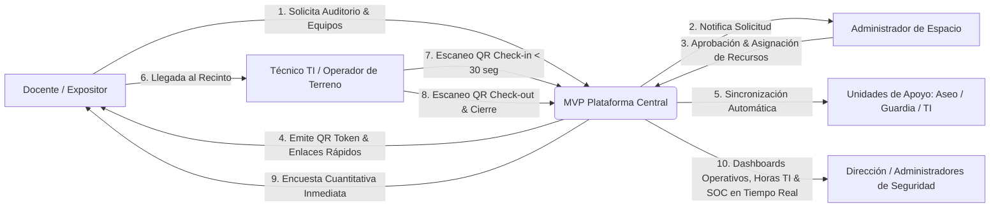
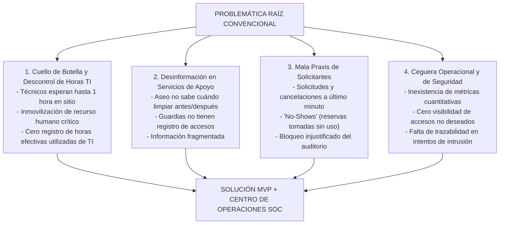
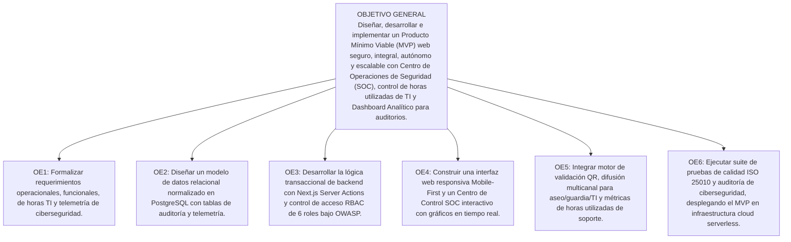
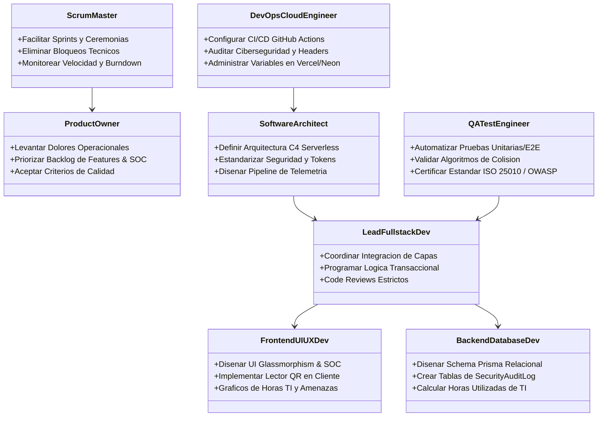
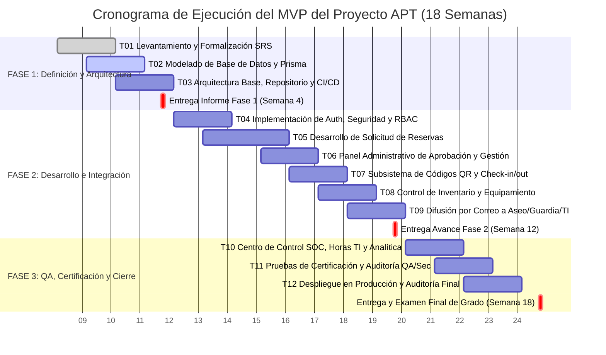
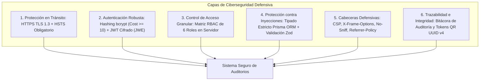
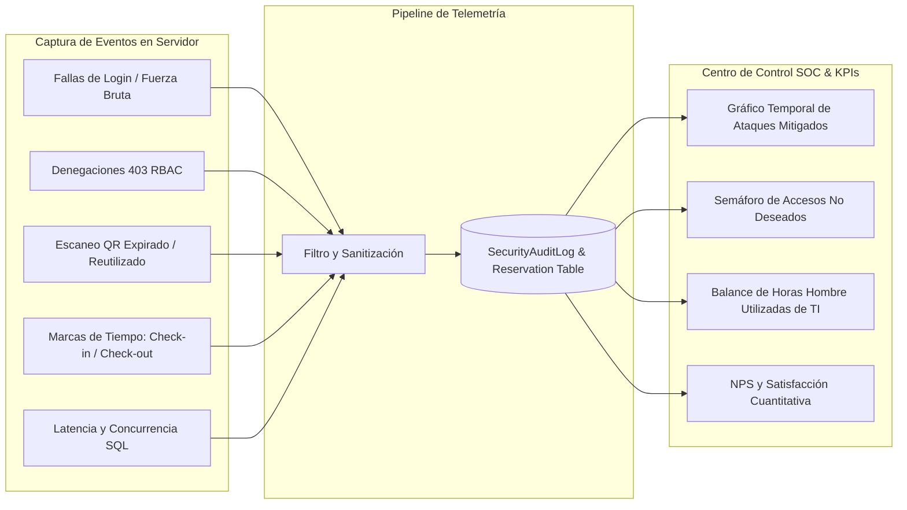
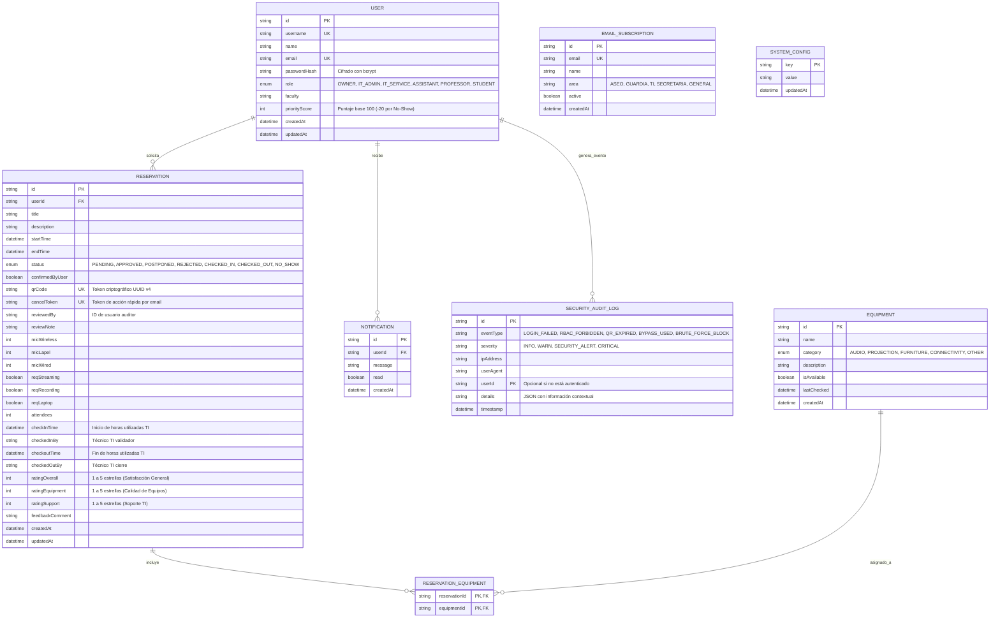

# INFORME DE INGENIERÍA - FASE 1: DEFINICIÓN DEL PROYECTO APT
## Asignatura: Capstone (PTY4614) - Portafolio de Título
### Sistema Autónomo de Gestión Operativa, Trazabilidad en Tiempo Real, Ciberseguridad y Centro de Operaciones (SOC) para Auditorios y Espacios Multiuso

---

**Datos del Estudiante y del Proyecto:**
* **Nombre del Estudiante:** Benjamín Mandujano
* **Carrera:** Ingeniería en Informática / Análisis Programador
* **Sede:** Sede La Florida
* **Asignatura:** Proyecto Capstone / Portafolio de Título (PTY4614)
* **Docente Guía / Comisión Evaluadora:** Comisión de Evaluación de Proyectos de Título
* **Fecha de Entrega:** Semestre Académico 2026 - Fase 1 (Semana 4)
* **Naturaleza del Entregable:** Producto Mínimo Viable (MVP) Operativo de Alta Fidelidad
* **Marco de Ciberseguridad & Telemetría:** OWASP Top 10, ISO/IEC 27001 y Centro de Operaciones de Seguridad (SOC)
* **Repositorio Público de Evidencias:** [https://github.com/IMANDOI/sistema-gestion-auditorios-capstone](https://github.com/IMANDOI/sistema-gestion-auditorios-capstone)

---

## Resumen Ejecutivo

El presente proyecto de titulación nace a partir de una problemática operacional empírica y crítica experimentada en la gestión de espacios comunes y auditorios de alta demanda: la absoluta descoordinación logística, el uso ineficiente y no medido del recurso humano técnico, la inexistencia de métricas cuantitativas de servicio y la falta de visibilidad sobre eventos de ciberseguridad y accesos indebidos. En la operación convencional, los procesos basados en planillas informales, correos y mensajería provocan constantes solicitudes de último minuto, cancelaciones imprevistas sin aviso ("No-Shows"), una grave brecha de comunicación que deja desinformados al personal de aseo, seguridad y administración, y una inmovilización de hasta una hora del personal de Soporte TI en terreno esperando expositores sin un registro real de las horas utilizadas.

Para erradicar esta raíz del problema, se diseña e implementa un **Producto Mínimo Viable (MVP)** funcional, modular y desacoplado de cualquier institución particular (arquitectura *white-label* escalable). El sistema integra un **Centro de Control y Operaciones de Seguridad (SOC / Admin Operations Center)** que combina la gobernanza logística con la medición cuantitativa de horas utilizadas de TI y la observabilidad de ciberseguridad:
1. **Subsistema Criptográfico de Check-in/Check-out mediante Códigos QR Dinámicos:** Reduce el tiempo de recepción y entrega de 60 minutos a menos de 30 segundos, registrando marcas temporales exactas, trazabilidad de activos audiovisuales y el **cómputo exacto de horas efectivas utilizadas de soporte TI**.
2. **Motor Automatizado de Difusión Multicanal por Áreas:** Distribuye listas operativas automáticas a los equipos de aseo, guardias, TI y administración.
3. **Mecanismos de Confirmación Anticipada y Penalización de Prioridad:** Desincentiva reservas fantasmas y optimiza el uso del espacio mediante un algoritmo de prioridad docente (*PriorityScore*).
4. **Dashboard de Analítica Cuantitativa y Panel de Satisfacción Inmediata:** Transforma comentarios cualitativos en datos duros de rendimiento, tasas de ocupación, NPS y **balance de horas hombre de TI utilizadas por evento y departamento**.
5. **Centro de Control de Ciberseguridad y Telemetría en Tiempo Real (SOC Dashboard):** Panel interactivo avanzado que monitorea intentos de acceso no deseados, ataques de fuerza bruta mitigados, intentos de reutilización de tokens QR caducados, denegaciones RBAC y métricas de latencia de base de datos.
6. **Capa Defensiva de Ciberseguridad:** Hashing adaptativo con bcrypt (factor >= 10), tokens de sesión JWT cifrados (JWE) en cookies `HttpOnly`/`Secure`/`SameSite=Lax`, esquemas de validación estricta Zod y cabeceras HTTP defensivas (CSP, HSTS, X-Frame-Options).

La solución se construye sobre Next.js 15, Prisma ORM y PostgreSQL serverless en Neon Cloud, bajo una metodología ágil Scrum que simula una célula de ingeniería de software de 8 roles, garantizando el cumplimiento de los estándares ISO/IEC 25010 y las 4 competencias clave del perfil de egreso.

---

## Tabla de Contenidos
1. [PARTE I: Definición y Fundamentación del Proyecto APT](#parte-i-definición-y-fundamentación-del-proyecto-apt)
   * 1.1 [Antecedentes del Postulante e Independencia Institucional](#11-antecedentes-del-postulante-e-independencia-institucional)
   * 1.2 [Definición y Alcance del Producto Mínimo Viable (MVP)](#12-definición-y-alcance-del-producto-mínimo-viable-mvp)
   * 1.3 [Áreas de Desempeño y Competencias del Perfil de Egreso](#13-áreas-de-desempeño-y-competencias-del-perfil-de-egreso)
   * 1.4 [Fundamentación: Análisis Exhaustivo de la Problemática Raíz](#14-fundamentación-análisis-exhaustivo-de-la-problemática-raíz)
   * 1.5 [Pertinencia con el Perfil de Egreso](#15-pertinencia-con-el-perfil-de-egreso)
   * 1.6 [Relación con los Intereses Profesionales](#16-relación-con-los-intereses-profesionales)
   * 1.7 [Estudio de Factibilidad Técnica, Operativa, Económica y Temporal](#17-estudio-de-factibilidad-técnica-operativa-económica-y-temporal)
2. [PARTE II: Planificación de Ingeniería, Metodología y Gestión](#parte-ii-planificación-de-ingeniería-metodología-y-gestión)
   * 2.1 [Definición de Objetivos (General y Específicos)](#21-definición-de-objetivos-general-y-específicos)
   * 2.2 [Metodología de Desarrollo y Estructura Organizacional (Equipo Simulado de 8 Roles)](#22-metodología-de-desarrollo-y-estructura-organizacional-equipo-simulado-de-8-roles)
   * 2.3 [Matriz de Evidencias e Hitos Evaluativos](#23-matriz-de-evidencias-e-hitos-evaluativos)
   * 2.4 [Plan de Trabajo Detallado](#24-plan-de-trabajo-detallado)
   * 2.5 [Carta Gantt del Ciclo Académico (18 Semanas)](#25-carta-gantt-del-ciclo-académico-18-semanas)
3. [PARTE III: Arquitectura de Software, Ciberseguridad, Telemetría y Modelado](#parte-iii-arquitectura-de-software-ciberseguridad-telemetría-y-modelado)
   * 3.1 [Marco de Ciberseguridad y Protección de Datos Sensibles (OWASP / ISO 27001)](#31-marco-de-ciberseguridad-y-protección-de-datos-sensibles-owasp--iso-27001)
   * 3.2 [Centro de Control, Telemetría y Medición de Horas Utilizadas de TI (SOC Dashboard)](#32-centro-de-control-telemetría-y-medición-de-horas-utilizadas-de-ti-soc-dashboard)
   * 3.3 [Diagrama de Casos de Uso del Negocio y Seguridad](#33-diagrama-de-casos-de-uso-del-negocio-y-seguridad)
   * 3.4 [Arquitectura de Contenedores y Flujo de Datos (C4 Model)](#34-arquitectura-de-contenedores-y-flujo-de-datos-c4-model)
   * 3.5 [Modelo Entidad-Relación y Estructura de Datos (con Logs de Ciberseguridad)](#35-modelo-entidad-relación-y-estructura-de-datos-con-logs-de-ciberseguridad)
4. [PARTE IV: Roadmap Evolutivo y Conclusiones Académicas](#parte-iv-roadmap-evolutivo-y-conclusiones-académicas)
   * 4.1 [Límites del MVP vs Roadmap Post-Proyecto](#41-límites-del-mvp-vs-roadmap-post-proyecto)
   * 4.2 [Conclusiones Generales del Informe](#42-conclusiones-generales-del-informe)
   * 4.3 [Conclusiones Individuales del Proyecto](#43-conclusiones-individuales-del-proyecto)
   * 4.4 [Reflexión Profesional](#44-reflexión-profesional)
5. [PARTE V: Referencias Bibliográficas y Estándares](#parte-v-referencias-bibliográficas-y-estándares)

---

# PARTE I: Definición y Fundamentación del Proyecto APT

## 1.1 Antecedentes del Postulante e Independencia Institucional

| Campo | Detalle Institucional / Académico |
| :--- | :--- |
| **Estudiante Postulante** | Benjamín Mandujano |
| **Carrera** | Ingeniería en Informática |
| **Asignatura** | PTY4614 - Capstone / Portafolio de Título |
| **Sede** | Sede La Florida |
| **Tipo de Solución** | Producto Mínimo Viable (MVP) con SOC y Medición de Horas TI (*White-Label*) |
| **Repositorio Oficial de Avances** | `https://github.com/IMANDOI/sistema-gestion-auditorios-capstone` |

> [!NOTE]
> **Aclaración de Alcance y Definición como MVP:**
> El sistema desarrollado en el marco de esta asignatura corresponde formalmente a un **Producto Mínimo Viable (MVP)**. Su objetivo es implementar el conjunto nuclear de funcionalidades operacionales, de medición de horas utilizadas de TI y de ciberseguridad que permitan resolver cuellos de botella de personal técnico, descoordinación de cuadrillas de apoyo y falta de trazabilidad en seguridad.

## 1.2 Definición y Alcance del Producto Mínimo Viable (MVP)
El MVP contempla la digitalización y automatización del flujo esencial del auditorio junto a un centro de observabilidad de seguridad y medición de dedicación de TI:



## 1.3 Áreas de Desempeño y Competencias del Perfil de Egreso

El desarrollo del proyecto cubre de manera demostrable las cuatro competencias fundamentales del perfil de egreso:


1. **Competencia 1 - Aseguramiento de Calidad y Pruebas (QA):** Pruebas unitarias de algoritmos de colisión, pruebas de penetración (DAST) simuladas contra inyecciones y validación de lectura de códigos QR.
2. **Competencia 2 - Gestión de Proyectos Informáticos:** Planificación bajo Scrum con estimación en Story Points, gestión de riesgos de seguridad, medición de horas utilizadas de TI y control de Carta Gantt en 18 semanas.
3. **Competencia 3 - Construcción de Modelos de Datos Escalables:** Esquema relacional en 3FN en PostgreSQL (Neon), tablas de telemetría y auditoría de seguridad (`SecurityAuditLog`) con índices B-Tree para consultas analíticas de alto rendimiento.
4. **Competencia 4 - Desarrollo e Integración de Software:** Construcción Fullstack moderna en Next.js 15, autenticación NextAuth con RBAC de 6 niveles, panel SOC interactivo con gráficos en tiempo real y generación criptográfica de tokens QR.

---

## 1.4 Fundamentación: Análisis Exhaustivo de la Problemática Raíz



### 1. El Cuello de Botella y Descontrol de Horas de TI (Productividad Laboral)
* **Problemática:** Técnicos de TI perdían hasta 1 hora esperando en sitio a expositores retrasados para entregar micrófonos y proyector, sin que existiera ninguna métrica ni registro formal de **cuántas horas de TI se utilizaban realmente en soporte presencial vs tiempo ocioso**. Esto retrasaba la resolución de tickets en el resto del campus y distorsionaba la planificación laboral del área técnica.
* **Solución del MVP:** Validación presencial por **código QR dinámico** en menos de 30 segundos; tolerancia de 15 minutos tras la cual el sistema marca `NO_SHOW` y libera al técnico. Además, el sistema computa el intervalo exacto entre `checkInTime` y `checkoutTime`, permitiendo conocer las **horas de TI utilizadas con precisión de minutos por evento y unidad académica**.

### 2. Desinformación Crónica en Unidades de Apoyo (Aseo, Guardias y Administración)
* **Problemática:** Aseo y seguridad nunca recibían la información a tiempo sobre eventos o servicios especiales (coffee break o invitados externos).
* **Solución del MVP:** Listas automáticas de difusión (`EmailSubscription`) despachadas automáticamente por áreas operativas.

### 3. Cancelaciones Imprevistas y No-Shows
* **Problemática:** Bloqueo de fechas sin uso real y solicitudes a último minuto.
* **Solución del MVP:** Confirmación anticipada por token sin login (48h/24h) y algoritmo de penalización (*PriorityScore* descontando 20 puntos por No-Show).

### 4. Ceguera Operacional y Falta de Visibilidad en Seguridad (SOC Dashboard)
* **Problemática:** Inexistencia de registros de accesos sospechosos, ataques de fuerza bruta, tokens QR fraudulentos y falta de métricas cuantitativas sobre el uso real del espacio y del soporte técnico.
* **Solución del MVP:** **Panel de Control Integral y SOC Dashboard**, que consolida telemetría de ciberseguridad en tiempo real (ataques mitigados, denegaciones 403, intentos de bypass) junto con el **balance de horas utilizadas de TI**, tasas de ocupación y encuestas de satisfacción (1 a 5 estrellas).

---

## 1.5 Pertinencia con el Perfil de Egreso
La construcción de este MVP con observabilidad de seguridad y control operativo demuestra dominio en:
* **Ciberseguridad y Telemetría:** Implementación de pipelines de captura de eventos de auditoría (`SecurityAuditLog`), detección de anomalías y control granular RBAC.
* **Modelado Transaccional y Escalable:** Optimización de queries analíticas mediante índices B-Tree y registro de horas hombre de TI utilizadas.
* **Desarrollo Fullstack de Alto Rendimiento:** Componentes de servidor y cliente en Next.js 15 y React 19 optimizados para renderizado de gráficos y paneles interactivos.

## 1.6 Relación con los Intereses Profesionales
Este proyecto consolida mi perfil como **Ingeniero de Software Fullstack y Especialista en Arquitectura Cloud y Ciberseguridad**, demostrando competencias para diseñar plataformas que no solo resuelven problemas logísticos, sino que protegen la infraestructura y proveen métricas de horas utilizadas y seguridad que cualquier desarrollador y equipo de TI desearía tener.

## 1.7 Estudio de Factibilidad Técnica, Operativa, Económica y Temporal

| Dimensión de Factibilidad | Análisis de Viabilidad Técnica y Operativa | Estado |
| :--- | :--- | :---: |
| **Factibilidad Técnica** | Stack consolidado: Next.js 15, TypeScript, Tailwind CSS, Prisma ORM, PostgreSQL Neon y Chart.js/Recharts para visualización de métricas. | **VIABLE (100%)** |
| **Factibilidad Operativa** | Los administradores disponen de un centro de control intuitivo con semáforos de alerta, métricas de horas TI y gráficos directos; los técnicos operan con cámara móvil. | **VIABLE (100%)** |
| **Factibilidad Económica** | Arquitectura *Zero-Cost* en infraestructura cloud serverless (Vercel, Neon PostgreSQL, GitHub Actions). Costo inicial: **$0 USD**. | **VIABLE (100%)** |
| **Factibilidad Temporal** | Plan de 18 semanas de desarrollo ágil (Fase 1: Semanas 1-4; Fase 2: Semanas 5-12; Fase 3: Semanas 13-18). | **VIABLE (100%)** |

---

# PARTE II: Planificación de Ingeniería, Metodología y Gestión

## 2.1 Definición de Objetivos (General y Específicos)



### Objetivo General
Diseñar, desarrollar e implementar un Producto Mínimo Viable (MVP) web seguro, integral, autónomo y escalable para la gestión de reservas, control de inventario técnico, validación operativa en tiempo real mediante códigos QR, analítica de satisfacción, medición de horas utilizadas de soporte TI y un Centro de Control de Ciberseguridad (SOC Dashboard) para auditorios y espacios de alta demanda.

### Objetivos Específicos
1. **OE1 (Levantamiento y Seguridad):** Formalizar los requerimientos funcionales, no funcionales, de medición de horas TI y de telemetría de seguridad del MVP, modelando los flujos de Check-in/out, penalización de No-Shows y detección de intrusiones.
2. **OE2 (Modelado de Datos Relacional y Auditoría):** Modelar e implementar un esquema relacional normalizado en 3FN en PostgreSQL (Neon) utilizando Prisma ORM, con tablas especializadas en eventos de seguridad (`SecurityAuditLog`) y marcas de tiempo para cálculo de horas hombre.
3. **OE3 (Seguridad y Lógica de Negocio):** Implementar la capa de lógica transaccional con Next.js Server Actions y seguridad NextAuth con autenticación JWT, hashing bcrypt y roles RBAC de 6 niveles (`OWNER`, `IT_ADMIN`, `IT_SERVICE`, `ASSISTANT`, `PROFESSOR`, `STUDENT`).
4. **OE4 (Interfaz y Centro de Control SOC):** Construir una interfaz de usuario moderna con estética Glassmorphism y un Dashboard SOC interactivo con gráficos temporales de eventos, horas de TI utilizadas, accesos bloqueados y estado del auditorio.
5. **OE5 (Automatización e Integraciones Seguras):** Integrar subsistemas de lectura criptográfica de códigos QR, despacho automático de correos por listas de suscripción (Aseo, Guardia, TI) y captura de telemetría de incidentes y uso horario.
6. **OE6 (Aseguramiento de Calidad y Ciberseguridad):** Ejecutar pruebas unitarias, de integración, rendimiento y análisis estático de vulnerabilidades bajo estándares ISO/IEC 25010 y OWASP, culminando con el despliegue productivo y monitoreo del MVP en Vercel y Neon Cloud.

## 2.2 Metodología de Desarrollo y Estructura Organizacional (Equipo Simulado de 8 Roles)



## 2.3 Matriz de Evidencias e Hitos Evaluativos

| Hito / Entrega | Tipo de Evidencia | Nombre de la Evidencia | Descripción del Entregable | Justificación y Aporte |
| :---: | :---: | :--- | :--- | :--- |
| **Fase 1 (Semana 4)** | **Avance** | **Informe Técnico de Definición, SRS, Seguridad y SOC** | Documento exhaustivo con problemática raíz, objetivos, arquitectura, ciberseguridad OWASP, telemetría y especificación formal de requerimientos. | Establece los cimientos teóricos, operativos, de seguridad y arquitectura sin ambigüedades. |
| **Fase 1 (Semana 4)** | **Avance** | **Modelo Entidad-Relación y Schema Prisma** | Archivo declarativo `schema.prisma` con modelos relacionales, campos de horas utilizadas y tabla de logs de seguridad para PostgreSQL Neon. | Garantiza la estructura de persistencia para soportar concurrencia, reglas operativas y auditoría. |
| **Fase 2 (Semana 8)** | **Avance** | **Módulo Core de Auth, RBAC y Reservas** | MVP funcional con inicio de sesión multi-rol, prevención de colisiones de horario y formulario de reservas. | Valida la lógica de negocio central del auditorio. |
| **Fase 2 (Semana 12)** | **Avance** | **Subsistema QR, Check-in/out y Mailing** | Lector QR en tiempo real para técnicos, registro de marcas temporales de horas de TI y despacho automático de correos a Aseo/Guardia. | Elimina el cuello de botella de 1 hora de TI e integra a los servicios de apoyo. |
| **Fase 3 (Semana 16)** | **Final** | **Centro de Control SOC, Dashboard y Suite QA** | Panel interactivo de telemetría de ciberseguridad, métricas NPS, balance de horas utilizadas de TI, suite de pruebas y reporte de calidad ISO 25010. | Provee observabilidad en tiempo real y certifica la robustez de la solución. |
| **Fase 3 (Semana 18)** | **Final** | **MVP en Producción y Defensa de Grado** | Despliegue productivo en Vercel/Neon, manual técnico, manual de usuario y presentación final de grado. | Entrega el producto de software totalmente operativo y transferible. |

## 2.4 Plan de Trabajo Detallado

| ID | Actividad / Tarea | Descripción Técnica | Recursos | Duración | Responsable Simulado | Mitigación de Riesgos |
| :---: | :--- | :--- | :--- | :---: | :--- | :--- |
| **T01** | Análisis y Formalización de Requerimientos | Levantamiento de dolores operacionales (TI, aseo, cancelaciones), redacción de casos de uso y SRS del MVP con matriz de seguridad, horas TI y SOC. | Plantillas IEEE 830, herramientas de modelado. | 2 Semanas | Product Owner | *Riesgo:* Alcance difuso.<br>*Mitigación:* Validación mediante matriz de trazabilidad. |
| **T02** | Modelado de Base de Datos y Restricciones | Diseño de esquemas en Prisma, definición de enums, modelos relacionales y tabla de auditoría `SecurityAuditLog`. | PostgreSQL Neon, Prisma ORM, VS Code. | 2 Semanas | Backend & DB Dev | *Riesgo:* Solapamiento de horarios.<br>*Mitigación:* Restricciones a nivel de base de datos e índices únicos. |
| **T03** | Arquitectura Base, Repositorio y CI/CD | Configuración de Next.js 15, TypeScript estricto, Tailwind CSS y sincronización con GitHub. | GitHub Actions, Vercel CLI, Node.js. | 1 Semana | DevOps Engineer | *Riesgo:* Incompatibilidad de paquetes.<br>*Mitigación:* Lockfile estricto (`package-lock.json`). |
| **T04** | Autenticación, Ciberseguridad y Roles RBAC | Configuración de NextAuth, hashing de contraseñas con bcrypt (salt factor >= 10), JWT cifrado y middleware de 6 roles. | NextAuth.js, bcryptjs, Jose, Zod. | 2 Semanas | Backend Dev | *Riesgo:* Vulnerabilidad en rutas.<br>*Mitigación:* Middleware centralizado con denegación por defecto. |
| **T05** | Formulario Inteligente de Reservas | Vista de solicitud en pasos con requerimientos técnicos (microfonía, streaming, podio, aseo) y validación Zod. | React Hook Form, Tailwind CSS, Lucide Icons. | 3 Semanas | Frontend UI/UX Dev | *Riesgo:* Formularios complejos.<br>*Mitigación:* Diseño por etapas (Wizard) intuitivo. |
| **T06** | Panel de Dictamen y Gestión de Solicitudes | Dashboard para encargados con acciones de Aprobar, Aplazar y Rechazar con notas explicativas. | Next.js Server Actions, TanStack Table. | 2 Semanas | Lead Fullstack Dev | *Riesgo:* Tiempos lentos de carga.<br>*Mitigación:* Server-Side Rendering y paginación en servidor. |
| **T07** | Módulo de Validación QR Criptográfico | Generación de QR con UUID v4 único y escáner móvil para validación presencial de TI en < 30 seg y cómputo de horas. | `html5-qrcode`, Web Crypto API. | 2 Semanas | Fullstack Dev | *Riesgo:* Fallas de cámara en celulares.<br>*Mitigación:* Soporte alternativo de búsqueda por token alfanumérico. |
| **T08** | Control de Inventario y Equipos | Catálogo de equipamiento técnico con estados de operatividad y asignación dinámica por evento. | Prisma ORM, Server Actions. | 2 Semanas | Backend Dev | *Riesgo:* Pérdida de equipos.<br>*Mitigación:* Trazabilidad ligada al Check-out del técnico de TI. |
| **T09** | Motor de Correos y Listas de Difusión | Despacho automático de cronogramas a listas de Aseo, Guardia y TI, más confirmaciones por token. | Resend / Nodemailer API. | 2 Semanas | Backend Dev | *Riesgo:* SPAM en correos.<br>*Mitigación:* Plantillas HTML limpias y headers autenticados. |
| **T10** | Centro de Control SOC y Dashboard Analítico | Panel gráfico integral con telemetría de ataques mitigados, accesos no deseados, horas de TI utilizadas, tasa de ocupación y NPS. | Chart.js / Recharts, Tailwind CSS. | 2 Semanas | Frontend Dev | *Riesgo:* Sobrecarga de datos.<br>*Mitigación:* Filtros interactivos por nivel de severidad y fecha. |
| **T11** | Pruebas de Calidad y Auditoría de Seguridad | Batería de pruebas unitarias y de concurrencia bajo estándar ISO/IEC 25010 y OWASP. | Vitest / Jest, Playwright, npm audit. | 2 Semanas | QA Test Engineer | *Riesgo:* Errores en producción.<br>*Mitigación:* Pipeline de testing automatizado antes de cada merge. |
| **T12** | Despliegue en Producción y Cierre | Despliegue en Vercel/Neon, manuales de usuario/técnicos y preparación de defensa de grado. | Vercel Platform, Markdown Docs. | 2 Semanas | Todo el Equipo | *Riesgo:* Variables de entorno erróneas.<br>*Mitigación:* Checklist de despliegue validado. |

## 2.5 Carta Gantt del Ciclo Académico (18 Semanas)



---

# PARTE III: Arquitectura de Software, Ciberseguridad, Telemetría y Modelado

## 3.1 Marco de Ciberseguridad y Protección de Datos Sensibles (OWASP / ISO 27001)



## 3.2 Centro de Control, Telemetría y Medición de Horas Utilizadas de TI (SOC Dashboard)

El sistema incorpora un **Dashboard de Ciberseguridad, Operaciones y Cómputo de Horas de Soporte TI (SOC)** diseñado para brindar observabilidad total tanto a corto plazo (identificación instantánea de anomalías) como a largo plazo (análisis de tendencias de uso y horas de soporte consumidas):



### Métricas y Capacidades del Panel de Control (SOC):
1. **Balance y Trazabilidad de Horas Hombre Utilizadas de TI:** Cómputo exacto de las horas efectivas que el personal técnico de TI dedicó a cada evento (diferencial `checkoutTime - checkInTime`), desglosado por carrera, facultad o tipo de actividad para planificar la carga laboral técnica.
2. **Contador de Ataques y Accesos No Deseados:** Registro en tiempo real de intentos de autenticación fallidos y peticiones bloqueadas por rate limiting.
3. **Monitoreo de Violaciones de Permisos (RBAC Violations):** Detección de usuarios autenticados que intentan acceder a recursos administrativos sin privilegios (código HTTP 403).
4. **Auditoría de Tokens QR:** Identificación de intentos de escaneo de códigos QR duplicados, alterados o fuera del horario programado.
5. **Métricas Operativas del Auditorio:** Tasa de ocupación efectiva semanal, índice de No-Shows y cálculo de Net Promoter Score (NPS).
6. **Observabilidad del Rendimiento:** Monitoreo de tiempos de respuesta del servidor (TTFB < 800ms) y salud de la base de datos PostgreSQL Neon.

## 3.3 Diagrama de Casos de Uso del Negocio y Seguridad

```mermaid
graph TD
    Docente([Docente / Expositor])
    Admin([Administrador / Encargado Auditorio])
    IT([Soporte TI / Validador en Terreno])
    SecAdmin([Administrador de Seguridad / SOC])
    Servicios([Personal de Aseo y Guardia])
    Visor([Público General / Estudiante])

    subgraph MVP Sistema Autónomo de Gestión de Auditorios
        CU01(CU01: Autenticación Segura y Perfil de Usuario)
        CU02(CU02: Solicitar Auditorio con Requerimientos Técnicos)
        CU03(CU03: Confirmar / Liberar Reserva por Token de Email)
        CU04(CU04: Responder Encuesta Cuantitativa de Satisfacción)
        
        CU05(CU05: Evaluar y Dictaminar Solicitudes: Aprobar/Aplazar/Rechazar)
        CU06(CU06: Administrar Catálogo y Estado de Equipos)
        CU07(CU07: Visualizar Dashboard de Horas Utilizadas de TI y NPS)
        
        CU08(CU08: Validar Ingreso Check-in mediante Escaneo QR < 30s)
        CU09(CU09: Validar Retiro y Devolución Check-out con Registro Horario)
        
        CU10(CU10: Recibir Cronograma Automático de Limpieza y Seguridad)
        CU11(CU11: Consultar Cartelera Pública de Eventos)

        CU12(CU12: Monitorear Centro de Control SOC y Alertas de Seguridad)
        CU13(CU13: Auditar Bitácora de Intentos de Intrusión y Accesos Denegados)
    end

    Docente --> CU01
    Docente --> CU02
    Docente --> CU03
    Docente --> CU04

    Admin --> CU01
    Admin --> CU05
    Admin --> CU06
    Admin --> CU07

    IT --> CU01
    IT --> CU08
    IT --> CU09
    IT --> CU06

    SecAdmin --> CU01
    SecAdmin --> CU12
    SecAdmin --> CU13

    Servicios --> CU10
    Visor --> CU11
```



## 3.4 Arquitectura de Contenedores y Flujo de Datos (C4 Model)

```mermaid
graph TB
    subgraph Capa de Presentación (Dispositivos de Usuario)
        B1["Navegador Web Escritorio<br>(Docentes y Administradores)"]
        B2["Navegador Web Móvil con Cámara<br>(Soporte TI en Terreno)"]
        B3["Consola de Seguridad / SOC<br>(Administradores de Seguridad)"]
    end

    subgraph Capa de Aplicación Cloud (Vercel Serverless)
        direction TB
        AppRouter["Next.js 15 App Router<br>(React 19 Server Components)"]
        AuthModule["NextAuth.js v5<br>(Tokens JWT / Control RBAC 6 Roles)"]
        BusinessLogic["Server Actions & API Handlers<br>(Lógica Transaccional y Cómputo de Horas TI)"]
        QRValidator["Motor Criptográfico de Tokens & QR<br>(Generación y Validación Instantánea)"]
        TelemetryEngine["Motor de Telemetría & Logging<br>(Captura de Anomalías y Fallas de Autenticación)"]
    end

    subgraph Capa de Persistencia Cloud (Neon Serverless)
        PrismaClient["Prisma ORM Client<br>(Tipado Estricto TypeScript)"]
        PostgresDB[("PostgreSQL 18 Database<br>- Modelos Relacionales Normalizados<br>- Tabla SecurityAuditLog<br>- Índices B-Tree en Fechas y Estados<br>- Transacciones Atómicas ACID")]
    end

    subgraph Servicios Externos
        MailingService["Servicio SMTP / Resend API<br>(Correos a Solicitantes y Listas de Aseo/Guardia/TI)"]
    end

    B1 -->|HTTPS TLS 1.3 / UI React| AppRouter
    B2 -->|HTTPS TLS 1.3 / Video Stream QR| AppRouter
    B3 -->|HTTPS TLS 1.3 / SOC Analytics| AppRouter
    AppRouter --> AuthModule
    AppRouter --> BusinessLogic
    BusinessLogic --> QRValidator
    BusinessLogic --> TelemetryEngine
    TelemetryEngine --> PrismaClient
    BusinessLogic --> PrismaClient
    PrismaClient --> PostgresDB
    BusinessLogic -->|Despacho Automático| MailingService
```

## 3.5 Modelo Entidad-Relación y Estructura de Datos (con Logs de Ciberseguridad)



---

# PARTE IV: Roadmap Evolutivo y Conclusiones Académicas

## 4.1 Límites del MVP vs Roadmap Post-Proyecto

```mermaid
graph TD
    subgraph MVP Actual (Fase Titulacion)
        M1[Autenticación RBAC 6 Roles + bcrypt]
        M2[Motor de Reservas Anti-Colisión]
        M3[Check-in/out por QR Móvil < 30s]
        M4[Mailing a Aseo, Guardia y TI]
        M5[Métricas de Horas Utilizadas de TI & NPS]
        M6[Centro de Control SOC & Audit Logs]
    end

    subgraph Roadmap Futuro (Post-MVP Enterprise)
        F1[Integración Google Calendar / Outlook API]
        F2[Domótica IoT: Control de Luces y Proyectores]
        F3[App Móvil Nativa iOS / Android con Push]
        F4[IA Predictiva de Demanda y Horarios]
        F5[Detección de Intrusiones con Machine Learning]
    end

    MVP -->|Evolución Continua| Roadmap
```

| Módulo / Capacidad | Estado en MVP (Actual) | Evolución en Roadmap Post-MVP |
| :--- | :--- | :--- |
| **Centro de Control SOC** | Panel interactivo de telemetría de ataques, denegaciones y horas utilizadas de TI. | Integración con SIEM corporativo (Splunk / Elastic SIEM) y bloqueo automático de IPs maliciosas. |
| **Medición de Horas TI** | Registro exacto de horas utilizadas por evento (`checkoutTime - checkInTime`). | Análisis predictivo de dotación de personal técnico según estacionalidad académica. |
| **Seguridad y Accesos** | Autenticación local robusta con bcrypt y RBAC de 6 roles. | Integración con SSO institucional (Single Sign-On Azure AD / Google Workspace). |
| **Validación de Presencia** | Escáner QR web móvil ultra-rápido (< 30s). | Torniquetes automatizados con lector NFC / RFID. |
| **Gestión de Calendario** | Calendario interactivo web en tiempo real. | Sincronización bidireccional con Microsoft 365 y Google Calendar. |
| **Control de Sala y Equipos** | Control de stock digital y checklist de entrega. | Integración IoT para encendido/apagado automático de proyectores y aire acondicionado. |
| **Canales de Usuario** | Web responsiva Mobile-First y correos automáticos. | Aplicación móvil nativa en React Native / Flutter con notificaciones push. |

## 4.2 Conclusiones Generales del Informe
1. El diseño del MVP resuelve una problemática operativa tangible y universal: la inmovilización de personal técnico, el descontrol de horas utilizadas de TI, la descoordinación de servicios generales y la falta de visibilidad analítica.
2. La medición exacta de horas hombre utilizadas de TI proporciona por primera vez una métrica cuantitativa para evaluar la carga de trabajo y dimensionar la dotación de soporte técnico.
3. La incorporación del Centro de Control SOC y telemetría en tiempo real dota al sistema de una capa de observabilidad de ciberseguridad sin precedentes, permitiendo detectar incidentes y auditar accesos indebidos.
4. La implementación de códigos QR dinámicos transforma un proceso manual que demoraba hasta 1 hora en una transacción digital verificada en menos de 30 segundos, liberando al personal técnico para tareas críticas de soporte.
5. El proyecto articula en su totalidad las cuatro competencias del perfil de egreso, cumpliendo rigurosamente con los estándares técnicos, metodológicos y de seguridad exigidos por la asignatura Capstone.

## 4.3 Conclusiones Individuales del Proyecto
* La culminación de la Fase 1 establece una base conceptual, matemática, operativa y de seguridad sólida para el MVP, permitiendo medir con exactitud las horas de soporte técnico utilizadas y mitigando la espera pasiva de personal técnico.
* El modelado relacional en 3FN, la tabla de telemetría `SecurityAuditLog`, el hashing con bcrypt y las restricciones transaccionales proporcionan una garantía formal contra colisiones de reservas, accesos indebidos y ataques informáticos.
* La planificación ágil bajo Scrum simulando 8 roles especializados permite abordar el ciclo de vida del software con la rigurosidad, trazabilidad y profesionalismo propios de la industria tecnológica.

## 4.4 Reflexión Profesional
* Transformar un conjunto de ineficiencias operacionales reales en un Producto Mínimo Viable funcional, seguro, observable y automatizado constituye el propósito fundamental de la ingeniería informática.
* Medir variables críticas como las horas hombre utilizadas de TI y la telemetría de ciberseguridad en tiempo real demuestra la capacidad de diseñar soluciones orientadas a la eficiencia operativa y a la toma de decisiones basada en datos duros.
* Este proyecto representa un MVP de alta fidelidad, transferible y con valor organizacional directo para cualquier institución o empresa que administre recintos de alta demanda.

---

# PARTE V: Referencias Bibliográficas y Estándares

1. **OWASP Foundation.** (2025). *OWASP Top 10: The Ten Most Critical Web Application Security Risks*. Open Web Application Security Project. https://owasp.org/Top10/
2. **ISO/IEC.** (2022). *Information security, cybersecurity and privacy protection — Information security management systems — Requirements* (ISO/IEC 27001:2022).
3. **IEEE Computer Society.** (1998). *IEEE Recommended Practice for Software Requirements Specifications* (IEEE Std 830-1998).
4. **ISO/IEC/IEEE.** (2014). *Systems and software engineering — Software life cycle processes* (ISO/IEC/IEEE 12207:2014).
5. **ISO/IEC.** (2011). *Systems and software engineering — Systems and software Quality Requirements and Evaluation (SQuaRE)* (ISO/IEC 25010:2011).
6. **Ries, E.** (2011). *The Lean Startup: How Today's Entrepreneurs Use Continuous Innovation to Create Radically Successful Businesses*. Crown Business.
7. **Next.js Documentation.** (2026). *Next.js 15 Security Best Practices and Server Actions*. Vercel Inc. https://nextjs.org/docs
8. **Prisma Documentation.** (2026). *Prisma ORM Security and Query Parameterization*. https://www.prisma.io/docs
